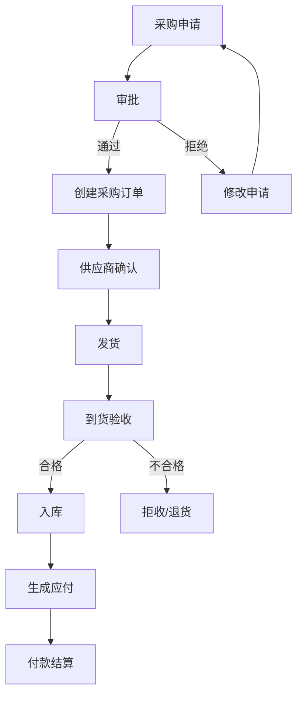
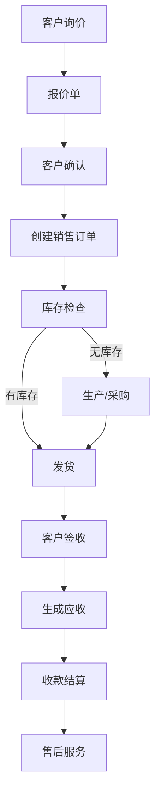
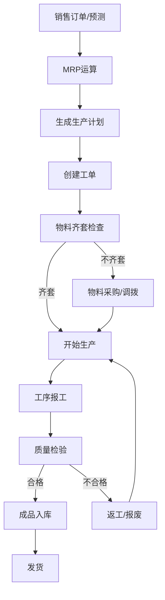
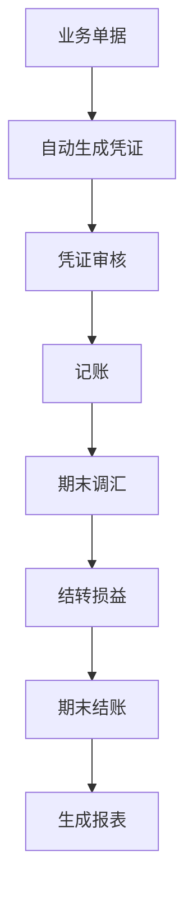

# ERP 系统产品需求文档

## 1. 产品概述

**ERP (Enterprise Resource Planning)** 是一套面向大型企业的集成化管理信息系统，旨在整合企业的财务、采购、销售、生产、库存、人力资源等核心业务流程，实现数据的统一管理和实时共享，提升企业运营效率和决策能力。

**目标用户**：大型企业（员工数 > 500），涵盖制造业、贸易、服务业等多个行业
**核心价值**：打破信息孤岛，实现业务流程标准化，提供实时决策支持

---

## 2. 核心功能

### 2.1 用户角色

| 角色 | 注册方式 | 核心权限 |
|------|----------|----------|
| 系统管理员 | 后台创建 | 系统配置、用户管理、权限分配 |
| 财务总监 | 邮箱注册+审批 | 财务报表、预算管理、资金调配 |
| 财务专员 | 邮箱注册+审批 | 记账、对账、发票管理 |
| 采购总监 | 邮箱注册+审批 | 供应商管理、采购策略 |
| 采购专员 | 邮箱注册+审批 | 采购订单、收货验收 |
| 销售总监 | 邮箱注册+审批 | 销售报表、客户管理 |
| 销售专员 | 邮箱注册+审批 | 销售订单、客户跟进 |
| 生产经理 | 邮箱注册+审批 | 生产计划、车间调度 |
| 仓库管理员 | 邮箱注册+审批 | 库存管理、出入库操作 |
| 人力资源经理 | 邮箱注册+审批 | 员工管理、薪资核算 |
| 普通员工 | 邮箱注册+审批 | 个人信息、考勤打卡、报销申请 |

### 2.2 功能模块

1. **财务管理模块**：总账管理、应收应付、固定资产、成本核算、预算管理、财务报表
2. **采购管理模块**：供应商管理、采购申请、采购订单、收货验收、采购结算
3. **销售管理模块**：客户管理、销售报价、销售订单、发货管理、销售结算、售后服务
4. **生产管理模块**：BOM管理、生产计划、车间调度、工单管理、质量管理
5. **库存管理模块**：库存台账、出入库管理、库存盘点、库存预警、批次管理
6. **人力资源模块**：员工管理、考勤管理、薪资管理、绩效管理、培训管理
7. **项目管理模块**：项目立项、进度跟踪、资源分配、成本控制、项目报表
8. **报表分析模块**：自定义报表、数据看板、趋势分析、多维分析

### 2.3 页面详情

| 页面名称 | 模块名称 | 功能描述 |
|----------|----------|----------|
| 系统首页 | 数据看板 | 企业运营概览、关键指标展示、快捷操作入口 |
| 财务管理 | 总账管理 | 科目设置、凭证录入、账簿查询、期末结账 |
| 财务管理 | 应收管理 | 应收账款、收款单、账龄分析、坏账处理 |
| 财务管理 | 应付管理 | 应付账款、付款单、供应商对账 |
| 财务管理 | 固定资产 | 资产卡片、折旧计算、资产处置 |
| 财务管理 | 财务报表 | 资产负债表、利润表、现金流量表 |
| 采购管理 | 供应商管理 | 供应商档案、资质审核、绩效评估 |
| 采购管理 | 采购申请 | 申请单创建、审批流程、采购建议 |
| 采购管理 | 采购订单 | 订单创建、审批、跟踪、变更 |
| 采购管理 | 收货验收 | 到货通知、质检入库、拒收处理 |
| 销售管理 | 客户管理 | 客户档案、信用管理、客户分类 |
| 销售管理 | 销售报价 | 报价单创建、审批、有效期管理 |
| 销售管理 | 销售订单 | 订单创建、库存检查、发货安排 |
| 销售管理 | 发货管理 | 出库单、物流跟踪、签收确认 |
| 销售管理 | 售后服务 | 售后工单、维修记录、客户回访 |
| 生产管理 | BOM管理 | BOM创建、版本控制、替代料管理 |
| 生产管理 | 生产计划 | MRP运算、产能规划、生产排程 |
| 生产管理 | 工单管理 | 工单创建、派工、进度跟踪、报工 |
| 生产管理 | 质量管理 | 质检单、不合格品处理、质量追溯 |
| 库存管理 | 库存台账 | 库存查询、批次管理、序列号追踪 |
| 库存管理 | 出入库管理 | 采购入库、销售出库、调拨、盘点 |
| 库存管理 | 库存预警 | 安全库存设置、预警通知、补货建议 |
| 人力资源 | 员工管理 | 员工档案、组织架构、岗位管理 |
| 人力资源 | 考勤管理 | 考勤打卡、请假申请、加班管理 |
| 人力资源 | 薪资管理 | 薪资核算、工资发放、社保公积金 |
| 人力资源 | 绩效管理 | 绩效目标、考核评分、绩效报表 |
| 项目管理 | 项目管理 | 项目立项、任务分解、进度跟踪 |
| 报表分析 | 报表中心 | 自定义报表、数据导出、权限控制 |
| 系统管理 | 用户管理 | 用户创建、角色分配、权限设置 |
| 系统管理 | 系统配置 | 参数设置、流程配置、数据字典 |

---

## 3. 核心流程

### 3.1 采购流程

### 3.2 销售流程

### 3.3 生产流程

### 3.4 财务核算流程

---

## 4. 用户界面设计

### 4.1 设计风格

- **主色调**：深蓝色（#1a365d）+ 浅蓝色（#3182ce）
- **辅助色**：绿色（#38a169）成功状态、红色（#e53e3e）警告状态、橙色（#ed8936）提醒状态
- **按钮风格**：圆角矩形（border-radius: 6px），渐变背景，hover效果增强
- **字体**：Inter 字体，中文使用思源黑体
- **布局风格**：左侧侧边栏导航 + 顶部工具栏 + 主内容区，卡片式布局
- **图标风格**：Lucide React 图标库，统一的线性风格

### 4.2 页面设计概览

| 页面名称 | 模块名称 | UI 元素 |
|----------|----------|---------|
| 系统首页 | 数据看板 | 仪表盘卡片、图表组件、快捷入口、通知中心 |
| 财务管理 | 总账管理 | 表格列表、表单组件、筛选器、分页器 |
| 采购管理 | 采购订单 | 订单卡片、审批流程可视化、状态标签 |
| 销售管理 | 客户管理 | 客户卡片、关系图、数据统计 |
| 生产管理 | 工单管理 | Gantt 图、进度条、资源分配视图 |
| 库存管理 | 库存台账 | 库存卡片、预警提示、库存分布地图 |
| 人力资源 | 员工管理 | 组织架构图、员工卡片、花名册 |
| 系统管理 | 用户管理 | 用户列表、角色树、权限矩阵 |

### 4.3 响应式设计

- **桌面端（1200px+）**：完整的侧边栏 + 工具栏 + 内容区布局
- **平板端（768px-1199px）**：折叠侧边栏，点击展开
- **移动端（<768px）**：底部导航栏，全屏内容区，手势操作

### 4.4 交互设计

- **操作反馈**：所有操作提供即时反馈（成功/失败提示）
- **批量操作**：支持批量选择、批量审批、批量导出
- **拖拽排序**：支持列表拖拽排序、任务看板拖拽
- **键盘快捷键**：支持常用操作的快捷键（Ctrl+S 保存、Ctrl+N 新建等）
- **实时通知**：审批提醒、库存预警、任务通知等实时推送

---

## 5. 非功能需求

### 5.1 性能要求

- 页面加载时间 < 2秒
- 数据查询响应时间 < 1秒
- 支持至少 500 并发用户
- 系统可用性 > 99.9%

### 5.2 安全要求

- 数据传输采用 HTTPS 加密
- 用户密码采用 BCrypt 加密存储
- 支持多因素认证（MFA）
- 细粒度的权限控制（RBAC + ABAC）
- 操作日志记录与审计追踪

### 5.3 可扩展性要求

- 支持多租户架构
- 模块化设计，支持模块独立部署
- RESTful API 设计，支持第三方系统集成
- 支持插件机制扩展功能

### 5.4 数据要求

- 数据备份策略：每日全量备份 + 实时增量备份
- 数据保留周期：至少 7 年
- 数据恢复时间目标（RTO）：< 4 小时
- 数据恢复点目标（RPO）：< 1 小时

---

## 6. 实施计划

### 6.1 第一阶段（基础架构）

- 系统架构设计
- 用户认证与权限系统
- 基础数据管理
- 系统配置模块

### 6.2 第二阶段（核心业务）

- 财务总账模块
- 库存管理模块
- 采购管理模块
- 销售管理模块

### 6.3 第三阶段（生产制造）

- BOM 管理模块
- 生产计划模块
- 工单管理模块
- 质量管理模块

### 6.4 第四阶段（扩展模块）

- 人力资源模块
- 项目管理模块
- 报表分析模块
- 系统集成接口

### 6.5 第五阶段（优化迭代）

- 性能优化
- 用户体验优化
- 功能完善
- 培训与上线