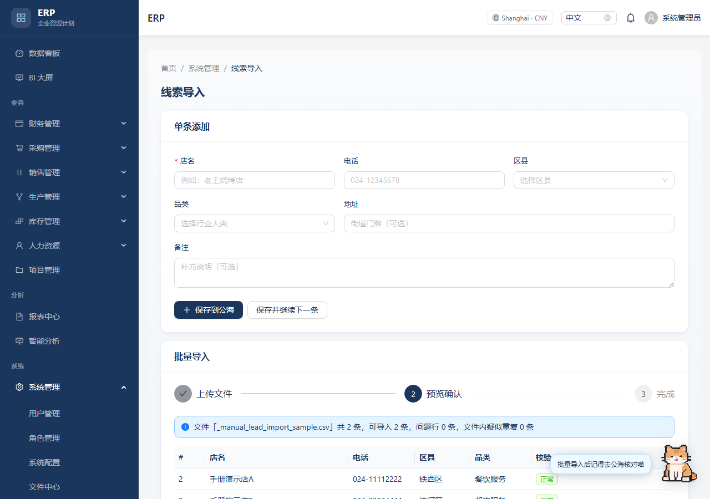
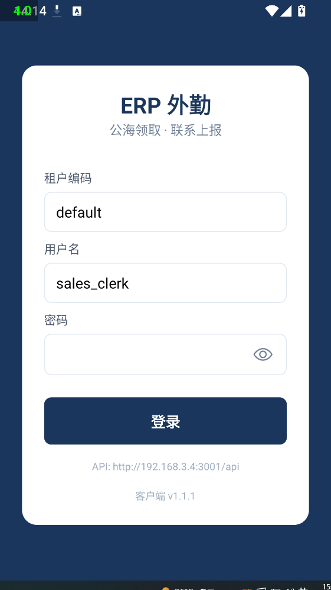
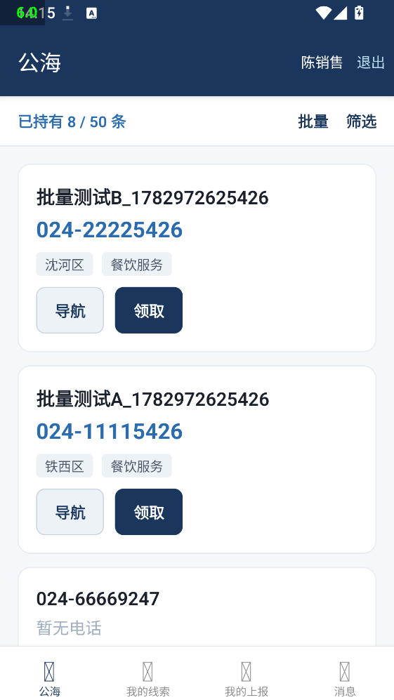

# ERP 企业资源计划系统

基于 **NestJS + React + PostgreSQL** 的全栈 ERP，覆盖采购、销售、库存、生产、财务、人力、项目、报表与系统管理等模块；配套 **外勤移动端**（`mobile-field`，Expo / React Native）。支持多租户、RBAC 权限、Redis 缓存、MinIO 文件存储、WebSocket 通知、区块链库存追溯锚点及中英文界面。

## 功能概览

| 模块 | 能力 |
|------|------|
| 采购 | 供应商、采购申请、采购订单、收货验收 |
| 销售 | 客户、报价、销售订单、发货、售后、公海线索、联系上报与审核 |
| 库存 | 台账、出入库、调拨、盘点、批次追溯 |
| 生产 | BOM、计划、工单、质检 |
| 财务 | 总账、应收应付、固定资产、预算、报表 |
| 人力 | 员工、部门、岗位、考勤、薪资 |
| 报表 | 运营看板、**BI 大屏**（KPI 滚动、线索地图、事件流、订单滚动条）、智能补货分析 |
| 系统 | 用户、角色、权限、租户、审计、文件、**线索导入向导**（模板 / 预览 / 单条录入） |
| **桌面助手** | 右下角像素猫桌宠：路由提示、打字机气泡、快捷入口、可改名 |
| **个人设置** | Header 抽屉：资料、时区、币种、改密、猫名 |
| **外勤 App** | 公海领取（含批量）、联系上报、录音上传、上报审核、消息、地图导航、离线上报、版本更新 |

## 外勤 App（Android / iOS）

面向销售外勤的移动端，与 Web ERP **共用账号与后端 API**。

| 平台 | 当前版本 | 获取方式 |
|------|----------|----------|
| **Android** | v1.1.1（versionCode 5） | [Release 下载 APK](https://github.com/xyc667/erp-system/releases/download/field-v1.1.1/erp-field-latest.apk) · [Release 页](https://github.com/xyc667/erp-system/releases/tag/field-v1.1.1) |
| **iOS** | 内测版 | TestFlight（见 [iOS 部署方案](docs/FIELD_APP_IOS_SETUP.md)） |

**Android 安装：** 下载 APK 后安装；若提示签名冲突，先卸载旧版。租户编码默认 `default`，演示账号见 seed 配置。

**自行构建 APK（Windows）：**

```bash
cd mobile-field
cp .env.example .env    # 设置 EXPO_PUBLIC_API_URL 为你的后端地址
npm run build:apk
# 产物复制到 backend/public/apk/erp-field-latest.apk
```

**开发联调：**

```bash
npm run start:backend          # 项目根目录，需配置 backend/.env
cd mobile-field && npm run android
```

| 文档 | 说明 |
|------|------|
| [docs/FIELD_APP_USER_GUIDE.md](docs/FIELD_APP_USER_GUIDE.md) | 安装、操作、FAQ |
| [mobile-field/README.md](mobile-field/README.md) | 开发者构建与联调 |
| [docs/FIELD_APP_IOS_SETUP.md](docs/FIELD_APP_IOS_SETUP.md) | EAS 云构建 + TestFlight |
| [docs/CLOUD_DEPLOYMENT.md](docs/CLOUD_DEPLOYMENT.md) | 上云后外勤 App 配置 |

版本检查接口（无需登录）：`GET /api/app/field-android/latest`、`GET /api/app/field-ios/latest`

## 界面预览

### BI 大屏（`/bi-screen`）

全屏运营数据展示，30 秒自动刷新。除销售趋势、订单状态、销采对比外，还包括：

- **KPI 数字滚动动画**
- **沈阳线索分布地图**（区县气泡 + POI 散点，数据来自公海线索）
- **业务事件流**（销售/采购订单、线索转化、系统操作）
- **底部订单滚动条**（近期销采订单）

数据接口：`GET /api/dashboard/stats`（统计）、`GET /api/dashboard/feed`（地图 / 事件 / 订单，30s 缓存）。

### 线索导入（`/system/leads/import`）

| 方式 | 说明 |
|------|------|
| **单条添加** | 表单录入店名、电话、区县、品类等，支持「保存并继续下一条」 |
| **批量导入** | 下载 CSV 模板 → 拖拽上传 → **预览校验** → 确认导入 |
| 高级 | JSON 数组（折叠面板，供脚本对接） |

支持**中文表头**（店名、电话、区县…）与英文表头；仅店名必填。CSV 解析与校验见 `frontend/src/utils/leadImportParse.ts`。




### 外勤 App（Android）

与 Web 共用账号；Android 可直接安装 APK，iPhone 可用 Web/PWA 或 TestFlight 内测（见 [iOS 部署方案](docs/FIELD_APP_IOS_SETUP.md)）。

| 截图 | 说明 |
|------|------|
|  | 登录 |
|  | 公海 |

### 登录页


### 数据看板


### BI 大屏


### 采购管理


### 智能分析


### 角色与权限


### 公海线索与联系上报


## 环境要求

- Node.js >= 18
- PostgreSQL >= 16（或 Docker Compose 一键启动）

## 快速开始

### 1. 安装依赖

```bash
npm run install:all
```

### 2. 配置环境变量

```bash
cp backend/.env.example backend/.env
cp frontend/.env.example frontend/.env   # 可选，开发模式可走 Vite 代理
```

编辑 `backend/.env`：设置 `DATABASE_URL`、`JWT_SECRET`，以及 seed 用的演示账号密码（**生产环境务必修改**）。

### 3. 初始化数据库

**Windows：**

```powershell
.\scripts\init-db.ps1
```

**Linux / macOS：**

```bash
chmod +x scripts/init-db.sh && ./scripts/init-db.sh
```

或手动：

```bash
cd backend
npx prisma generate
npx prisma migrate deploy
npm run seed
```

seed 完成后，控制台会输出已创建的管理员与演示用户名；密码以你在 `.env` 中配置的 `SEED_ADMIN_PASSWORD` / `SEED_DEMO_PASSWORD` 为准。

### 4. 启动开发服务

```bash
# 终端 1 — 后端 API（默认 http://localhost:3000，可在 backend/.env 改 PORT）
npm run start:backend

# 终端 2 — 前端（默认 http://localhost:5173）
npm run start:frontend
```

开发环境 Swagger 文档：http://localhost:3000/api

常用脚本：

| 命令 | 说明 |
|------|------|
| `npm run build:field-apk` | 构建外勤 Android Release APK |
| `npm run docs:pdf` | 导出 Web / 外勤使用说明 PDF |
| `npm run docs:verify:field-version` | 冒烟测试 App 版本接口 |
| `node scripts/test-system-flow.mjs` | 系统管理 + 线索导入 API 冒烟 |
| `node scripts/import-shenyang-poi.mjs` | 从高德/OSM 导入沈阳 POI 公海数据 |

## 近期更新

- **BI 大屏**：科技风布局、全屏修复、地图 / 事件流 / 订单滚动、数字动画
- **线索导入**：三步向导、CSV 模板、预览校验、单条表单
- **桌面助手**：像素猫精灵图、路由台词、打字机、可拖拽
- **个人设置**：`PATCH /api/auth/me`、`PATCH /api/auth/me/password`
- **UI 统一**：PageCard / PageEmpty / 看板欢迎区、侧栏与空状态优化

## Docker 部署

```bash
npm run docker:up
```

| 服务 | 地址 |
|------|------|
| 前端 | http://localhost:8080 |
| 后端 API | http://localhost:3000 |
| PostgreSQL | localhost:5432 |

详见 [docs/DEPLOYMENT.md](docs/DEPLOYMENT.md)（含 Kubernetes、Redis、MinIO、性能测试说明）。  
**云服务器生产部署：** [docs/CLOUD_DEPLOYMENT.md](docs/CLOUD_DEPLOYMENT.md)

## 文档

| 文档 | 说明 |
|------|------|
| [docs/USER_GUIDE.md](docs/USER_GUIDE.md) | 业务流程与 FAQ |
| [docs/USER_MANUAL.md](docs/USER_MANUAL.md) | 详细使用说明（含财务、公海线索等分模块步骤与 FAQ） |
| [docs/FIELD_APP_USER_GUIDE.md](docs/FIELD_APP_USER_GUIDE.md) | **外勤 App**（Android / iOS）安装与操作说明 |
| [docs/FIELD_APP_IOS_SETUP.md](docs/FIELD_APP_IOS_SETUP.md) | **外勤 iOS 部署方案**（EAS + TestFlight + 云 API） |
| [docs/DEPLOYMENT.md](docs/DEPLOYMENT.md) | 部署指南（Docker / K8s） |
| [docs/CLOUD_DEPLOYMENT.md](docs/CLOUD_DEPLOYMENT.md) | **云服务器生产部署**（HTTPS、外勤 App） |

本地生成 PDF：`npm run docs:pdf` → `docs/USER_MANUAL.pdf` + `docs/FIELD_APP_USER_GUIDE.pdf`

## 测试

```bash
npm test                  # 前后端单元测试
npm run verify:migrations # 校验迁移文件
npm run test:e2e          # Playwright 端到端（需先 test:e2e:install）
npm run test:perf         # 性能冒烟（需后端运行中）
```

## 项目结构

```
erp/
├── backend/          # NestJS API + Prisma
├── frontend/         # React + Vite + Ant Design
├── mobile-field/     # 外勤 App（Expo / React Native，Android + iOS）
├── docker/           # Docker Compose（含生产 compose）
├── k8s/              # Kubernetes 清单
├── docs/             # 用户、外勤、部署文档
├── e2e/              # Playwright 测试
├── scripts/          # 数据库初始化、PDF 导出、手册截图
└── .github/workflows # CI 流水线
```

> APK 文件位于 `backend/public/apk/erp-field-latest.apk`（Git LFS，需 `git push` 同步）。**推荐从 [Releases](https://github.com/xyc667/erp-system/releases) 下载。** `.env`、keystore、公海 POI 数据 **不纳入仓库**。

## 权限模型

- **后端**：`@RequirePermissions` + `PermissionsGuard`
- **前端**：侧栏菜单过滤 + 路由级 `PermissionRoute`（403 页）

## 声明

禁止商业用途！！！

## 许可证

MIT
