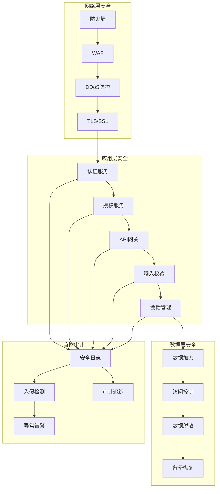
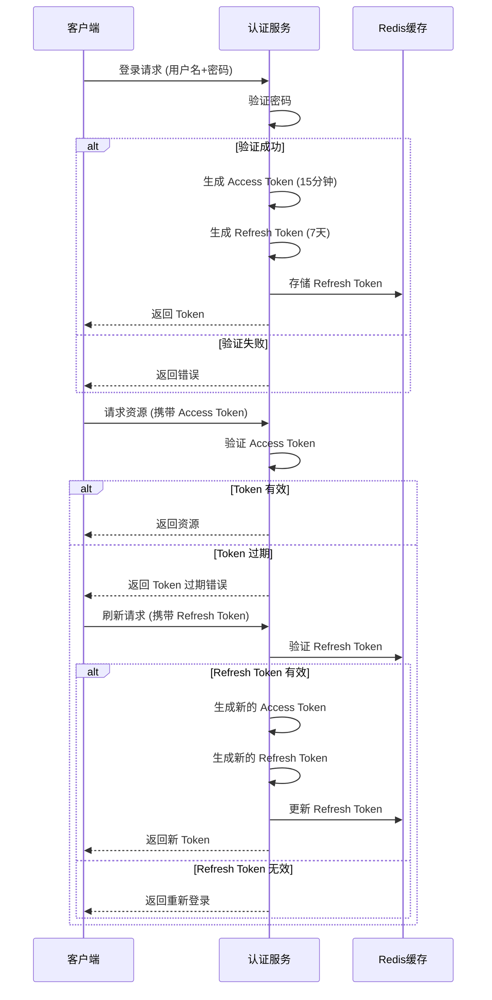
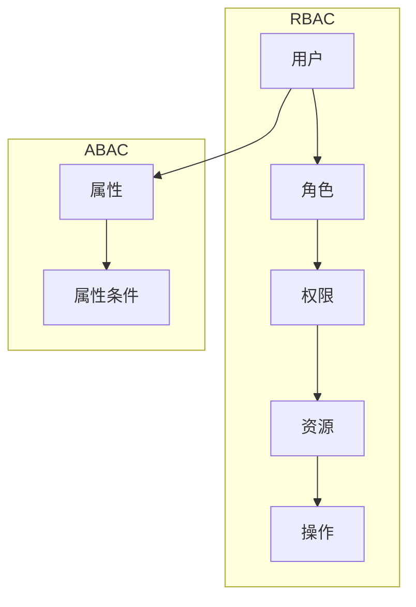
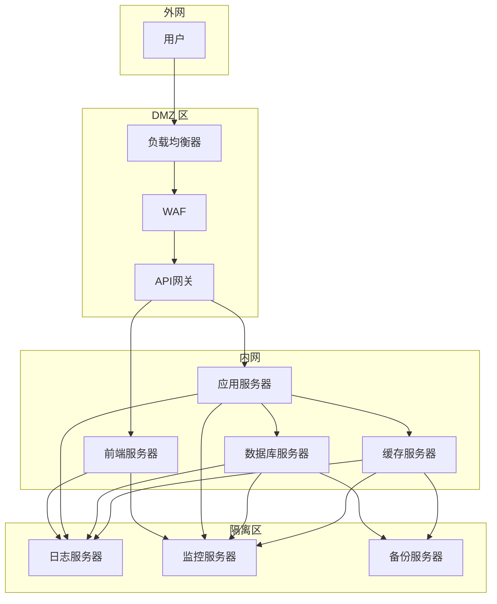
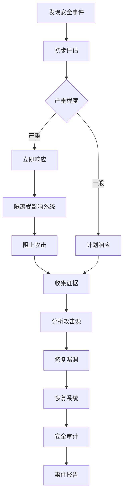

# ERP 系统安全架构设计文档

## 1. 安全架构总览



## 2. 认证安全

### 2.1 认证机制

| 认证方式 | 描述 | 使用场景 |
|----------|------|----------|
| JWT Token | 无状态认证，Token 包含用户信息 | API 接口认证 |
| Refresh Token | 定期刷新 Access Token | 会话延长 |
| 多因素认证 (MFA) | 密码 + 验证码/指纹/硬件令牌 | 敏感操作、首次登录 |
| SSO | 单点登录，集成企业身份提供商 | 企业级集成 |

### 2.2 Token 生命周期管理



### 2.3 密码安全

- **加密算法**：BCrypt（成本因子 12）
- **密码策略**：
  - 最小长度 12 位
  - 必须包含大小写字母、数字、特殊字符
  - 禁止使用常见密码
  - 定期强制修改（90天）
- **密码重置**：
  - 邮箱/短信验证码验证
  - 重置链接有效期 30 分钟
  - 记录重置历史

## 3. 授权安全

### 3.1 权限模型 (RBAC + ABAC)



### 3.2 权限矩阵

| 角色 | 用户管理 | 财务模块 | 采购模块 | 销售模块 | 生产模块 | 库存模块 | 人力资源 | 系统配置 |
|------|----------|----------|----------|----------|----------|----------|----------|----------|
| 系统管理员 | 全部 | 全部 | 全部 | 全部 | 全部 | 全部 | 全部 | 全部 |
| 财务总监 | 无 | 全部 | 查看 | 查看 | 查看 | 查看 | 无 | 无 |
| 财务专员 | 无 | 操作 | 无 | 无 | 无 | 无 | 无 | 无 |
| 采购总监 | 无 | 查看 | 全部 | 查看 | 查看 | 查看 | 无 | 无 |
| 采购专员 | 无 | 无 | 操作 | 无 | 无 | 无 | 无 | 无 |
| 销售总监 | 无 | 查看 | 查看 | 全部 | 查看 | 查看 | 无 | 无 |
| 销售专员 | 无 | 无 | 无 | 操作 | 无 | 无 | 无 | 无 |
| 生产经理 | 无 | 查看 | 查看 | 查看 | 全部 | 查看 | 无 | 无 |
| 仓库管理员 | 无 | 无 | 无 | 无 | 查看 | 操作 | 无 | 无 |
| HR经理 | 无 | 查看 | 无 | 无 | 无 | 无 | 全部 | 无 |
| 普通员工 | 无 | 无 | 无 | 无 | 无 | 无 | 查看个人 | 无 |

### 3.3 数据权限

- **行级权限**：根据部门、公司、项目等维度限制数据可见性
- **字段级权限**：隐藏敏感字段（如薪资、身份证号）
- **操作权限**：细粒度控制增删改查操作

## 4. 数据安全

### 4.1 数据加密

| 层级 | 加密方式 | 说明 |
|------|----------|------|
| 传输层 | HTTPS (TLS 1.3) | 所有数据传输加密 |
| 存储层 | AES-256 | 敏感数据字段加密存储 |
| 数据库 | Transparent Data Encryption | 数据库文件加密 |
| 备份 | GPG | 备份文件加密 |

### 4.2 敏感数据分类

| 级别 | 数据类型 | 处理方式 |
|------|----------|----------|
| 机密 | 密码、密钥、证书 | 加密存储，禁止明文显示 |
| 敏感 | 身份证号、银行卡号、薪资 | 加密存储，脱敏显示 |
| 内部 | 客户信息、业务数据 | 访问控制，审计追踪 |
| 公开 | 公开产品信息 | 基本访问控制 |

### 4.3 数据脱敏规则

- **身份证号**：显示前6位 + **** + 后4位
- **银行卡号**：显示 **** + 后4位
- **手机号**：显示前3位 + **** + 后4位
- **邮箱**：显示前缀前2位 + **** + @域名
- **姓名**：显示姓 + **

## 5. 应用安全

### 5.1 输入校验

| 攻击类型 | 防护措施 |
|----------|----------|
| SQL 注入 | 参数化查询、ORM 框架 |
| XSS | 输入过滤、输出转义、CSP 策略 |
| CSRF | Token 验证、SameSite Cookie |
| 命令注入 | 输入白名单、禁止执行系统命令 |
| 文件上传 | 文件类型校验、文件大小限制、存储隔离 |

### 5.2 API 安全

- **接口限流**：基于 IP/用户的速率限制
- **接口签名**：请求参数签名验证
- **版本控制**：API 版本管理
- **错误处理**：统一错误响应，隐藏敏感信息
- **文档权限**：Swagger 文档访问控制

### 5.3 会话安全

- **会话超时**：30 分钟无操作自动退出
- **并发登录限制**：同一账号最多登录 5 个设备
- **会话固定攻击防护**：登录后更换 Session ID
- **设备识别**：记录登录设备信息，异常设备告警

## 6. 网络安全

### 6.1 网络架构



### 6.2 安全组规则

| 端口 | 服务 | 允许来源 |
|------|------|----------|
| 443 | HTTPS | 0.0.0.0/0 |
| 80 | HTTP (重定向) | 0.0.0.0/0 |
| 5432 | PostgreSQL | 内网 IP 段 |
| 6379 | Redis | 内网 IP 段 |
| 5672 | RabbitMQ | 内网 IP 段 |
| 9200 | Elasticsearch | 内网 IP 段 |

## 7. 审计日志

### 7.1 日志分类

| 类别 | 内容 | 保留周期 |
|------|------|----------|
| 认证日志 | 登录、登出、Token 刷新、MFA 验证 | 90天 |
| 操作日志 | 数据增删改查、权限变更、配置修改 | 180天 |
| 安全日志 | 异常登录、权限拒绝、攻击检测 | 365天 |
| 系统日志 | 服务启动、错误、性能指标 | 30天 |

### 7.2 日志格式

```json
{
  "timestamp": "2024-01-15T10:30:00Z",
  "trace_id": "abc123",
  "user_id": "user-123",
  "username": "zhangsan",
  "role": "财务专员",
  "action": "CREATE",
  "resource": "purchase_order",
  "resource_id": "po-456",
  "ip_address": "192.168.1.100",
  "user_agent": "Mozilla/5.0...",
  "result": "SUCCESS",
  "detail": "{\"order_no\": \"PO-20240115-001\"}"
}
```

### 7.3 审计追踪

- **操作追溯**：支持按用户、时间、操作类型查询
- **数据变更历史**：记录数据每次变更的前后值
- **责任认定**：明确操作人、操作时间、操作内容

## 8. 安全监控与告警

### 8.1 监控指标

| 指标 | 告警阈值 | 告警级别 |
|------|----------|----------|
| 连续失败登录次数 | > 5 次/分钟 | 警告 |
| 单 IP 请求速率 | > 100 次/秒 | 严重 |
| Token 刷新频率 | > 10 次/分钟 | 警告 |
| 权限拒绝次数 | > 10 次/分钟 | 警告 |
| 数据库连接数 | > 80% | 警告 |
| 服务器 CPU 使用率 | > 90% | 严重 |
| 服务器内存使用率 | > 90% | 严重 |

### 8.2 告警方式

| 方式 | 适用场景 |
|------|----------|
| 邮件 | 常规告警 |
| 短信 | 紧急告警 |
| 企业微信/钉钉 | 实时通知 |
| 电话 | 严重告警 |

### 8.3 入侵检测

- **异常登录检测**：异地登录、非工作时间登录、新设备登录
- **异常操作检测**：批量数据操作、敏感数据访问、权限变更
- **异常流量检测**：DDoS 攻击、SQL 注入尝试、XSS 攻击

## 9. 安全运维

### 9.1 定期安全检查

| 检查项 | 频率 | 责任人 |
|--------|------|--------|
| 漏洞扫描 | 每月 | 安全工程师 |
| 渗透测试 | 每季度 | 安全工程师 |
| 代码审计 | 每季度 | 开发团队 |
| 配置审计 | 每月 | 运维团队 |

### 9.2 应急响应流程



### 9.3 备份策略

| 备份类型 | 频率 | 保留周期 | 存储位置 |
|----------|------|----------|----------|
| 增量备份 | 每小时 | 7天 | 本地 |
| 全量备份 | 每日 | 30天 | 本地 + 异地 |
| 归档备份 | 每月 | 7年 | 异地加密存储 |

## 10. 合规要求

### 10.1 数据保护法规

- **GDPR**：欧盟数据保护条例
- **网络安全法**：中国网络安全法
- **个人信息保护法**：中国个人信息保护法
- **等保 2.0**：网络安全等级保护 2.0

### 10.2 合规措施

- **数据分类分级**：按法规要求对数据进行分类
- **数据最小化**：仅收集必要数据
- **用户授权**：明确告知用户数据用途，获取授权
- **跨境数据传输**：符合法规要求，进行安全评估
- **数据删除**：支持用户请求删除个人数据
- **隐私影响评估**：定期进行隐私影响评估

## 11. 安全开发规范

### 11.1 编码规范

- **输入验证**：所有外部输入必须进行验证
- **输出编码**：所有输出必须进行编码
- **错误处理**：不要暴露系统内部信息
- **密码处理**：禁止明文存储密码
- **敏感信息**：禁止在日志中记录敏感信息

### 11.2 安全测试

| 测试类型 | 工具 | 说明 |
|----------|------|------|
| 静态代码分析 | SonarQube | 检测代码中的安全漏洞 |
| 动态测试 | OWASP ZAP | 运行时安全检测 |
| 依赖扫描 | Snyk | 检测第三方依赖漏洞 |
| 渗透测试 | Burp Suite | 模拟攻击测试 |

### 11.3 安全培训

- **新员工培训**：入职安全培训
- **定期培训**：每季度安全意识培训
- **专项培训**：针对开发人员的安全编码培训