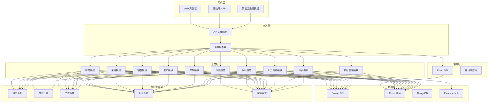
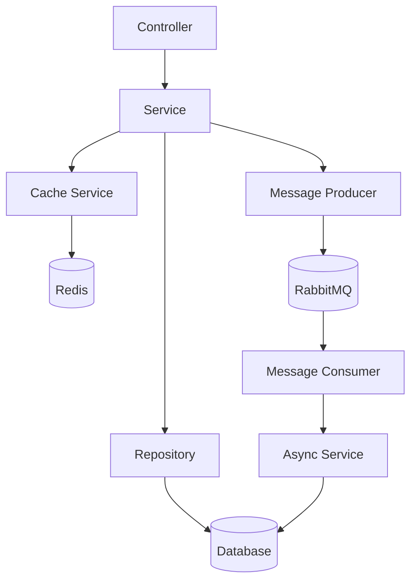
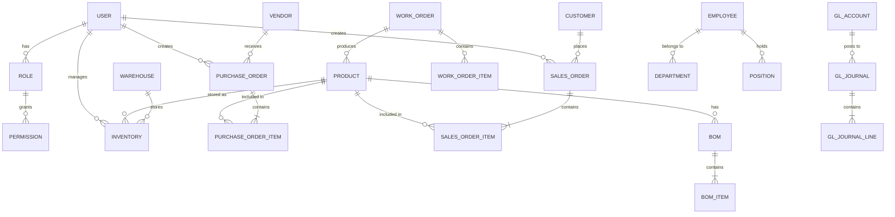
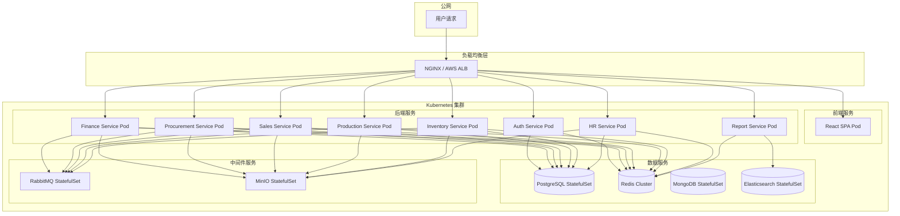

# ERP 系统技术架构设计文档

## 1. 架构设计



## 2. 技术选型

### 2.1 前端技术栈

| 分类 | 技术 | 版本 | 说明 |
|------|------|------|------|
| 框架 | React | 18.x | 核心前端框架，支持并发渲染 |
| 状态管理 | Zustand | 4.x | 轻量级状态管理，简化数据流 |
| UI 组件 | Ant Design | 5.x | 企业级 UI 组件库 |
| 图表 | ECharts | 5.x | 强大的数据可视化能力 |
| 路由 | React Router | 6.x | 前端路由管理 |
| 构建工具 | Vite | 6.x | 快速构建工具 |
| CSS | TailwindCSS | 3.x | 原子化 CSS 框架 |
| 国际化 | i18next | 23.x | 多语言支持 |
| 表单 | React Hook Form | 7.x | 高性能表单处理 |

### 2.2 后端技术栈

| 分类 | 技术 | 版本 | 说明 |
|------|------|------|------|
| 框架 | NestJS | 10.x | Node.js 企业级框架，支持 TypeScript |
| ORM | Prisma | 5.x | 现代数据库 ORM 工具 |
| 认证 | Auth0 / Passport | - | OAuth2.0 / JWT 认证 |
| API 文档 | Swagger | 6.x | 自动生成 API 文档 |
| 消息队列 | RabbitMQ | 3.x | 异步消息处理 |
| 定时任务 | BullMQ | 5.x | 分布式任务队列 |

### 2.3 数据库技术栈

| 分类 | 技术 | 版本 | 说明 |
|------|------|------|------|
| 关系型数据库 | PostgreSQL | 16.x | 主数据库，支持复杂查询和事务 |
| 缓存 | Redis | 7.x | 会话缓存、数据缓存、分布式锁 |
| 文档数据库 | MongoDB | 7.x | 存储非结构化数据（日志、配置等） |
| 搜索引擎 | Elasticsearch | 8.x | 全文搜索、报表数据分析 |

### 2.4 基础设施技术栈

| 分类 | 技术 | 说明 |
|------|------|------|
| 容器化 | Docker | 应用容器化部署 |
| 编排 | Kubernetes | 容器编排和管理 |
| CI/CD | GitHub Actions | 持续集成和部署 |
| 日志 | ELK Stack | 日志收集、存储和分析 |
| 监控 | Prometheus + Grafana | 性能监控和告警 |
| 文件存储 | MinIO / AWS S3 | 对象存储服务 |

## 3. 路由定义

### 3.1 前端路由

| 路由 | 页面 | 模块 |
|------|------|------|
| `/` | 系统首页 | 仪表盘 |
| `/login` | 登录页面 | 认证 |
| `/dashboard` | 数据看板 | 仪表盘 |
| `/finance/gl` | 总账管理 | 财务 |
| `/finance/ar` | 应收管理 | 财务 |
| `/finance/ap` | 应付管理 | 财务 |
| `/finance/fixed-asset` | 固定资产 | 财务 |
| `/finance/report` | 财务报表 | 财务 |
| `/procurement/vendor` | 供应商管理 | 采购 |
| `/procurement/request` | 采购申请 | 采购 |
| `/procurement/order` | 采购订单 | 采购 |
| `/procurement/receive` | 收货验收 | 采购 |
| `/sales/customer` | 客户管理 | 销售 |
| `/sales/quote` | 销售报价 | 销售 |
| `/sales/order` | 销售订单 | 销售 |
| `/sales/delivery` | 发货管理 | 销售 |
| `/sales/service` | 售后服务 | 销售 |
| `/production/bom` | BOM 管理 | 生产 |
| `/production/plan` | 生产计划 | 生产 |
| `/production/work-order` | 工单管理 | 生产 |
| `/production/quality` | 质量管理 | 生产 |
| `/inventory/stock` | 库存台账 | 库存 |
| `/inventory/inout` | 出入库管理 | 库存 |
| `/inventory/alert` | 库存预警 | 库存 |
| `/hr/employee` | 员工管理 | 人力资源 |
| `/hr/attendance` | 考勤管理 | 人力资源 |
| `/hr/salary` | 薪资管理 | 人力资源 |
| `/hr/performance` | 绩效管理 | 人力资源 |
| `/project` | 项目管理 | 项目 |
| `/report` | 报表中心 | 报表 |
| `/system/user` | 用户管理 | 系统 |
| `/system/role` | 角色管理 | 系统 |
| `/system/config` | 系统配置 | 系统 |

### 3.2 API 路由前缀

| 模块 | API 前缀 | 说明 |
|------|----------|------|
| 认证 | `/api/auth` | 登录、注册、Token 刷新 |
| 用户 | `/api/users` | 用户管理 |
| 角色权限 | `/api/roles` | 角色和权限管理 |
| 财务 | `/api/finance` | 财务模块 API |
| 采购 | `/api/procurement` | 采购模块 API |
| 销售 | `/api/sales` | 销售模块 API |
| 生产 | `/api/production` | 生产模块 API |
| 库存 | `/api/inventory` | 库存模块 API |
| 人力资源 | `/api/hr` | 人力资源模块 API |
| 项目管理 | `/api/project` | 项目管理 API |
| 报表 | `/api/report` | 报表数据 API |
| 系统 | `/api/system` | 系统配置 API |

## 4. API 定义

### 4.1 认证接口

```typescript
interface LoginRequest {
  username: string;
  password: string;
}

interface LoginResponse {
  access_token: string;
  refresh_token: string;
  expires_in: number;
  user: {
    id: string;
    username: string;
    name: string;
    role: string;
  };
}

interface RefreshTokenRequest {
  refresh_token: string;
}

interface RefreshTokenResponse {
  access_token: string;
  refresh_token: string;
  expires_in: number;
}
```

### 4.2 用户接口

```typescript
interface User {
  id: string;
  username: string;
  name: string;
  email: string;
  phone: string;
  role_id: string;
  status: 'active' | 'inactive';
  created_at: Date;
  updated_at: Date;
}

interface CreateUserRequest {
  username: string;
  name: string;
  email: string;
  phone?: string;
  role_id: string;
  password: string;
}

interface UpdateUserRequest {
  name?: string;
  email?: string;
  phone?: string;
  role_id?: string;
  status?: 'active' | 'inactive';
}
```

### 4.3 采购订单接口

```typescript
interface PurchaseOrder {
  id: string;
  order_no: string;
  vendor_id: string;
  vendor_name: string;
  items: PurchaseOrderItem[];
  total_amount: number;
  status: 'draft' | 'approved' | 'sent' | 'confirmed' | 'completed' | 'cancelled';
  created_by: string;
  approved_by?: string;
  created_at: Date;
  updated_at: Date;
}

interface PurchaseOrderItem {
  id: string;
  product_id: string;
  product_name: string;
  quantity: number;
  unit_price: number;
  amount: number;
}

interface CreatePurchaseOrderRequest {
  vendor_id: string;
  items: {
    product_id: string;
    quantity: number;
    unit_price: number;
  }[];
}
```

### 4.4 销售订单接口

```typescript
interface SalesOrder {
  id: string;
  order_no: string;
  customer_id: string;
  customer_name: string;
  items: SalesOrderItem[];
  total_amount: number;
  status: 'draft' | 'approved' | 'shipped' | 'delivered' | 'completed' | 'cancelled';
  created_by: string;
  created_at: Date;
  updated_at: Date;
}

interface SalesOrderItem {
  id: string;
  product_id: string;
  product_name: string;
  quantity: number;
  unit_price: number;
  amount: number;
}
```

### 4.5 库存接口

```typescript
interface Inventory {
  id: string;
  product_id: string;
  product_name: string;
  warehouse_id: string;
  warehouse_name: string;
  quantity: number;
  unit: string;
  batch_no?: string;
  expiry_date?: Date;
  created_at: Date;
  updated_at: Date;
}

interface StockMovement {
  id: string;
  type: 'purchase_in' | 'sales_out' | 'transfer' | 'adjustment';
  product_id: string;
  warehouse_id: string;
  quantity: number;
  reference_no: string;
  created_by: string;
  created_at: Date;
}
```

## 5. 服务架构图



### 5.1 分层架构说明

| 层级 | 职责 | 说明 |
|------|------|------|
| Controller | 处理 HTTP 请求 | 路由定义、参数校验、响应封装 |
| Service | 业务逻辑处理 | 核心业务逻辑、事务管理、调用其他服务 |
| Repository | 数据访问层 | 数据库 CRUD 操作、查询优化 |
| Entity | 数据模型定义 | 数据库表映射、字段定义 |
| DTO | 数据传输对象 | 请求/响应数据结构定义 |
| Middleware | 中间件 | 认证、日志、异常处理 |
| Module | 模块组织 | 功能模块划分、依赖注入 |

## 6. 数据模型

### 6.1 核心实体关系图



### 6.2 关键表设计

#### 用户表 (users)

| 字段 | 类型 | 约束 | 说明 |
|------|------|------|------|
| id | UUID | PRIMARY KEY | 用户唯一标识 |
| username | VARCHAR(50) | UNIQUE NOT NULL | 用户名 |
| password | VARCHAR(255) | NOT NULL | 加密后的密码 |
| name | VARCHAR(100) | NOT NULL | 真实姓名 |
| email | VARCHAR(100) | UNIQUE | 邮箱 |
| phone | VARCHAR(20) | | 手机号 |
| role_id | UUID | FOREIGN KEY | 角色 ID |
| status | VARCHAR(20) | DEFAULT 'active' | 状态 |
| created_at | TIMESTAMP | DEFAULT NOW() | 创建时间 |
| updated_at | TIMESTAMP | DEFAULT NOW() | 更新时间 |

#### 角色表 (roles)

| 字段 | 类型 | 约束 | 说明 |
|------|------|------|------|
| id | UUID | PRIMARY KEY | 角色唯一标识 |
| name | VARCHAR(50) | UNIQUE NOT NULL | 角色名称 |
| description | VARCHAR(255) | | 角色描述 |
| created_at | TIMESTAMP | DEFAULT NOW() | 创建时间 |
| updated_at | TIMESTAMP | DEFAULT NOW() | 更新时间 |

#### 权限表 (permissions)

| 字段 | 类型 | 约束 | 说明 |
|------|------|------|------|
| id | UUID | PRIMARY KEY | 权限唯一标识 |
| name | VARCHAR(50) | UNIQUE NOT NULL | 权限名称 |
| code | VARCHAR(50) | UNIQUE NOT NULL | 权限编码 |
| module | VARCHAR(50) | NOT NULL | 所属模块 |
| description | VARCHAR(255) | | 权限描述 |

#### 采购订单表 (purchase_orders)

| 字段 | 类型 | 约束 | 说明 |
|------|------|------|------|
| id | UUID | PRIMARY KEY | 订单唯一标识 |
| order_no | VARCHAR(50) | UNIQUE NOT NULL | 订单编号 |
| vendor_id | UUID | FOREIGN KEY NOT NULL | 供应商 ID |
| total_amount | DECIMAL(18,2) | NOT NULL | 总金额 |
| status | VARCHAR(20) | DEFAULT 'draft' | 订单状态 |
| created_by | UUID | FOREIGN KEY NOT NULL | 创建人 |
| approved_by | UUID | FOREIGN KEY | 审批人 |
| approved_at | TIMESTAMP | | 审批时间 |
| created_at | TIMESTAMP | DEFAULT NOW() | 创建时间 |
| updated_at | TIMESTAMP | DEFAULT NOW() | 更新时间 |

#### 销售订单表 (sales_orders)

| 字段 | 类型 | 约束 | 说明 |
|------|------|------|------|
| id | UUID | PRIMARY KEY | 订单唯一标识 |
| order_no | VARCHAR(50) | UNIQUE NOT NULL | 订单编号 |
| customer_id | UUID | FOREIGN KEY NOT NULL | 客户 ID |
| total_amount | DECIMAL(18,2) | NOT NULL | 总金额 |
| status | VARCHAR(20) | DEFAULT 'draft' | 订单状态 |
| created_by | UUID | FOREIGN KEY NOT NULL | 创建人 |
| created_at | TIMESTAMP | DEFAULT NOW() | 创建时间 |
| updated_at | TIMESTAMP | DEFAULT NOW() | 更新时间 |

#### 库存表 (inventory)

| 字段 | 类型 | 约束 | 说明 |
|------|------|------|------|
| id | UUID | PRIMARY KEY | 库存记录唯一标识 |
| product_id | UUID | FOREIGN KEY NOT NULL | 产品 ID |
| warehouse_id | UUID | FOREIGN KEY NOT NULL | 仓库 ID |
| quantity | DECIMAL(18,4) | NOT NULL | 数量 |
| unit | VARCHAR(20) | NOT NULL | 单位 |
| batch_no | VARCHAR(50) | | 批次号 |
| expiry_date | DATE | | 有效期 |
| created_at | TIMESTAMP | DEFAULT NOW() | 创建时间 |
| updated_at | TIMESTAMP | DEFAULT NOW() | 更新时间 |

#### 产品表 (products)

| 字段 | 类型 | 约束 | 说明 |
|------|------|------|------|
| id | UUID | PRIMARY KEY | 产品唯一标识 |
| code | VARCHAR(50) | UNIQUE NOT NULL | 产品编码 |
| name | VARCHAR(200) | NOT NULL | 产品名称 |
| category_id | UUID | FOREIGN KEY | 分类 ID |
| unit | VARCHAR(20) | NOT NULL | 单位 |
| price | DECIMAL(18,2) | | 参考价格 |
| description | TEXT | | 产品描述 |
| created_at | TIMESTAMP | DEFAULT NOW() | 创建时间 |
| updated_at | TIMESTAMP | DEFAULT NOW() | 更新时间 |

#### 总账科目表 (gl_accounts)

| 字段 | 类型 | 约束 | 说明 |
|------|------|------|------|
| id | UUID | PRIMARY KEY | 科目唯一标识 |
| code | VARCHAR(50) | UNIQUE NOT NULL | 科目编码 |
| name | VARCHAR(200) | NOT NULL | 科目名称 |
| type | VARCHAR(20) | NOT NULL | 科目类型 |
| parent_id | UUID | FOREIGN KEY | 上级科目 |
| description | VARCHAR(255) | | 科目描述 |

#### 凭证表 (gl_journals)

| 字段 | 类型 | 约束 | 说明 |
|------|------|------|------|
| id | UUID | PRIMARY KEY | 凭证唯一标识 |
| journal_no | VARCHAR(50) | UNIQUE NOT NULL | 凭证编号 |
| date | DATE | NOT NULL | 凭证日期 |
| type | VARCHAR(20) | NOT NULL | 凭证类型 |
| status | VARCHAR(20) | DEFAULT 'draft' | 状态 |
| created_by | UUID | FOREIGN KEY NOT NULL | 创建人 |
| approved_by | UUID | FOREIGN KEY | 审批人 |
| created_at | TIMESTAMP | DEFAULT NOW() | 创建时间 |

## 7. 部署架构



## 8. 关键设计决策

### 8.1 多租户架构

- **方案**：共享数据库，隔离 Schema
- **说明**：每个租户拥有独立的 Schema，数据隔离性强，便于维护和扩展

### 8.2 事务管理

- **方案**：使用 NestJS 的 Transaction 装饰器 + PostgreSQL 事务
- **说明**：保证复杂业务操作的原子性，支持分布式事务场景

### 8.3 缓存策略

- **方案**：Redis 多级缓存
- **说明**：热点数据缓存（如用户信息、产品信息），会话缓存，分布式锁

### 8.4 消息队列

- **方案**：RabbitMQ
- **说明**：异步处理非实时业务（如邮件通知、数据同步、报表生成）

### 8.5 高可用设计

- **数据库**：PostgreSQL 主从复制 + 自动故障转移
- **缓存**：Redis 集群模式
- **服务**：Kubernetes 自动扩缩容 + 健康检查
- **存储**：MinIO 分布式存储

### 8.6 安全性设计

- **认证**：JWT + Refresh Token 机制
- **权限**：RBAC + ABAC 混合模式
- **数据加密**：传输加密（HTTPS）+ 存储加密（AES-256）
- **审计日志**：全量操作日志记录