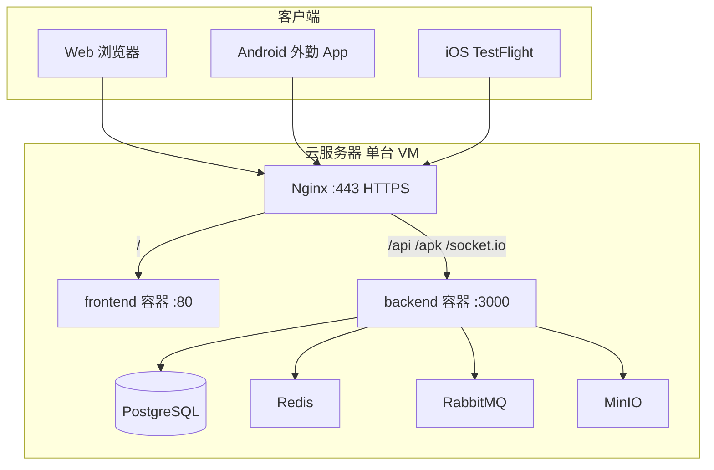

# 云服务器生产部署方案

> 适用：ERP Web + 后端 API + **外勤 App**（Android / iOS）公网访问  
> 本地 / 内网联调见 [DEPLOYMENT.md](DEPLOYMENT.md)；iOS 打包见 [FIELD_APP_IOS_SETUP.md](FIELD_APP_IOS_SETUP.md)

---

## 1. 目标与架构

销售在外用 4G/5G、Web 在浏览器、外勤 App 在任意网络，均通过 **同一域名 + HTTPS** 访问云端 ERP。



| 对外路径 | 用途 |
|----------|------|
| `https://erp.example.com/` | Web ERP 前端 |
| `https://erp.example.com/api/*` | REST API |
| `https://erp.example.com/apk/erp-field-latest.apk` | 外勤 Android 安装包 |
| `https://erp.example.com/socket.io/*` | WebSocket 实时通知 |

**安全原则：** 仅开放 **80 / 443**；数据库、Redis、RabbitMQ、MinIO **不对公网暴露**。

---

## 2. 前置准备

### 2.1 云资源

| 项 | 建议 |
|----|------|
| 云厂商 | 阿里云 / 腾讯云 / 华为云等 |
| 规格 | 2 核 4 GB 起（团队 &lt; 50 人）；用户增多再升配 |
| 系统 | Ubuntu 22.04 LTS 或 Debian 12 |
| 磁盘 | 40 GB+ SSD；数据库与 MinIO 占空间 |
| 带宽 | 3–5 Mbps 起 |

### 2.2 域名与证书

| 项 | 说明 |
|----|------|
| 域名 | 如 `erp.yourcompany.com`（国内云通常需 **ICP 备案**） |
| DNS | A 记录 → 云服务器公网 IP |
| SSL | Let's Encrypt（免费）或云厂商证书 |

### 2.3 安全组 / 防火墙

| 端口 | 策略 |
|------|------|
| 22 | 仅管理员 IP（SSH） |
| 80 | 0.0.0.0/0（HTTP 跳转 HTTPS） |
| 443 | 0.0.0.0/0 |
| 3000、5432、6379 等 | **禁止** 对公网开放 |

### 2.4 服务器软件

```bash
# Ubuntu 示例
sudo apt update && sudo apt install -y git docker.io docker-compose-plugin nginx certbot python3-certbot-nginx
sudo systemctl enable docker nginx
sudo usermod -aG docker $USER
# 重新登录使 docker 组生效
```

---

## 3. 部署步骤概览

| 步骤 | 内容 |
|------|------|
| ① | 克隆代码、配置生产环境变量 |
| ② | `docker compose` 构建并启动全套服务 |
| ③ | 主机 Nginx + Certbot 配置 HTTPS 反向代理 |
| ④ | 上传外勤 APK、配置版本号 |
| ⑤ | 重新打包 App（API 指向域名） |
| ⑥ | 冒烟测试与上线检查 |

---

## 4. 获取代码与配置

```bash
cd /opt
sudo git clone <你的仓库地址> erp
cd erp
```

### 4.1 生产环境变量

复制模板并编辑（**勿提交到 Git**）：

```bash
cp docker/.env.prod.example docker/.env.prod
nano docker/.env.prod
```

关键项说明见 [§5](#5-环境变量说明)。至少修改：

- `APP_PUBLIC_URL` → `https://erp.yourcompany.com`
- `JWT_SECRET`、数据库密码、MinIO 密码
- `CORS_ORIGIN` → 前端域名
- `RUN_SEED` → 首次 `true`，之后 `false`
- `FIELD_ANDROID_*` / `FIELD_IOS_*`

### 4.2 构建并启动

```bash
cd /opt/erp
docker compose -f docker/docker-compose.prod.yml --env-file docker/.env.prod up -d --build
```

首次启动会自动执行 `prisma migrate deploy`；`RUN_SEED=true` 时写入演示数据。

查看状态：

```bash
docker compose -f docker/docker-compose.prod.yml ps
docker compose -f docker/docker-compose.prod.yml logs -f backend
```

---

## 5. 环境变量说明

生产变量集中在 `docker/.env.prod`（由 `docker-compose.prod.yml` 注入 backend）。

| 变量 | 生产示例 | 说明 |
|------|----------|------|
| `APP_PUBLIC_URL` | `https://erp.yourcompany.com` | 版本接口、APK 下载链接前缀 |
| `CORS_ORIGIN` | `https://erp.yourcompany.com` | Web 前端跨域 |
| `JWT_SECRET` | 随机 64 字符+ | **必须修改** |
| `DATABASE_URL` | Compose 内自动拼接 | 使用强密码 |
| `RUN_SEED` | 首次 `true`，此后 `false` | 避免重复灌演示数据 |
| `REDIS_URL` | `redis://redis:6379` | 报表缓存 |
| `MINIO_*` | 见 `.env.prod.example` | 线索录音等文件 |
| `FIELD_ANDROID_VERSION_CODE` | 递增整数 | 对应 App `versionCode` |
| `FIELD_ANDROID_VERSION_NAME` | `1.1.0` | 显示版本号 |
| `FIELD_ANDROID_APK_PATH` | `/apk/erp-field-latest.apk` | 或 CDN 绝对 URL |
| `FIELD_IOS_DOWNLOAD_URL` | TestFlight HTTPS 链接 | iOS 更新入口 |

完整列表见 `backend/.env.example` 与 `docker/.env.prod.example`。

---

## 6. HTTPS 与 Nginx（主机反向代理）

容器内 frontend 监听 `127.0.0.1:8080`，backend 监听 `127.0.0.1:3000`（仅本机）。  
在 **宿主机** Nginx 终止 TLS 并转发。

### 6.1 复制站点配置

```bash
sudo cp /opt/erp/docker/nginx.cloud.conf /etc/nginx/sites-available/erp
sudo sed -i 's/erp.example.com/erp.yourcompany.com/g' /etc/nginx/sites-available/erp
sudo ln -sf /etc/nginx/sites-available/erp /etc/nginx/sites-enabled/
sudo nginx -t
```

### 6.2 申请证书

```bash
sudo certbot --nginx -d erp.yourcompany.com
```

Certbot 会自动修改 Nginx 加入 SSL。证书约 90 天自动续期。

### 6.3 代理路径说明

| location | 转发目标 |
|----------|----------|
| `/` | `http://127.0.0.1:8080`（前端静态） |
| `/api` | `http://127.0.0.1:3000` |
| `/apk/` | `http://127.0.0.1:3000`（外勤 APK） |
| `/socket.io` | `http://127.0.0.1:3000`（WebSocket） |

配置文件：`docker/nginx.cloud.conf`。

---

## 7. 外勤 App 发布

> **iOS 完整方案（EAS + TestFlight + 云 API）：** [FIELD_APP_IOS_SETUP.md](FIELD_APP_IOS_SETUP.md)

### 7.1 与内网部署的差异

| 项目 | 内网（192.168.x.x） | 云服务器 |
|------|---------------------|----------|
| API 地址 | 打包时写 LAN IP | 打包时写 `https://域名/api` |
| Android 安装 | 局域网 APK 链接 | `https://域名/apk/erp-field-latest.apk` |
| **iOS 安装** | TestFlight（与 IP 无关） | **TestFlight 公开链接**（安装包在 Apple，不在本服务器） |
| 网络要求 | 同一 WiFi | 任意有网环境 |
| 协议 | HTTP 可联调 | **必须 HTTPS**（iOS 强制） |

API 地址在 **编译时写入**，改域名后须 **重新构建 App**，旧包不会自动切换。

### 7.2 Android：上传 APK

将 Release APK 放到服务器：

```bash
scp mobile-field/.../erp-field-latest.apk user@服务器:/opt/erp/backend/public/apk/
# 或在服务器本地构建后复制
docker compose -f docker/docker-compose.prod.yml restart backend
```

更新 `docker/.env.prod` 中 `FIELD_ANDROID_VERSION_CODE` / `VERSION_NAME`，重启 backend。

### 7.3 重新打包 App

#### Android（构建机，Windows 亦可）

```bash
cd mobile-field
# .env 或 eas.json / 构建脚本中设置：
# EXPO_PUBLIC_API_URL=https://erp.yourcompany.com/api
npm run build:apk
```

#### iOS（EAS 云构建，无需 Mac）

iOS **不把 IPA 放在云服务器**；服务器只提供 API 和版本元数据（`FIELD_IOS_*`）。

```bash
cd mobile-field
# 1. eas.json production.env 改为你的 HTTPS 域名
# 2. 填写 submit.production.ios（appleId / ascAppId / appleTeamId）

eas build --platform ios --profile production
eas submit --platform ios --profile production --latest
```

TestFlight 外部测试审核通过后，将公开链接写入 `docker/.env.prod`：

```env
FIELD_IOS_DOWNLOAD_URL=https://testflight.apple.com/join/XXXXXXXX
FIELD_IOS_VERSION_CODE=1          # 与 app.config.ts ios.buildNumber 一致
FIELD_IOS_VERSION_NAME=1.1.0
```

销售：App Store 装 TestFlight → 打开邀请链接 → 安装「ERP 外勤」。

详见 **[FIELD_APP_IOS_SETUP.md](FIELD_APP_IOS_SETUP.md)**（Apple 账号、发版 checklist、生产 ATS 配置）。

### 7.4 版本检查接口

```bash
curl -s https://erp.yourcompany.com/api/app/field-android/latest | jq
curl -s https://erp.yourcompany.com/api/app/field-ios/latest | jq
npm run docs:verify:field-version   # 本地对 E2E_API_URL 冒烟（含 Android + iOS）
```

生产包应关闭 HTTP 明文（`app.config.ts` 中移除 `usesCleartextTraffic` / `NSAllowsArbitraryLoads`）。

---

## 8. 数据迁移（从内网迁到云）

若内网已有业务数据：

```bash
# 内网机器导出
pg_dump -h 192.168.3.4 -U postgres -d erp -F c -f erp_backup.dump

# 上传到云服务器后导入（先停止 backend 或确保无写入）
scp erp_backup.dump user@云服务器:/tmp/
docker compose -f docker/docker-compose.prod.yml exec -T postgres \
  pg_restore -U postgres -d erp --clean --if-exists < /tmp/erp_backup.dump
```

MinIO 文件需单独同步（`mc mirror` 或控制台导出上传）。

---

## 9. 运维

### 9.1 日常命令

```bash
cd /opt/erp

# 查看日志
docker compose -f docker/docker-compose.prod.yml logs -f backend

# 更新代码后重新部署
git pull
docker compose -f docker/docker-compose.prod.yml --env-file docker/.env.prod up -d --build

# 仅重启 API
docker compose -f docker/docker-compose.prod.yml restart backend
```

### 9.2 数据库备份（建议每日 cron）

```bash
# /etc/cron.daily/erp-pg-backup
docker compose -f /opt/erp/docker/docker-compose.prod.yml exec -T postgres \
  pg_dump -U postgres erp | gzip > /var/backups/erp-$(date +%F).sql.gz
```

### 9.3 监控与健康检查

```bash
curl -s https://erp.yourcompany.com/api/health
```

返回中含数据库、Redis 等状态。可配合云厂商监控或 Uptime 探针。

### 9.4 日志与排错

| 现象 | 排查 |
|------|------|
| 502 Bad Gateway | `docker compose ps`；backend 是否 healthy |
| App 连不上 | 确认 `EXPO_PUBLIC_API_URL` 是否为 HTTPS 域名；证书是否有效 |
| APK 404 | `backend/public/apk/` 是否有文件；Nginx `/apk/` 是否配置 |
| Web 登录 CORS 错误 | `CORS_ORIGIN` 是否与浏览器地址一致 |
| 录音上传失败 | MinIO 是否运行；`MINIO_*` 是否正确 |

---

## 10. 上线检查清单

### 基础设施

- [ ] 域名 DNS 已解析到云服务器
- [ ] 安全组仅开放 22（受限）、80、443
- [ ] HTTPS 证书有效，HTTP 自动跳转 HTTPS
- [ ] `docker compose ps` 全部 healthy

### 安全

- [ ] `JWT_SECRET`、数据库密码、MinIO 密码已修改
- [ ] `SEED_DEMO_PASSWORD` 已改或禁用演示账号
- [ ] `RUN_SEED=false`（非首次部署）
- [ ] 未对公网暴露 5432 / 6379 / 9000

### 业务

- [ ] `GET /api/health` 正常
- [ ] Web 登录、线索、财务等核心流程走一遍
- [ ] `GET /api/app/field-android/latest` 返回正确 `downloadUrl`
- [ ] 浏览器可下载 APK
- [ ] 外勤 App（新包）可登录、上报、收通知
- [ ] iOS TestFlight 链接已写入 `FIELD_IOS_DOWNLOAD_URL`

### 备份

- [ ] PostgreSQL 自动备份任务已配置
- [ ] 备份恢复流程已演练一次

---

## 11. 可选增强

| 能力 | 说明 |
|------|------|
| CDN | APK、静态资源加速；`FIELD_ANDROID_APK_PATH` 填 CDN URL |
| 多可用区 / K8s | 用户量大时见 [DEPLOYMENT.md](DEPLOYMENT.md) Kubernetes 章节 |
| WAF | 云厂商 Web 应用防火墙，防暴力登录 |
| 登录页可配 API | 多客户各自部署时，减少重打 APK（需额外开发） |
| 对象存储 | 生产可将 MinIO 换为云 OSS（需改 storage 配置） |

---

## 12. 相关文档

| 文档 | 内容 |
|------|------|
| [DEPLOYMENT.md](DEPLOYMENT.md) | Docker 开发环境、K8s、Redis、MinIO |
| [FIELD_APP_USER_GUIDE.md](FIELD_APP_USER_GUIDE.md) | 外勤 App 用户说明 |
| [FIELD_APP_IOS_SETUP.md](FIELD_APP_IOS_SETUP.md) | iOS EAS + TestFlight |
| [mobile-field/README.md](../mobile-field/README.md) | App 构建与联调 |

---

## 附录 A：单机资源估算

| 规模 | CPU | 内存 | 备注 |
|------|-----|------|------|
| 演示 / &lt; 20 人 | 2 核 | 4 GB | 本方案默认 |
| 20–100 人 | 4 核 | 8 GB | 考虑 Redis 缓存、MinIO 分离 |
| 100+ 人 | K8s 或多节点 | 16 GB+ | 数据库 RDS、对象存储 OSS |

## 附录 B：从内网切换到云的 App 发布节奏

1. 云上部署完成并通过 Web 验收  
2. 用 **新 API 域名** 打 Android APK + iOS 包  
3. 通知销售安装新版本（Android 下载页 / TestFlight）  
4. 可选：提高 `FIELD_ANDROID_MIN_VERSION_CODE` 强制旧内网包升级  

旧内网包在公网 **无法使用**，无需单独「下线」，只要不连内网即可。
