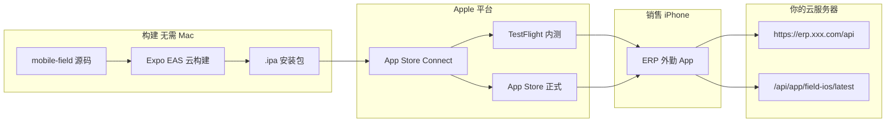

# ERP 外勤 iOS 部署方案

> 业务代码与 Android **共用** `mobile-field/` 工程。  
> **云服务器 + 域名 + HTTPS** 见 [CLOUD_DEPLOYMENT.md](CLOUD_DEPLOYMENT.md)；用户操作见 [FIELD_APP_USER_GUIDE.md](FIELD_APP_USER_GUIDE.md)。

---

## 1. 方案总览

iOS 与 Android 的 **最大差异** 在分发：不能像 APK 那样通过 `https://域名/apk/xxx` 直装，必须经过 **Apple 签名渠道**。



| 环节 | iOS 方案 | 说明 |
|------|----------|------|
| 打包 | **EAS Build**（云端） | Windows 开发机即可，无需 Mac |
| 内测分发 | **TestFlight**（推荐） | 公开邀请链接，最多约 1 万外部测试员 |
| 正式上架 | App Store（可选） | 需苹果审核，适合对外公开 |
| API 地址 | 编译时写入 `EXPO_PUBLIC_API_URL` | 上云后必须为 **HTTPS 域名** |
| 版本更新 | 后端 `FIELD_IOS_*` + App 内跳转 TestFlight | 不能像 Android 直接下 IPA |

**推荐路径：** 云服务器部署 API → EAS 打 iOS 包 → TestFlight 内测 → 销售装 TestFlight 使用。

---

## 2. 前置条件与成本

| 项 | 要求 |
|----|------|
| Apple Developer Program | [developer.apple.com](https://developer.apple.com) 注册，**$99/年** |
| Expo 账号 | [expo.dev](https://expo.dev) 免费；EAS 构建有免费额度 |
| EAS CLI | `npm install -g eas-cli` |
| 云服务器 | 已按 [CLOUD_DEPLOYMENT.md](CLOUD_DEPLOYMENT.md) 部署，**HTTPS 可用** |
| Bundle ID | `com.erp.field`（已在 `app.config.ts` 配置） |

| 成本项 | 估算 |
|--------|------|
| Apple 开发者年费 | $99/年 |
| EAS Build | 免费档有限次数；超出按次计费，见 [expo.dev/pricing](https://expo.dev/pricing) |
| 云服务器 | 与 Android/Web 共用，无额外 iOS 服务器 |

---

## 3. 工程现状（已实现）

无需重复开发业务功能，以下已就绪：

| 模块 | 状态 |
|------|------|
| `app.config.ts` | `ios.bundleIdentifier`、`buildNumber`、地图 scheme |
| `eas.json` | `preview` / `production` 构建配置 |
| 后端 API | `GET /api/app/field-ios/latest` |
| 客户端版本检查 | 自动请求 iOS 接口，提示「前往 TestFlight」 |
| 业务功能 | 公海、上报、审核、通知、离线等与 Android 一致 |

---

## 4. Apple 侧一次性配置

### 4.1 注册开发者账号

1. 访问 [Apple Developer](https://developer.apple.com/programs/) 注册（公司建议用 **Organization** 账号）。
2. 完成付款与身份/企业认证（通常 1–3 个工作日）。

### 4.2 App Store Connect 创建 App

1. 登录 [App Store Connect](https://appstoreconnect.apple.com)。
2. **我的 App** → **+** → **新建 App**。
3. 填写：

| 字段 | 值 |
|------|-----|
| 平台 | iOS |
| 名称 | ERP 外勤 |
| 主要语言 | 简体中文 |
| 套装 ID | `com.erp.field`（需先在 [Certificates, Identifiers & Profiles](https://developer.apple.com/account/resources/identifiers/list) 注册 App ID） |
| SKU | 自定，如 `erp-field-001` |

4. 记录 **Apple ID**（数字 App ID），填入 `mobile-field/eas.json` → `submit.production.ios.ascAppId`。

### 4.3 关联 Expo 与 Apple Team

```bash
cd mobile-field
eas login
eas build:configure
```

在 [expo.dev](https://expo.dev) → 项目 → **Credentials** 中绑定 Apple Team ID（`eas.json` 中 `appleTeamId`）。

首次 `eas build --platform ios` 时选 **Log in to Apple account**，EAS 可自动创建：

- Distribution Certificate  
- Provisioning Profile  

---

## 5. 云服务器后端配置

iOS 安装包 **不放在** 你的服务器上；服务器只提供 **API** 和 **版本元数据**。

### 5.1 环境变量

在云服务器 `docker/.env.prod`（或 `backend/.env`）中配置：

```env
APP_PUBLIC_URL=https://erp.yourcompany.com

FIELD_IOS_VERSION_CODE=1
FIELD_IOS_VERSION_NAME=1.0.0
FIELD_IOS_MIN_VERSION_CODE=1
FIELD_IOS_FORCE_UPDATE=false
FIELD_IOS_RELEASE_NOTES=初始 iOS 内测版

# TestFlight 公开邀请链接（见 §6.4）
FIELD_IOS_DOWNLOAD_URL=https://testflight.apple.com/join/XXXXXXXX
```

重启 backend 后验证：

```bash
curl -s https://erp.yourcompany.com/api/app/field-ios/latest
# 或项目根目录
npm run docs:verify:field-version
```

### 5.2 版本字段对应关系

| 客户端 | 服务端 |
|--------|--------|
| `app.config.ts` → `ios.buildNumber` | `FIELD_IOS_VERSION_CODE`（整数，**每次发版递增**） |
| `app.config.ts` → `version` | `FIELD_IOS_VERSION_NAME`（如 `1.1.0`） |

---

## 6. EAS 构建与 TestFlight 分发

### 6.1 构建配置（`eas.json`）

| Profile | 用途 | API 地址 |
|---------|------|----------|
| `preview` | 真机内测 → 提交 TestFlight | 内网 IP（开发） |
| `preview-simulator` | 模拟器 UI 测试（需 Mac） | 内网 IP |
| `production` | **云上生产** | `https://erp.yourcompany.com/api` |

**上云前** 修改 `eas.json`：

```json
"production": {
  "ios": { "simulator": false },
  "env": {
    "EXPO_PUBLIC_API_URL": "https://erp.yourcompany.com/api"
  }
}
```

并填写 `submit.production.ios`：

```json
"submit": {
  "production": {
    "ios": {
      "appleId": "your-apple-id@example.com",
      "ascAppId": "1234567890",
      "appleTeamId": "ABCDE12345"
    }
  }
}
```

### 6.2 云构建命令

```bash
cd mobile-field

# 生产包（连云端 HTTPS API）
eas build --platform ios --profile production

# 构建完成后提交 TestFlight
eas submit --platform ios --profile production --latest
```

也可在 [expo.dev](https://expo.dev) 网页手动触发构建、下载 `.ipa` 后上传。

### 6.3 TestFlight 测试员

| 类型 | 人数 | 审核 | 适用 |
|------|------|------|------|
| **内部测试** | 最多 100（同 Team） | 无需 | 开发、管理员即时验证 |
| **外部测试** | 最多约 10,000 | 首次需苹果 Beta 审核（通常 1–2 天） | **销售团队内测（推荐）** |

操作路径：**App Store Connect → TestFlight → 测试员 / 群组**。

### 6.4 获取公开邀请链接

1. TestFlight → **外部测试** → 创建群组（如「销售外勤」）。  
2. 添加构建版本，提交 Beta 审核（首次）。  
3. 审核通过后 → **公开链接** → 复制 URL。  
4. 写入服务器 `FIELD_IOS_DOWNLOAD_URL`。  

销售安装步骤：

1. App Store 安装 **TestFlight**。  
2. 打开邀请链接 → 安装 **ERP 外勤**。  
3. 以后更新在 TestFlight 内点「更新」，或 App 内点「前往 TestFlight 更新」。

---

## 7. 发版流程（标准 checklist）

每次发布新版本：

| 步骤 | 操作 |
|------|------|
| 1 | 修改 `app.config.ts`：`version` + `ios.buildNumber`（**必须递增**） |
| 2 | 确认 `eas.json` `production.env.EXPO_PUBLIC_API_URL` 为云端 HTTPS |
| 3 | `eas build --platform ios --profile production` |
| 4 | `eas submit --platform ios --profile production --latest` |
| 5 | TestFlight 中选新构建 → 分发给测试组 → 自测登录/上报/通知 |
| 6 | 更新云服务器 `FIELD_IOS_VERSION_CODE` / `VERSION_NAME` / `RELEASE_NOTES` |
| 7 | 重启 backend；可选提高 `MIN_VERSION_CODE` 强制旧版升级 |
| 8 | 通知销售在 TestFlight 更新（或依赖 App 内版本提示） |

---

## 8. 生产环境安全（上云必做）

当前 `app.config.ts` 为 **内网联调** 开启了 HTTP 例外：

```ts
NSAppTransportSecurity: { NSAllowsArbitraryLoads: true }
```

**连接云服务器 HTTPS 后应移除**，否则 App Store 审核可能被拒：

```ts
ios: {
  bundleIdentifier: 'com.erp.field',
  buildNumber: '1',
  infoPlist: {
    LSApplicationQueriesSchemes: ['maps', 'comgooglemaps'],
    // 生产：删除 NSAppTransportSecurity
  },
},
```

要求：

- API 必须为有效 HTTPS（Let's Encrypt 即可）  
- 证书勿过期；`curl -I https://erp.yourcompany.com/api/health` 应返回 200  

---

## 9. 与 Android 云部署对照

| 项目 | Android（云） | iOS（云） |
|------|---------------|-----------|
| 安装包托管 | 自己服务器 `/apk/` 或 CDN | **Apple TestFlight / App Store** |
| 构建环境 | Windows 本地 Gradle | **EAS 云端**（无需 Mac） |
| API 配置 | `EXPO_PUBLIC_API_URL` 打包写入 | 同上 |
| 版本接口 | `/api/app/field-android/latest` | `/api/app/field-ios/latest` |
| 更新入口 | `downloadUrl` → 浏览器下 APK | `downloadUrl` → TestFlight 链接 |
| 强制更新 | `FIELD_ANDROID_MIN_VERSION_CODE` | `FIELD_IOS_MIN_VERSION_CODE` |
| 协议 | 生产建议 HTTPS | **必须 HTTPS** |

---

## 10. 可选方案

### 10.1 App Store 正式上架

内测稳定后，在 App Store Connect 填写截图、隐私政策、审核说明，提交 **App Store 审核**。  
通过后：

- 将 `FIELD_IOS_DOWNLOAD_URL` 改为 App Store 链接  
- 销售可直接搜索安装，无需 TestFlight  

适合：对外客户、大规模分发。

### 10.2 Apple 企业计划（$299/年）

仅 **本企业员工**、不走 App Store，可用 MDM 或企业证书内部分发。  
限制多、审核严，一般销售外勤 **不推荐**，TestFlight 即可。

### 10.3 多环境（开发 / 生产）

| 环境 | EAS Profile | API |
|------|-------------|-----|
| 办公室内网联调 | `preview` | `http://192.168.x.x:3001/api` + ATS 例外 |
| 云上生产 | `production` | `https://erp.xxx.com/api` |

不建议把内网 HTTP 包发给外出销售使用。

---

## 11. 上线检查清单

### Apple / EAS

- [ ] Apple Developer 账号有效  
- [ ] App Store Connect 已创建 `com.erp.field`  
- [ ] `eas.json` 中 `appleId`、`ascAppId`、`appleTeamId` 已填写  
- [ ] `production` 构建成功并已 submit 到 TestFlight  
- [ ] 外部测试 Beta 审核通过（若用公开链接）  

### 云服务器

- [ ] `https://域名/api/health` 正常  
- [ ] `GET /api/app/field-ios/latest` 返回正确 `downloadUrl`  
- [ ] `FIELD_IOS_DOWNLOAD_URL` 为有效 TestFlight HTTPS 链接  
- [ ] `FIELD_IOS_VERSION_CODE` 与 App `buildNumber` 一致  

### App 功能（TestFlight 真机）

- [ ] 登录、公海领取、联系上报、录音上传  
- [ ] 消息通知、主管审核  
- [ ] 地图导航（Apple Maps）  
- [ ] 版本更新提示可打开 TestFlight  
- [ ] 离线暂存、恢复网络后同步  

---

## 12. 常见问题

### Q：没有 Mac 能开发 iOS 吗？

能。业务开发与 Android 共用；打包用 **EAS 云构建**。仅模拟器调试需要 Mac + Xcode。

### Q：iOS 能连内网 `192.168.x.x` 吗？

开发包可以（已开 ATS 例外）。**外出销售** 应使用连 **云 HTTPS** 的 `production` 包。

### Q：TestFlight 链接在哪？

App Store Connect → 你的 App → TestFlight → 外部测试 → 公开链接。

### Q：版本检查打不开链接？

确认 `FIELD_IOS_DOWNLOAD_URL` 为 `https://testflight.apple.com/join/...`，且 Beta 审核已通过。

### Q：和 Android 要分开维护代码吗？

**不用**。同一 `mobile-field` 仓库，`eas build --platform android` / `ios` 分别出包即可。

### Q：云服务器要单独为 iOS 配什么？

**不需要**。iOS 只消费 HTTPS API；TestFlight 由 Apple 托管安装包。

---

## 13. 相关文档

| 文档 | 内容 |
|------|------|
| [CLOUD_DEPLOYMENT.md](CLOUD_DEPLOYMENT.md) | 云服务器、Nginx、HTTPS、Docker 全套 |
| [FIELD_APP_USER_GUIDE.md](FIELD_APP_USER_GUIDE.md) | 销售使用说明（含 TestFlight 安装） |
| [mobile-field/README.md](../mobile-field/README.md) | 本地联调与 Android 构建 |
| [Expo EAS Build](https://docs.expo.dev/build/introduction/) | 官方构建文档 |
| [TestFlight 帮助](https://developer.apple.com/testflight/) | Apple 官方 TestFlight 说明 |
