# ERP 系统详细使用说明

> 版本：1.0 · 适用环境：本地开发 / Docker 部署（http://localhost:8080）  
> 配套截图位于 [`docs/images/`](images/) 目录。

---

## 目录

1. [系统概述](#1-系统概述)
2. [访问与登录](#2-访问与登录)
3. [界面布局与通用操作](#3-界面布局与通用操作)
4. [角色、账号与权限](#4-角色账号与权限)
5. [数据看板与 BI 大屏](#5-数据看板与-bi-大屏)
6. [采购管理](#6-采购管理)
7. [销售管理](#7-销售管理)
8. [库存管理](#8-库存管理)
9. [生产管理](#9-生产管理)
10. [财务管理](#10-财务管理)
11. [人力资源](#11-人力资源)
12. [项目管理](#12-项目管理)
13. [报表与智能分析](#13-报表与智能分析)
14. [系统管理](#14-系统管理)
15. [区域设置与国际化](#15-区域设置与国际化)
16. [移动端与离线](#16-移动端与离线)
17. [常见问题](#17-常见问题)
18. [附录](#18-附录)

---

## 1. 系统概述

本 ERP 系统覆盖企业核心业务流程：

| 模块 | 主要能力 |
|------|----------|
| 采购 | 供应商、采购申请、采购订单、收货验收 |
| 销售 | 客户、报价、销售订单、发货、售后工单、公海线索、联系上报与审核、**外勤 Android App** |
| 库存 | 台账、出入库、调拨、盘点、预警、批次/序列号追溯 |
| 生产 | BOM、生产计划、工单、质检 |
| 财务 | 总账、应收/应付、固定资产、预算、财务报表 |
| 人力 | 员工、部门、岗位、考勤、薪资、绩效 |
| 项目 | 项目与任务进度 |
| 报表 | 运营概览、BI 大屏、智能补货/财务分析 |
| 系统 | 用户、角色、权限、租户、审计、文件、集成 |

技术栈：React 前端 + NestJS 后端 + PostgreSQL，支持 Redis 缓存、MinIO 文件存储、WebSocket 通知。

---

## 2. 访问与登录

### 2.1 访问地址

| 环境 | 前端地址 | 后端 API |
|------|----------|----------|
| 开发模式 | http://localhost:5173 | http://localhost:3001/api（或见 `backend/.env` 中 `PORT`） |
| Docker Compose | http://localhost:8080 | http://localhost:3000/api |

### 2.2 登录步骤

1. 打开浏览器访问上述前端地址，未登录时会自动跳转到登录页。
2. 填写 **租户**（默认选 `default` / 默认租户）。
3. 填写 **用户名** 和 **密码**。
4. 点击 **登录**。

登录页右上角可切换 **中文 / English**。

### 2.3 默认与演示账号

执行数据库 seed 后会自动创建管理员与多角色演示用户。密码在 `backend/.env` 中通过以下变量配置（**切勿使用默认值部署到公网**）：

| 变量 | 说明 |
|------|------|
| `SEED_ADMIN_PASSWORD` | 管理员 `admin` 的初始密码 |
| `SEED_DEMO_PASSWORD` | 各角色演示用户的统一初始密码 |

| 账号 | 角色 | 用途 |
|------|------|------|
| `admin` | 系统管理员 | 全功能管理 |
| `employee` | 普通员工 | 权限测试（采购申请、库存只读、报表） |
| `finance_director` | 财务总监 | 财务全盘 |
| `finance_clerk` | 财务专员 | 日常记账 |
| `procurement_director` | 采购总监 | 采购全流程 |
| `procurement_clerk` | 采购专员 | 采购执行 |
| `sales_director` | 销售总监 | 销售全盘、上报审核 |
| `sales_clerk` | 销售专员 | 报价/订单/发货、公海领取、联系上报 |
| `production_manager` | 生产经理 | 生产+库存协调 |
| `production_clerk` | 生产专员 | 工单执行 |
| `warehouse_admin` | 仓库管理员 | 库存与追溯 |
| `hr_clerk` | 人事专员 | 人事模块 |

> seed 完成后控制台会列出已创建的用户名；密码以 `.env` 配置为准。

---

## 3. 界面布局与通用操作

登录成功后进入主界面，由四部分组成：


### 3.1 左侧导航栏（Sider）

- 按业务域分组：财务、采购、销售、生产、库存、人力等。
- **仅显示当前用户有权限的菜单**；无权限的模块不会出现。
- 窄屏（手机/平板）下自动变为 **Drawer 抽屉菜单**，点击左上角图标展开。

### 3.2 顶栏（Header）

| 元素 | 说明 |
|------|------|
| 面包屑 | 显示当前页面路径，如 `首页 / 采购管理 / 采购申请` |
| 区域设置 | `Shanghai · CNY` 按钮，切换时区与币种（会同步到用户 Profile） |
| 语言 | 中文 / English |
| 通知铃铛 | 站内通知列表，支持 WebSocket 实时推送 |
| 用户名 | 当前登录用户姓名，点击可退出登录 |

### 3.3 主内容区

- 页面标题由 **PageTitle** 组件统一展示。
- 列表页普遍采用 **ResponsiveTable**：宽屏表格、窄屏自动卡片化，便于手机浏览。
- 常见按钮：**新建**、**编辑**、**删除**、**审批**、**刷新** 等，操作结果以右上角 Message 提示。

### 3.4 通用表格操作

1. 点击 **新建** 打开表单弹窗（Modal）。
2. 填写必填项（带红色星号），点击 **保存/创建**。
3. 行内 **编辑** 修改记录；**删除** 需二次确认。
4. 带审批流的单据需先 **提交/审批** 才能进入下一环节。

### 3.5 退出登录

点击 Header 右侧用户名 → **退出登录**。Token 清除后需重新登录。

---

## 4. 角色、账号与权限

### 4.1 权限模型

- 系统预置 **41 项权限**，按模块分组（system、finance、procurement、sales 等）。
- 每个 **角色** 绑定若干权限；用户通过 **角色** 获得权限。
- API 与菜单均受权限控制：
  - **菜单**：侧栏隐藏无权限项。
  - **路由**：直接访问无权限 URL 显示 403 页面。
  - **接口**：无权限返回 HTTP 403。

### 4.2 预置角色（12 个）

| 角色 | 权限数 | 典型使用人 |
|------|--------|------------|
| 系统管理员 | 41（全部） | IT / 实施顾问 |
| 财务总监 | 7 | 财务负责人 |
| 财务专员 | 5 | 会计 |
| 采购总监 | 7 | 采购经理 |
| 采购专员 | 4 | 采购员 |
| 销售总监 | 9+ | 销售经理（含线索审核） |
| 销售专员 | 8+ | 销售员（含公海与上报） |
| 生产经理 | 8 | 车间主任 |
| 生产专员 | 4 | 计划员/操作工 |
| 仓库管理员 | 5 | 仓管 |
| 人事专员 | 5 | HR |
| 普通员工 | 4 | 一线员工 |

### 4.3 配置角色权限

路径：**系统管理 → 角色管理**

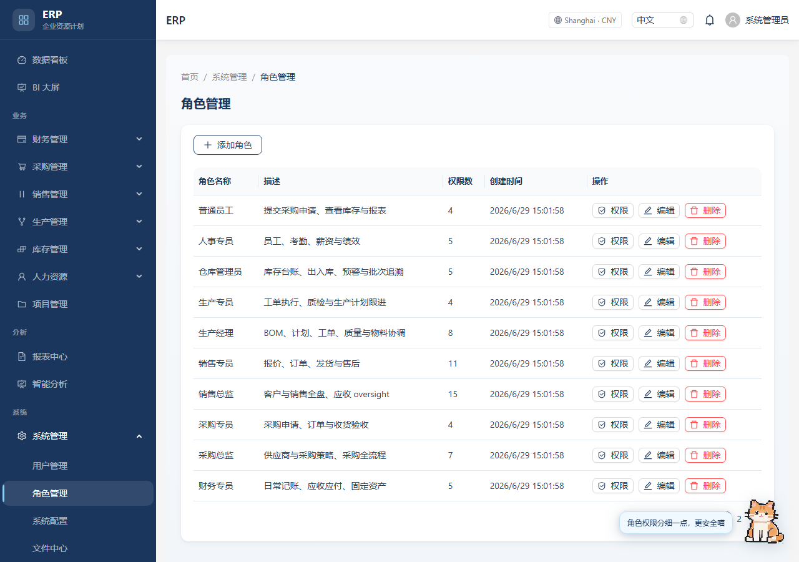

**操作步骤：**

1. 在列表中找到目标角色，点击 **权限** 按钮。
2. 在弹窗中按模块勾选权限（finance、inventory、sales 等分组展示）。
3. 点击 **确定** 保存；系统会替换该角色的全部权限绑定。
4. 已登录用户需 **重新登录** 后权限才会刷新（JWT 内不含实时权限变更）。

**新建角色：**

1. 点击 **+ 添加角色**。
2. 填写角色名称、描述 → 创建。
3. 再点击 **权限** 分配具体权限。

### 4.4 用户管理

路径：**系统管理 → 用户管理**

1. **新建用户**：用户名、姓名、邮箱、角色、初始密码。
2. **编辑**：可修改角色、状态（启用/禁用）。
3. 用户被禁用后无法登录。

### 4.5 权限测试建议

用 `employee` 账号（演示密码见 `.env` 中 `SEED_DEMO_PASSWORD`）登录验证：

- 侧栏应仅有：采购申请、部分库存、报表中心等。
- 访问 `/system/role` 应显示 403。
- 可创建采购申请；**不能** 执行出入库调整（403）。

运行自动化审计（可选）：

```powershell
node tests/permissions-audit.mjs
```

---

## 5. 数据看板与 BI 大屏

### 5.1 数据看板（Dashboard）

路径：**数据看板** 或 `/dashboard`

展示内容：

- **指标卡片**：销售总额、采购订单数、库存总量、系统用户数。
- **销售趋势图**：按月份汇总销售订单金额。
- **订单状态分布**：草稿 / 已审批 / 已完成 / 已取消 占比。

数据来源于真实业务单据，报表有约 **60 秒 Redis 缓存**，稍等或刷新即可看到最新值。

### 5.2 BI 大屏

路径：**BI 大屏** 或 `/bi-screen`


特点：

- 深色全屏风格，适合会议室电视展示。
- **每 30 秒自动刷新** 数据。
- 右上角 **全屏** 按钮进入浏览器全屏模式。

---

## 6. 采购管理

### 6.1 业务流程总览

```
采购申请 → 审批 → 转采购订单 → 审批采购单 → 收货入库 → 应付生成
```

### 6.2 供应商管理

路径：**采购管理 → 供应商管理**

- 维护供应商编码、名称、联系人、电话。
- 采购订单创建时需选择供应商。

### 6.3 采购申请

路径：**采购管理 → 采购申请**


**新建申请：**

1. 点击 **+ 新建申请**。
2. 填写标题、申请原因。
3. 添加明细行：选择产品、填写数量、预估单价（可选）。
4. 保存后状态为 **草稿**，可编辑。
5. 点击 **提交审批** → 审批通过后可用 **转采购单** 生成采购订单。

**智能补货转申请：**

在 **报表中心 → 智能分析 → 智能补货** 中，可 **一键全部转采购申请** 或按行 **转采购申请**（需 `procurement:request` 权限）。

### 6.4 采购订单

路径：**采购管理 → 采购订单**

1. 由申请转换或手工新建。
2. 选择供应商、明细、单价。
3. **审批** 通过后进入可收货状态。
4. 审批时会 **扣减采购预算**（如已配置预算）。

### 6.5 收货验收

路径：**采购管理 → 收货验收**（与 **采购订单** 页共用同一功能，已审批订单均可在此收货）

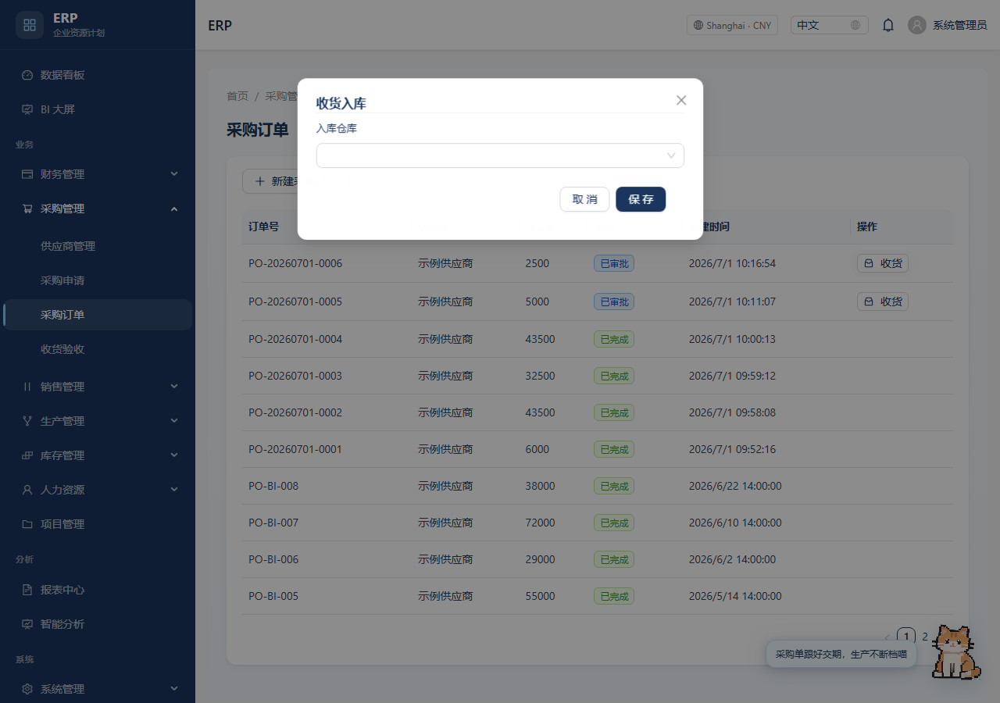

1. 在 **采购订单** 或 **收货验收** 列表中找到状态为 **已审批（approved）** 的订单。
2. 点击 **收货**，在弹窗中选择 **收货仓库**（默认主仓库）。
3. 确认后 **库存增加**，并自动生成 **应付单**（详见 [10.3 应付管理](#103-应付管理)）。

> 订单须先 **审批** 才能收货；收货后状态变为 **已完成（completed）**，不可重复收货。

### 6.6 智能补货全流程

路径：**报表中心 → 智能分析 → 智能补货**

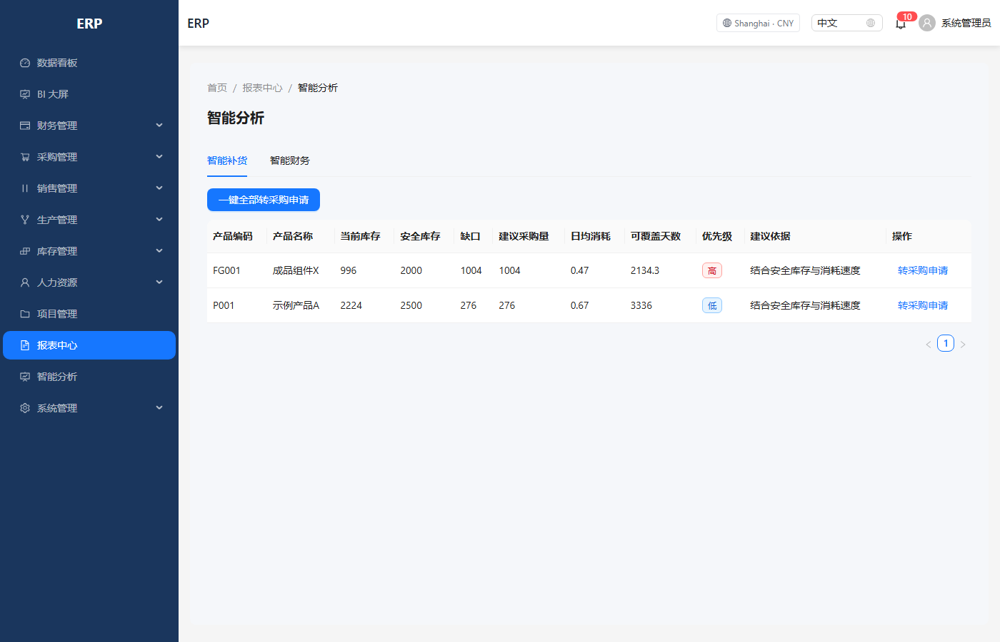

当产品 **当前库存 < 安全库存** 时，系统根据近 30 天出库速度与 lead time 计算建议采购量，可按以下链路闭环：

```
智能补货预警 → 转采购申请 → 审批 → 转采购订单 → 审批 → 收货 → 应付 → 付款 → 财务报表
```

| 步骤 | 操作 | 预期 |
|------|------|------|
| 1 | 产品管理：设置 **安全库存**（或库存低于阈值） | 智能补货 Tab 出现预警行 |
| 2 | 点击 **转采购申请** 或 **一键全部转采购申请** | 采购申请列表新增草稿/待审单 |
| 3 | 采购申请 → **提交审批** → **审批通过** → **转采购单** | 生成采购订单（草稿） |
| 4 | 采购订单 → **审批** | 状态 `approved`，扣减预算（如已配置） |
| 5 | **收货** → 选主仓库 | 库存增加；应付单自动生成 |
| 6 | 应付管理 → **付款** | 状态 `open` → `partial` → `paid` |
| 7 | 财务报表 | 「应付未付」减少；刷新后可见最新汇总 |

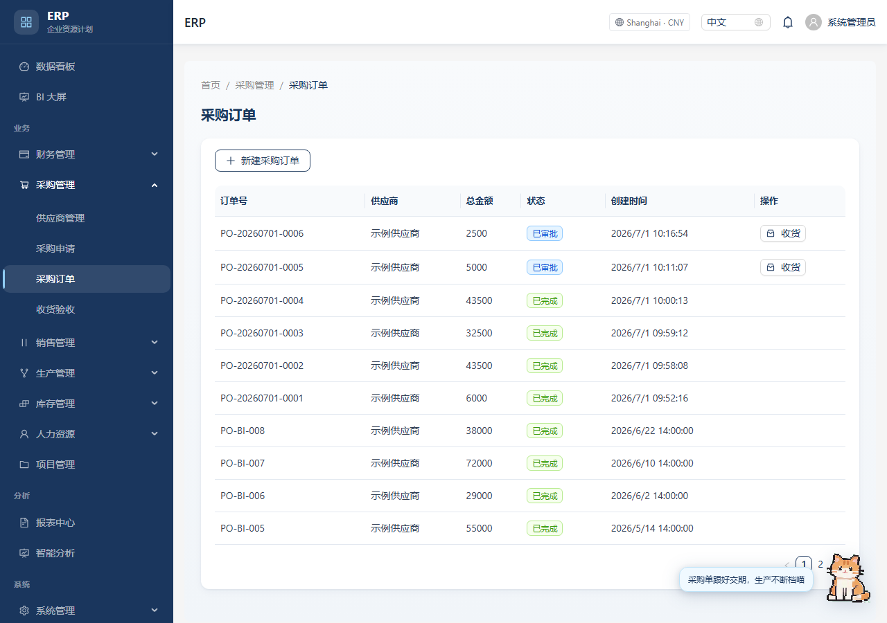

**权限要求：** `procurement:request`、`procurement:order`、`procurement:receive`、`finance:ap`、`finance:report`。

若补货列表为空，请在 **产品管理** 提高安全库存，或等待库存消耗至阈值以下后再查看。

---

## 7. 销售管理

### 7.1 业务流程

**订单主线：**

```
销售报价 → 审批 → 转销售订单 → 审批 → 发货（扣库存）→ 应收生成 → 售后（可选）
```

**线索主线（沈阳公海 POI）：**

```
公海浏览/筛选 → 领取至我的线索 → 联系上报（可选上传录音）→ 主管审核 → 转客户 / 继续跟进
```

> **外勤 App** 可完成公海领取（含批量）、我的线索、联系上报、导航到店、消息通知等；报价/订单/发货/统计仍在 **Web ERP** 操作。详见 **[外勤 App 使用说明](FIELD_APP_USER_GUIDE.md)**。

### 7.2 客户管理

维护客户档案、联系人、信用额度。

### 7.3 销售报价

1. 新建报价单，添加产品行与报价单价。
2. 审批后可 **转为销售订单**。

### 7.4 销售订单

1. 创建/转换订单，确认客户与明细。
2. 审批通过后可在 **发货** 中选择仓库出库。
3. 发货前系统 **校验库存**；不足则提示失败。
4. 发货成功后生成 **应收单**（详见 [10.2 应收管理](#102-应收管理)）。

### 7.5 发货管理

对已审批订单执行出库，扣减对应仓库库存。

### 7.6 售后服务

路径：**销售管理 → 售后服务**

- 创建售后工单，关联客户/销售订单。
- 跟踪处理状态（待处理、处理中、已完成等）。

### 7.7 公海线索

路径：**销售管理 → 公海线索**

公海存放尚未分配的销售线索（本系统已导入沈阳市真实 POI 商户数据，含店名、电话、地址、区县、行业分类等）。


**页面说明：**

| 元素 | 说明 |
|------|------|
| 已持有 X / 50 条 | 当前用户私海持有量上限为 **50** 条 |
| 区县 / 分类 / 电话 | 按行政区、高德一级行业、是否有电话筛选 |
| 店名/电话/地址 | 关键词模糊搜索 |
| 领取 | 将单条线索划入「我的线索」，进入 **15 天保护期** |
| 批量领取 | 勾选多行后一次性领取（受上限约束） |

**操作步骤：**

1. 使用 `sales_clerk`（销售专员）或具备 `lead:claim` 权限的账号登录。
2. 按需设置筛选项，点击 **查询**。
3. 点击行内 **领取**，或勾选后 **批量领取**。
4. 领取成功后，线索从公海列表消失，出现在 **我的线索**。

> 保护期内的线索仅持有人可跟进；超期未有效跟进将自动回收至公海（系统定时任务）。

### 7.8 我的线索与联系上报

路径：**销售管理 → 我的线索**

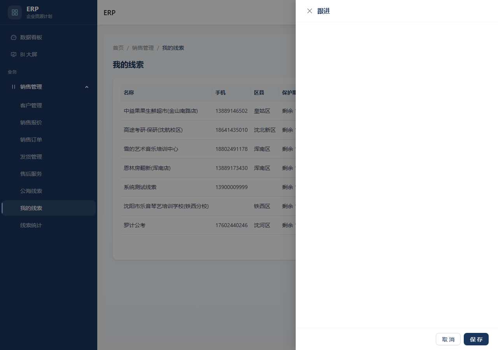

| 列 | 说明 |
|----|------|
| 保护期 | 剩余天数，到期未跟进将回收到公海 |
| 跟进次数 | 含联系上报与手工跟进记录 |
| 操作 | **联系上报**、跟进、转为客户、释放、标记无效 |

#### 联系上报（结构化跟进）

销售专员完成一次电话/拜访后，应使用 **联系上报** 提交结构化记录（全部进入待审队列，由主管审核）。可在 **Web 我的线索** 或 **外勤 App → 我的线索 → 联系上报** 操作。


**操作步骤（Web / App 字段一致）：**

1. 在「我的线索」点击 **联系上报**（Web 为右侧抽屉，App 为独立页面）。
2. 填写必填项：
   - **跟进方式**：电话 / 拜访 / 微信 / 其他
   - **联系结果**（见下表）
   - **沟通摘要**：客户反馈、意向、下次计划等
3. **电话录音（可选）**：
   - **Web**：点击 **上传录音**，选择本地 mp3/m4a/wav
   - **App**：点击 **选择录音文件**，从手机存储选取（不支持 App 内录音）
   - 单文件 ≤ 10MB，存储于 MinIO
4. **质量标记**（Web 可选）：有效 / 空号 / 已关店等。
5. 点击 **提交上报**。提交后状态为 **待审核**，跟进次数 +1；主管会收到 **消息通知**。

> **App 离线**：无网络时可暂存上报，恢复网络后自动提交（见 [外勤 App 使用说明 §6.4](FIELD_APP_USER_GUIDE.md#64-离线暂存)）。

**联系结果枚举：**

| 结果 | 说明 | 附加要求 |
|------|------|----------|
| 已接通 | 电话接通并完成沟通 | — |
| 未接/挂断 | 无人接听或挂断 | — |
| 有意向 | 客户表达合作意向 | — |
| 明确拒绝 | 客户明确不需要 | — |
| 约下次联系 | 约定下次回访时间 | 必须填写 **下次联系时间** |
| 空号/错号 | 号码无效 | — |
| 已关店 | 商户已停业 | — |

**权限：** `lead:report`（销售专员默认具备）。重新登录后权限才会刷新。

### 7.9 上报审核与联系统计

路径：**销售管理 → 上报审核**（需 `lead:review` 或 `lead:manage`）

销售总监、系统管理员可在此审核全员上报，查看录音与统计数据。销售专员访问该页将显示 **403**（可在 **外勤 App → 上报审核** 或 **我的上报** 查看本人记录）。

#### 待审核 / 全部上报


| 列 | 说明 |
|----|------|
| 上报人 | 提交上报的销售姓名 |
| 联系结果 | 结构化结果标签 |
| 录音 | 有附件时显示 **播放**（页面内音频播放器；亦可在外勤 App 中播放） |
| 审核状态 | 待审核 / 已通过 / 已驳回 |
| 操作 | **通过**、**驳回**（仅待审核行） |

**审核步骤：**

1. 打开 **待审核** 标签页，查看待处理数量。
2. 可选点击 **播放** 收听录音（弹窗内播放，无需新开浏览器标签）。
3. 点击 **通过** 或 **驳回**，在弹窗中填写 **审核备注**（可选），确认。
4. 审核完成后记录移至 **全部上报** 列表；提交人会收到 **消息通知**（Web 铃铛 / App 消息 Tab）。

#### 联系统计

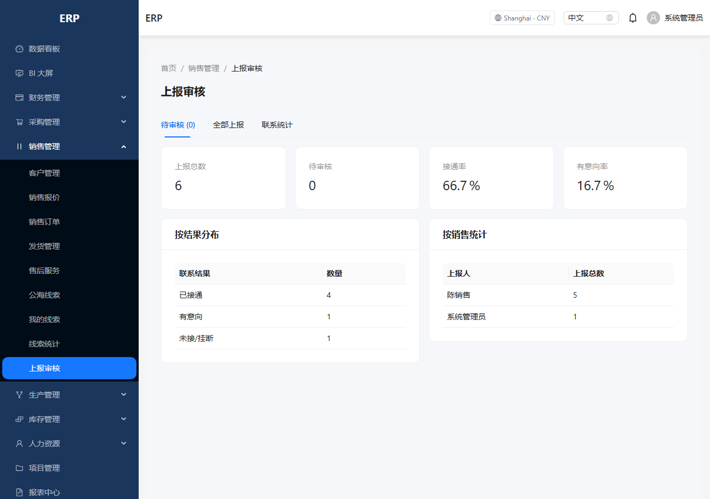

| 指标 | 含义 |
|------|------|
| 上报总数 | 全部联系上报条数 |
| 待审核 | 尚未审核条数 |
| 接通率 | 「已接通」占比 |
| 有意向率 | 「有意向」占比 |
| 按结果分布 | 各联系结果数量 |
| 按销售统计 | 各上报人提交量排名 |

### 7.10 公海数据导入（管理员）

路径：**系统管理 → 线索导入**（`/system/leads/import`，需 `lead:import` 权限，`admin` 默认具备）

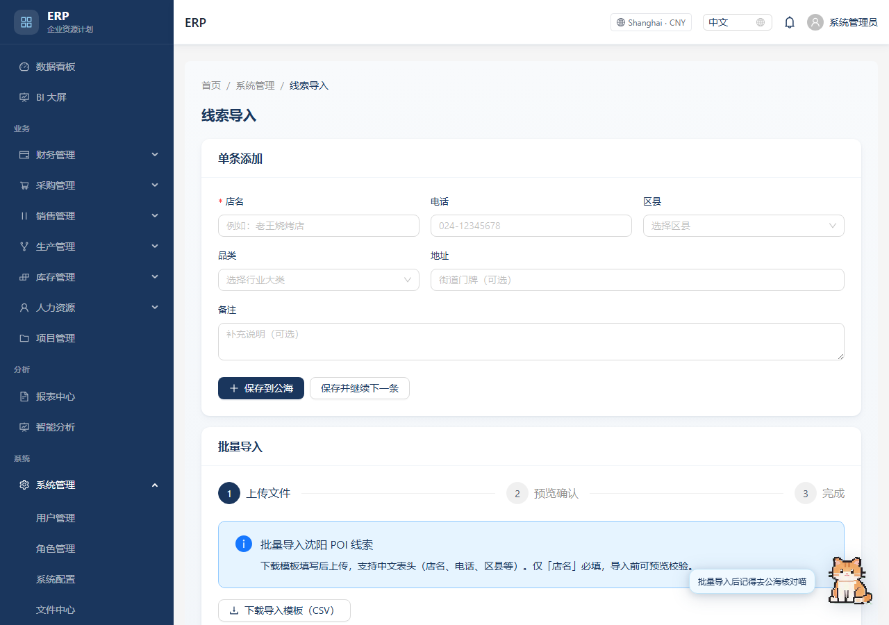

公海线索有三种导入方式，按数据量选择：

| 场景 | 推荐方式 |
|------|----------|
| 自有 Excel/CRM 导出，几百～几千条 | **页面上传 CSV** 或粘贴 JSON |
| 外部系统定时同步 | **API** `POST /api/leads/import` |
| 沈阳全城 POI、尽量补全电话 | **运维脚本** `import-shenyang-poi.mjs` + 高德 Key |

导入完成后，在 **销售管理 → 公海线索** 查看数量与筛选项是否正常。

#### 方式 A：页面上传 CSV

1. 使用 `admin` 登录 → **系统管理 → 线索导入**。
2. 点击 **上传 CSV**，选择 UTF-8 编码的 CSV 文件。
3. 导入结束后页面显示 **新增 / 跳过（重复）/ 失败** 数量。

**CSV 表头（第一行）：**

```text
name,phone,address,district,category,source,source_id
```

**字段说明：**

| 字段 | 必填 | 说明 |
|------|------|------|
| `name` | 是 | 店名/商户名 |
| `phone` | 否 | 主联系电话 |
| `address` | 否 | 详细地址 |
| `district` | 否 | 区县，建议与公海筛选项一致（沈阳 13 区县，见下表） |
| `category` | 否 | 行业大类，建议与公海「分类」筛选项一致（见下表） |
| `source` | 否 | 数据来源，默认 `manual`；有外部 ID 时填 `amap`、`tencent` 等 |
| `source_id` | 否 | 外部 POI 编号，与 `source` 配合用于去重 |

**可选扩展列**（表头可用下划线）：`phone_backup`（备用电话）、`lng`、`lat`（经纬度）。

**CSV 示例：**

```csv
name,phone,address,district,category,source,source_id
云之印图文广告,15840454431,黄河北大街25号,皇姑区,生活服务,manual,
恩林房翻新(浑南店),13889173430,浑南区某路88号,浑南区,生活服务,amap,B0FFXXXX
```

**沈阳 13 区县（`district` 建议值）：**  
和平区、沈河区、大东区、皇姑区、铁西区、苏家屯区、浑南区、沈北新区、于洪区、辽中区、新民市、康平县、法库县。

**行业大类（`category` 建议值，与公海筛选一致）：**  
餐饮服务、购物服务、生活服务、体育休闲服务、医疗保健服务、住宿服务、汽车服务、汽车销售、汽车维修、摩托车服务、科教文化服务、金融保险服务、公司企业、商务住宅、风景名胜、公共设施、其他。

#### 方式 B：页面粘贴 JSON

同一路径下方 **JSON 文本框**，格式示例：

```json
[
  {
    "name": "示例餐饮店",
    "phone": "024-12345678",
    "address": "和平区某某路1号",
    "district": "和平区",
    "category": "餐饮",
    "source": "manual"
  }
]
```

点击 **导入 JSON** 提交。字段与 CSV 相同，亦支持 `phoneBackup`、`lng`、`lat`、`remark` 等。

#### 方式 C：API 批量导入

适合脚本或第三方系统对接：

```http
POST /api/leads/import
Authorization: Bearer <access_token>
Content-Type: application/json

{
  "items": [
    {
      "name": "示例店",
      "phone": "13800001111",
      "district": "铁西区",
      "category": "购物服务"
    }
  ]
}
```

响应示例：`{ "created": 100, "skipped": 5, "failed": 0, "errors": [] }`  
`skipped` 表示与库内已有记录重复而未写入。

#### 方式 D：沈阳全量 POI 脚本（大批量）

已在本地导入约 2.7 万条沈阳真实 POI 时，使用的是项目根目录运维脚本（直连数据库，不经过页面）：

```powershell
cd backend
node ../scripts/import-shenyang-poi.mjs

# 清空现有公海后重新导入
node ../scripts/import-shenyang-poi.mjs --replace

# 仅高德 / 仅 OpenStreetMap
node ../scripts/import-shenyang-poi.mjs --amap-only
node ../scripts/import-shenyang-poi.mjs --osm-only
```

**前置条件：**

- PostgreSQL 可连接，已执行 migrate 与 seed。
- `backend/.env` 中配置 `AMAP_API_KEY`（[高德开放平台](https://lbs.amap.com/) 申请 **Web 服务** Key）。
- 可选：导入后执行 `node scripts/recategorize-leads.mjs` 统一行业分类。

#### 去重规则

系统写入前自动去重，重复记录会计入 **跳过**，不会覆盖已有数据：

| 条件 | 去重键 |
|------|--------|
| 填写了 `source` + `source_id`，且 `source` 不是 `manual` | 店名 + 来源 + 外部 ID |
| 手工导入或未填外部 ID | 店名 + 电话 + 区县 |

#### 导入后验证

1. **销售管理 → 公海线索**：列表有数据，区县/分类筛选可用。
2. **销售管理 → 线索统计**（如有权限）：查看公海/已领取数量分布。
3. 用 `sales_clerk` 试领 1 条，确认 **我的线索** 与 **联系上报** 流程正常。

---

## 8. 库存管理

### 8.0 业务总览

库存模块是采购、销售、生产的 **数量中枢**，核心链路如下：

```
主数据（产品/仓库）→ 台账 → 出入库/调拨/盘点 → 预警与追溯
     ↑ 采购收货 / 销售发货 / 生产领料·完工 等业务自动写入流水
```

| 子模块 | 菜单路径 | 所需权限 | 说明 |
|--------|----------|----------|------|
| 库存台账 | 库存管理 → 库存台账 | `inventory:stock` | 各仓当前数量 |
| 出入库管理 | 库存管理 → 出入库管理 | `inventory:inout` | 手工调整与流水 |
| 库存调拨 | 库存管理 → 库存调拨 | `inventory:inout` | 仓间转移 |
| 库存盘点 | 库存管理 → 库存盘点 | `inventory:inout` | 账实核对 |
| 库存预警 | 库存管理 → 库存预警 | `inventory:alert` | 低于安全库存 |
| 批次追溯 | 库存管理 → 批次追溯 | `inventory:trace` | 批次/序列号 |
| 产品管理 | 库存管理 → 产品管理 | `inventory:stock` | 含安全库存 |
| 仓库管理 | 库存管理 → 仓库管理 | `inventory:stock` | 仓库主数据 |

演示环境 seed 预置 **主仓库 WH001**、产品 **P001（原材料）**、**FG001（成品）** 及初始库存。

---

### 8.1 库存台账

路径：**库存管理 → 库存台账**

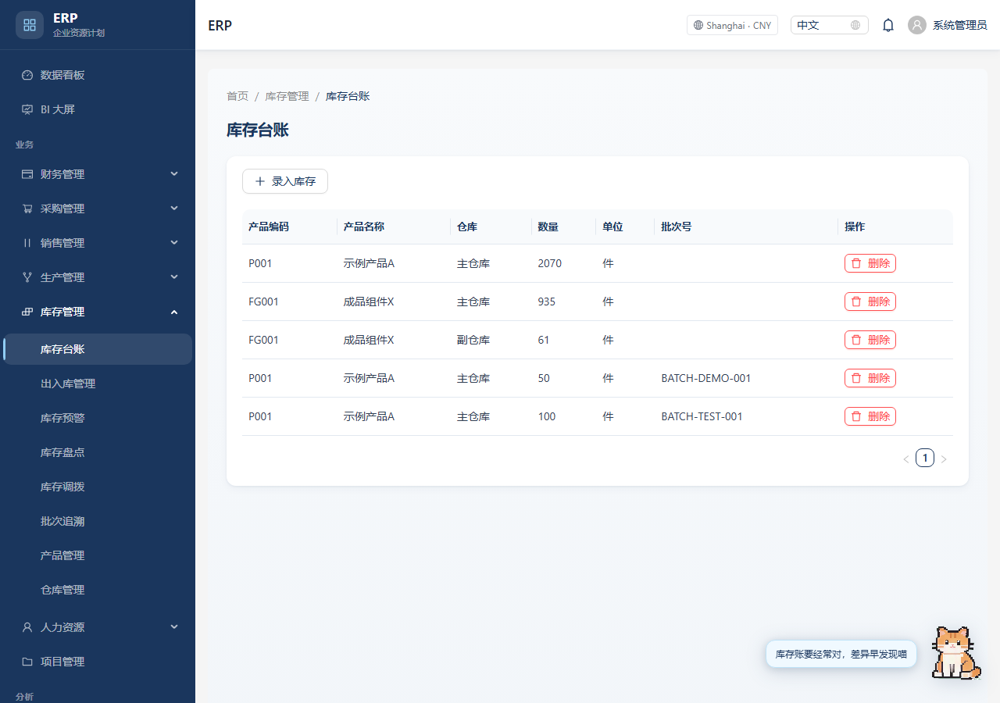

- 按 **产品 × 仓库 × 批次号** 展示当前库存；无批次时批次列为空。
- 同一产品在不同仓库、不同批次会 **分多行** 显示（如主仓/副仓、批次库存）。
- 点击 **+ 录入库存** 可手工初始化某仓库存记录。
- 列表支持 **删除** 空库存行（谨慎操作）。

**业务自动更新：** 采购收货、销售发货、生产领料/完工、调拨、盘点差异等都会反映在此台账。

---

### 8.2 出入库管理

路径：**库存管理 → 出入库管理**

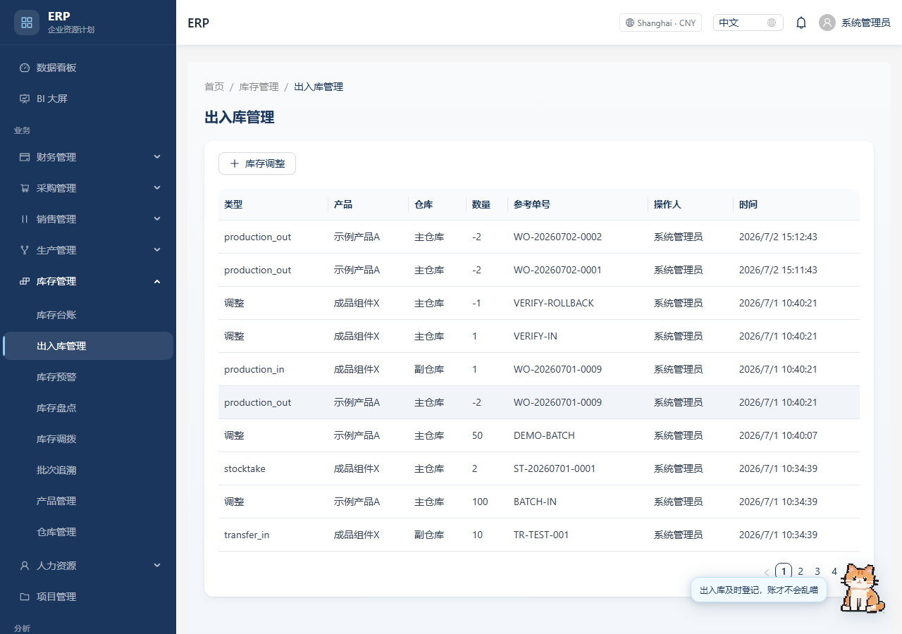

记录所有库存变动流水，常见类型：

| 类型 | 来源 |
|------|------|
| `purchase_in` | 采购收货 |
| `sales_out` | 销售发货 |
| `production_out` / `production_in` | 工单开工 / 完工 |
| `transfer_in` / `transfer_out` | 库存调拨 |
| `adjustment` | 手工库存调整 |
| `stocktake` | 盘点差异调整 |

#### 手工库存调整

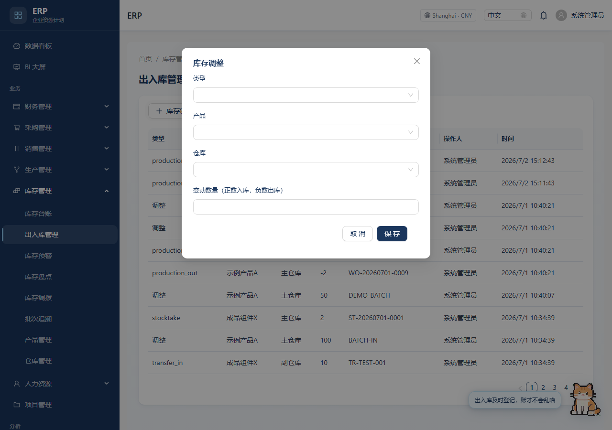

1. 点击 **库存调整**。
2. 选择类型（调整）、产品、仓库、**数量**（正数入库、负数出库）。
3. 可选填 **批次号**、参考单号。
4. 确认后生成流水并更新台账。

> 若调整后库存为负，系统返回 **「库存不足」** 并拒绝。

---

### 8.3 库存调拨

路径：**库存管理 → 库存调拨**

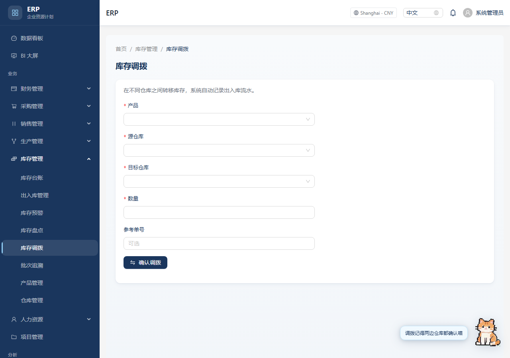

1. 选择 **产品**、**源仓库**、**目标仓库**、数量。
2. 可选填参考单号。
3. 点击 **确认调拨**。

系统在同一事务中生成 **transfer_out**（源仓减）与 **transfer_in**（目标仓增）两条流水。**源仓与目标仓不能相同**。

> 调拨前请确认源仓库库存充足；需至少 **两个仓库**（可在仓库管理中新增，如 WH002 副仓库）。

---

### 8.4 库存盘点

路径：**库存管理 → 库存盘点**

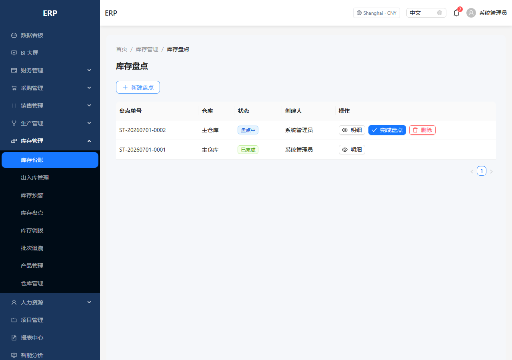

1. 点击 **+ 新建盘点**，选择 **仓库**（该仓须有库存记录）。
2. 系统按当前账面数量生成盘点单（状态 **盘点中 counting**）及明细行。
3. 点击 **明细**，录入各产品 **实盘数量**。
4. 全部明细录入后，点击 **完成盘点**。

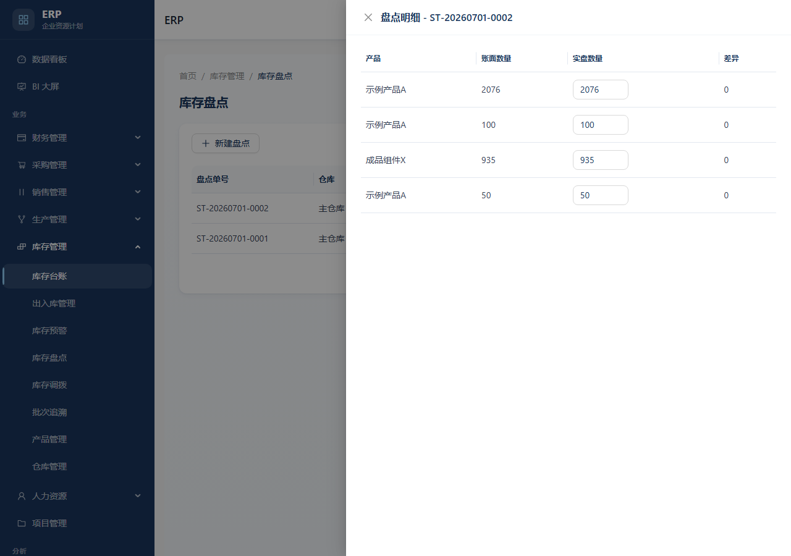

- 完成时按 **实盘 − 账面** 差异自动生成 **stocktake** 类型出入库调整。
- 若有明细未录入实盘数量，完成将被拒绝。
- **已完成** 盘点单不可删除。

---

### 8.5 库存预警

路径：**库存管理 → 库存预警**

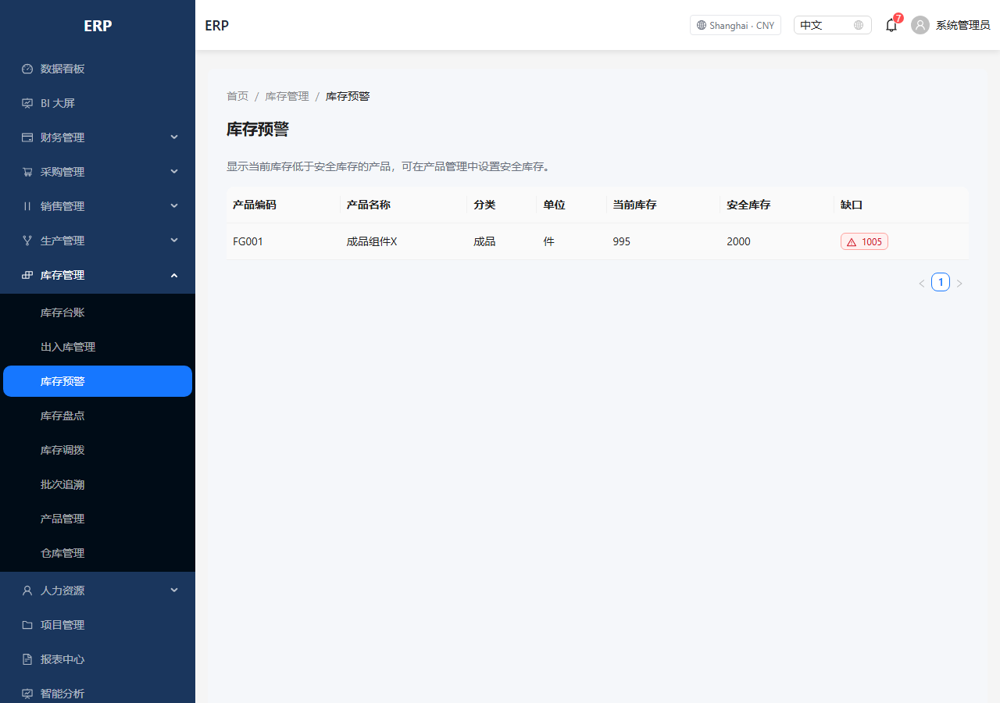

列出 **全仓合计库存 < 安全库存** 的产品，显示当前库存、安全库存与 **缺口**。

- 安全库存在 **产品管理** 中维护（字段 **安全库存**，须 > 0 才参与预警）。
- 采购收货、生产完工、手工入库等使库存回升后，预警行会自动消失。
- 与 **报表中心 → 智能补货** 联动：低于安全库存的产品会出现补货建议。

---

### 8.6 产品与仓库主数据

#### 产品管理

路径：**库存管理 → 产品管理**

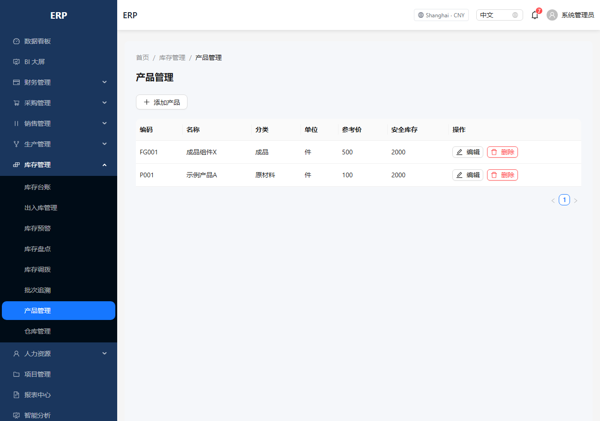

维护产品编码、名称、分类、单位、单价、**安全库存**、是否序列号管理等。安全库存是预警与智能补货的基础。

#### 仓库管理

路径：**库存管理 → 仓库管理**

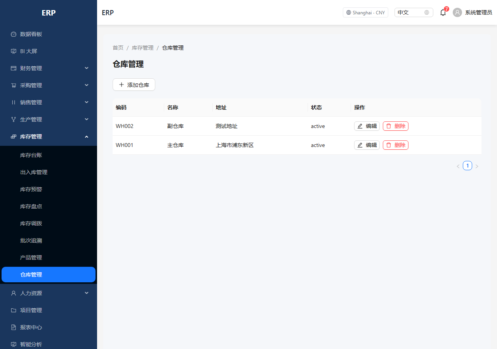

维护仓库编码、名称、地址。调拨、盘点、业务单据收货/发货均依赖仓库主数据。

---

### 8.7 批次 / 序列号追溯

路径：**库存管理 → 批次追溯**

#### 批次追溯 Tab

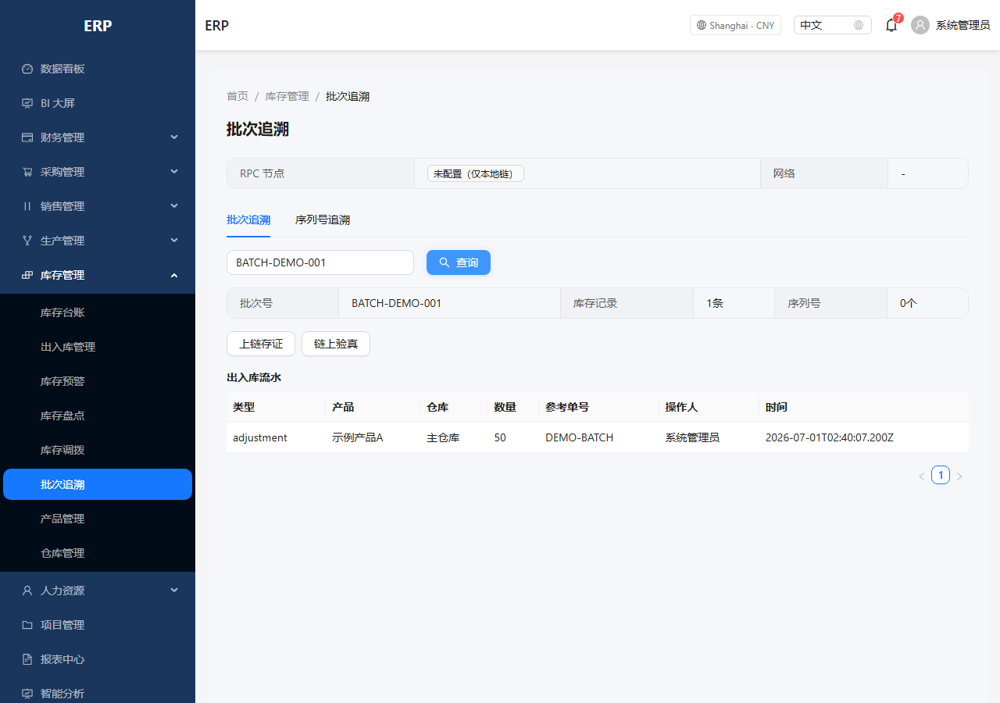

1. 输入 **批次号**（出入库调整时可指定 batchNo）。
2. 点击 **查询**，展示该批次当前库存分布与全部流转流水。

#### 序列号追溯 Tab

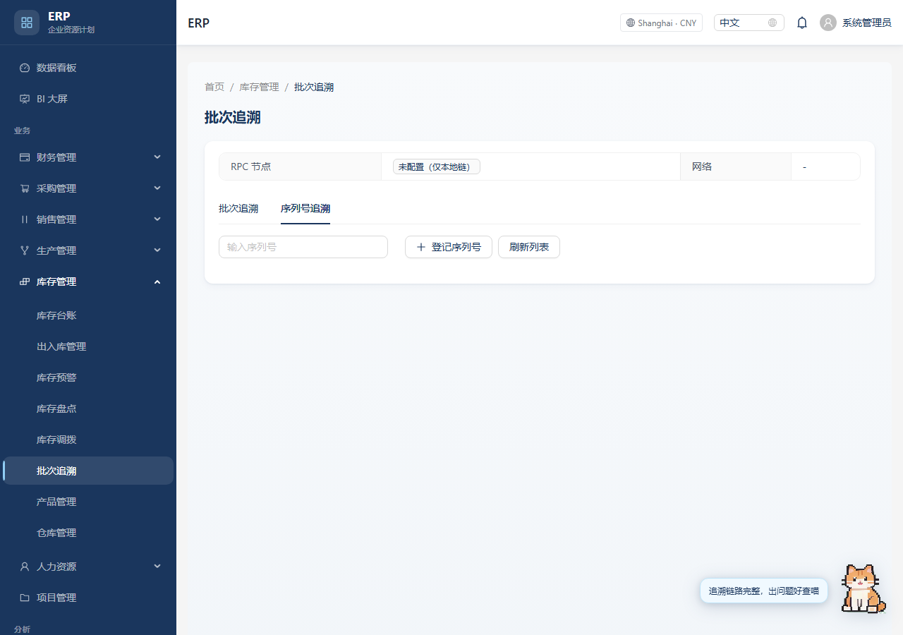

1. 切换到 **序列号追溯**，输入序列号查询生命周期流水。
2. 或通过 **登记序列号** 为新序列号建立档案（关联产品、批次、仓库）。

#### 区块链存证（可选）

- 页面顶部显示 RPC 配置状态；未配置时为 **本地哈希链**。
- 支持 **上链存证 / 链上验真**（需配置 `BLOCKCHAIN_RPC_URL` 与 `BLOCKCHAIN_PRIVATE_KEY`）。

---

### 8.8 实操演练（推荐顺序）

| 步骤 | 操作 | 预期结果 |
|------|------|----------|
| 1 | 库存台账 → 查看 FG001 / P001 | 见主仓库数量 |
| 2 | 出入库管理 → 库存调整 +10 | 台账增加；流水出现 adjustment |
| 3 | 仓库管理 → 新增副仓库 | 调拨可用两个仓库 |
| 4 | 库存调拨 → 主仓转副仓 5 件 | 两仓数量变化；transfer 流水 |
| 5 | 库存盘点 → 新建 → 录入实盘 → 完成 | 差异自动 adjustment |
| 6 | 产品管理 → 提高安全库存 | 库存预警出现该产品 |
| 7 | 批次追溯 → 输入批次号查询 | 见库存与流水 |

---

### 8.9 与其他模块联动

| 业务 | 库存影响 | 流水类型 |
|------|----------|----------|
| 采购收货 | 原材料 **增加** | `purchase_in` |
| 销售发货 | 成品 **减少** | `sales_out` |
| 工单开工 | 组件 **减少** | `production_out` |
| 工单完工 | 成品 **增加** | `production_in` |
| 智能补货 | 预警驱动采购 → 最终收货回补 | 间接 |

发货/开工提示 **库存不足** 时，应先在台账确认数量，或通过采购收货、生产完工、手工调整补充。

---

## 9. 生产管理

### 9.0 业务总览

生产模块与 **库存** 联动，典型链路如下：

```
BOM 维护 → 生产计划 → 审批 → 工单 → 下达 → 开工(扣减组件库存) → 完工入库(增加成品库存) → 质检
```

| 子模块 | 菜单路径 | 所需权限 | 说明 |
|--------|----------|----------|------|
| BOM 管理 | 生产管理 → BOM 管理 | `production:bom` | 成品与组件用量 |
| 生产计划 | 生产管理 → 生产计划 | `production:plan` | 计划数量与日期 |
| 工单管理 | 生产管理 → 工单管理 | `production:workorder` | 下达、开工、完工 |
| 质量管理 | 生产管理 → 质量管理 | `production:quality` | 工单质检记录 |

演示环境 seed 预置 **BOM-FG001**（成品 FG001，每件消耗原材料 P001 × 2）及主仓库库存，可直接演练完整流程。

---

### 9.1 BOM 管理

路径：**生产管理 → BOM 管理**

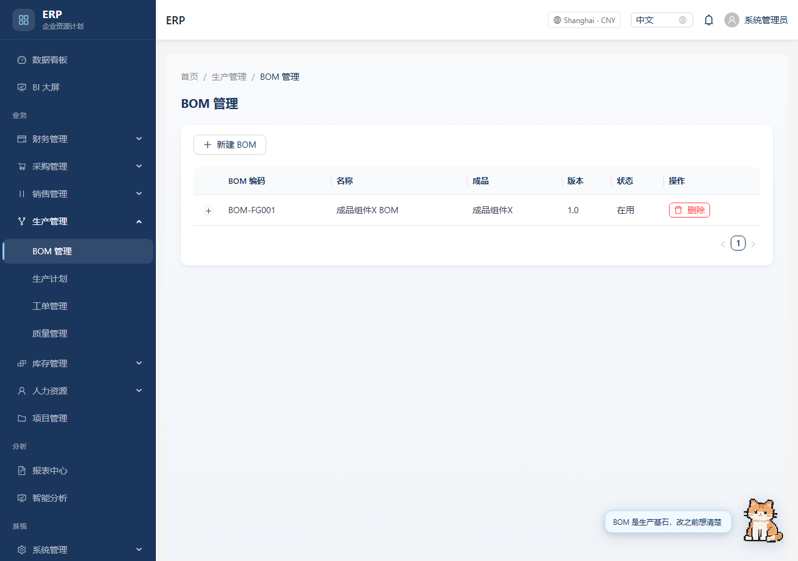

1. 点击 **+ 新建 BOM**，填写 BOM 编码、名称、**成品**、版本（默认 1.0）。
2. 添加 **组件行**：选择组件产品、单位用量、计量单位；至少一行，否则保存失败。
3. 列表中点击 **展开行** 可查看组件明细。

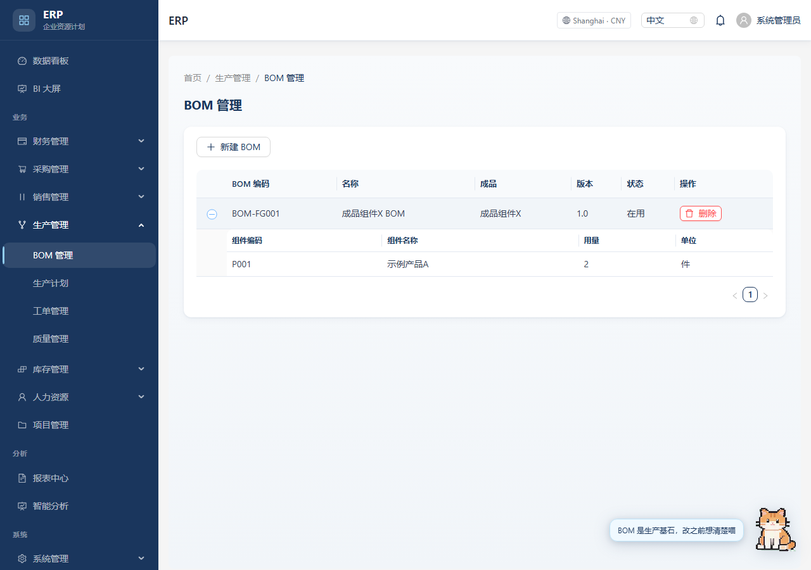

| 字段 | 说明 |
|------|------|
| 成品 | 工单完工入库的产品（如 FG001 成品组件X） |
| 组件 / 用量 | 生产 1 件成品所需组件数量；工单创建时按 **计划数量 × 用量** 生成领料需求 |

演示 BOM：**BOM-FG001**，成品 FG001，组件 P001 用量 **2 件/成品**。

---

### 9.2 生产计划

路径：**生产管理 → 生产计划**

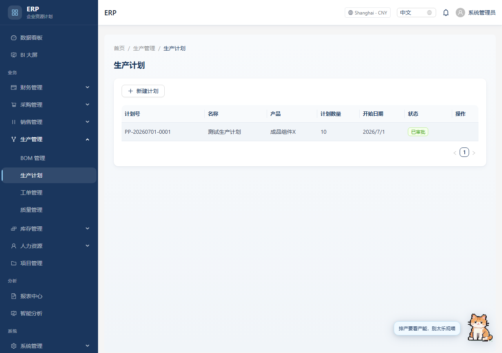

1. 点击 **+ 新建计划**，填写名称、产品、计划数量、开始/结束日期。
2. 保存后状态为 **草稿（draft）**，可删除或修改。
3. 点击 **审批（✓）** 后状态变为 **已审批（approved）**；已审批计划可在创建工单时关联。

> 仅 **草稿** 计划可编辑/删除；已审批计划用于指导工单，不会自动下达工单。

---

### 9.3 工单管理

路径：**生产管理 → 工单管理**

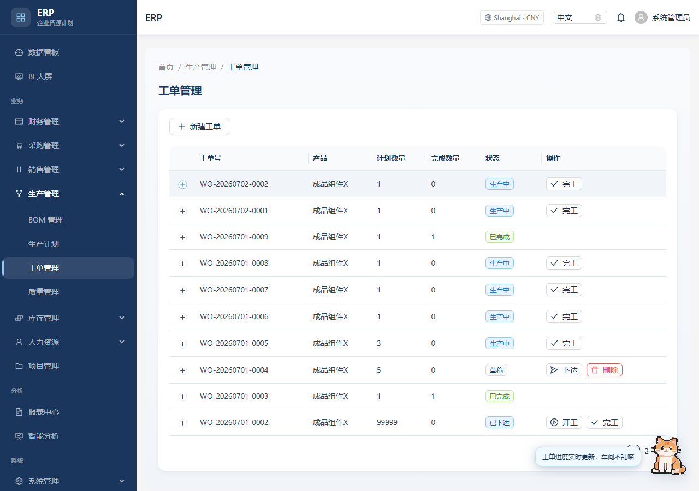

#### 状态流转

```
draft（草稿）→ released（已下达）→ in_progress（进行中）→ completed（已完成）
```

| 操作 | 当前状态 | 说明 |
|------|----------|------|
| **下达** | 草稿 | 确认排产，记录开始日期 |
| **开工** | 已下达 | 按 BOM 扣减 **组件库存**（`production_out`）；库存不足则失败 |
| **完工** | 进行中 / 已下达 | 成品入指定仓库（`production_in`），完成数量 = 计划数量 |
| **删除** | 草稿 | 已下达及以后不可删 |

#### 新建工单

1. 点击 **+ 新建工单**，选择 **产品**、可选 **BOM**、可选 **已审批生产计划**、计划数量。
2. 若选择 BOM，系统自动生成 **领料明细**（组件 × 计划数量）。
3. 按上表依次 **下达 → 开工 → 完工**。

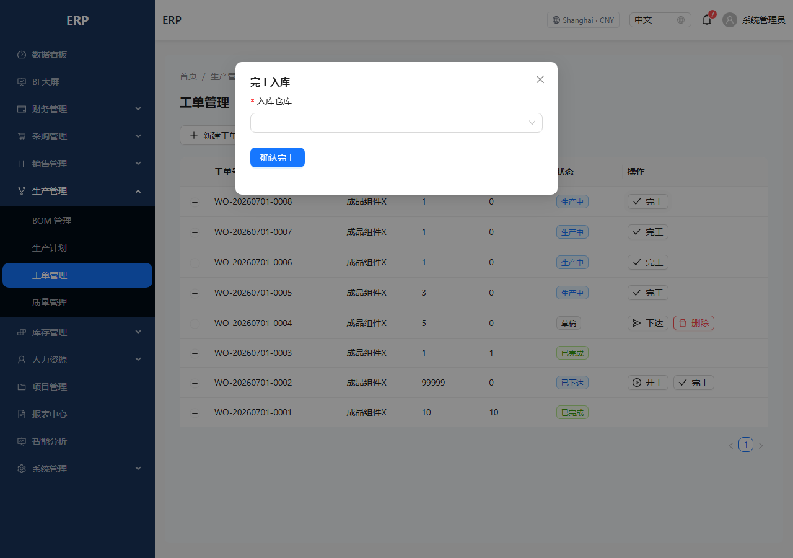

完工时选择 **入库仓库**（通常为主仓库），确认后成品库存增加、工单状态变为 **已完成**。展开工单行可查看领料与已消耗数量。

**库存校验：** 开工前请确认 **库存台账** 中组件（如 P001）数量充足；不足时提示「物料 xxx 库存不足」。

---

### 9.4 质量管理

路径：**生产管理 → 质量管理**

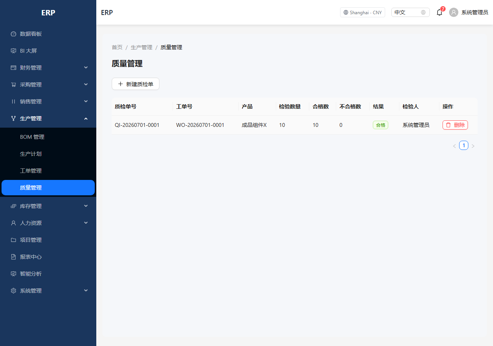

1. 点击 **+ 新建质检单**，选择 **进行中或已完工** 的工单。
2. 填写 **检验数量**、**合格数**、**不合格数**、检验说明。
3. **合格数 + 不合格数** 必须等于 **检验数量**，否则提交失败。
4. 不合格数 > 0 时质检状态为 **不合格（failed）**，否则为 **合格（passed）**。

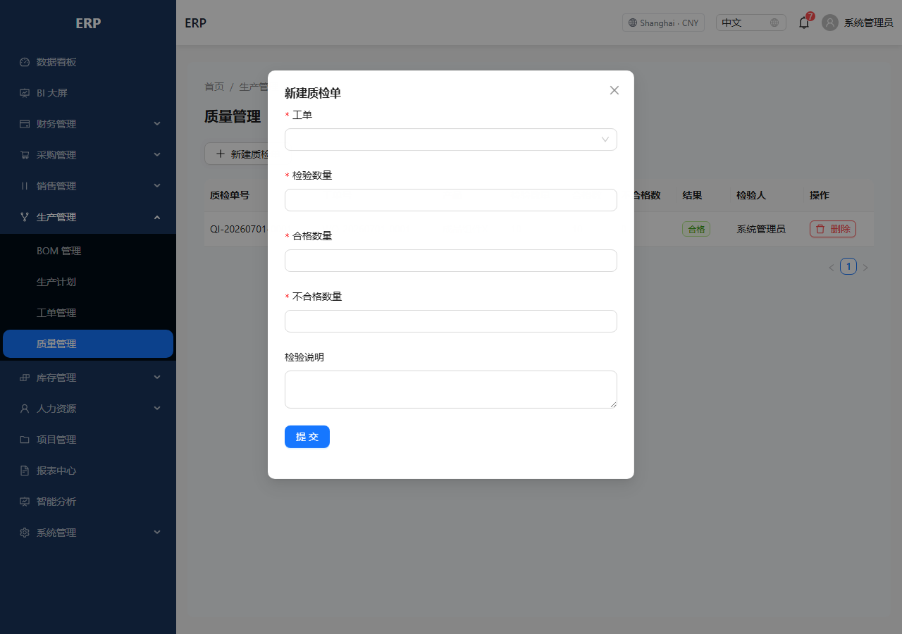

质检记录关联工单与产品，检验人取当前登录用户。

---

### 9.5 实操演练（推荐顺序）

适合生产专员约 30 分钟上机练习：

| 步骤 | 操作 | 预期结果 |
|------|------|----------|
| 1 | BOM 管理 → 展开 BOM-FG001 | 见 P001 × 2 |
| 2 | 生产计划 → 新建 → **审批** | 计划号 PP-…，状态已审批 |
| 3 | 工单管理 → 新建（选 BOM + 计划，数量 10）→ **下达** | 工单 WO-…，状态已下达 |
| 4 | **开工** | 状态进行中；P001 库存减少 20 |
| 5 | **完工** → 主仓库 | 状态已完成；FG001 库存 +10 |
| 6 | 质量管理 → 新建质检单（10 检 / 10 合格） | 质检单 QI-…，结果合格 |
| 7 | 库存台账 | 可见 production_in / production_out 流水 |

---

### 9.6 与库存的关系

| 环节 | 库存影响 | 流水类型 |
|------|----------|----------|
| 工单开工 | 组件仓库 **减少** | `production_out` |
| 工单完工 | 成品仓库 **增加** | `production_in` |

组件库存不足时无法开工；可通过 **采购收货** 或 **库存出入库** 补充原材料后再试。

---

## 10. 财务管理

### 10.0 业务总览

财务模块与采购、销售联动，核心链路如下：

```
销售：报价 → 销售订单 → 审批 → 发货（扣库存）→ 自动生成应收单 → 登记收款
采购：申请 → 采购订单 → 审批 → 收货（增库存）→ 自动生成应付单 → 登记付款
总账：维护科目 → 录入凭证 → 过账 → 财务报表科目余额表更新
```

| 子模块 | 菜单路径 | 所需权限 | 说明 |
|--------|----------|----------|------|
| 总账管理 | 财务管理 → 总账管理 | `finance:gl` | 科目与凭证 |
| 应收管理 | 财务管理 → 应收管理 | `finance:ar` | 销售发货后自动生成 |
| 应付管理 | 财务管理 → 应付管理 | `finance:ap` | 采购收货后自动生成 |
| 固定资产 | 财务管理 → 固定资产 | `finance:asset` | 资产卡片与折旧 |
| 预算管理 | 财务管理 → 预算管理 | `finance:budget` | 采购审批扣减预算 |
| 财务报表 | 财务管理 → 财务报表 | `finance:report` 或 `report:center` | 汇总与科目余额 |

演示环境 seed 会预置 **7 个会计科目**、**1 条固定资产**、**1 条年度预算**，以及若干已审批的采购/销售订单，便于直接演练收付款流程。

---

### 10.1 总账管理

路径：**财务管理 → 总账管理**

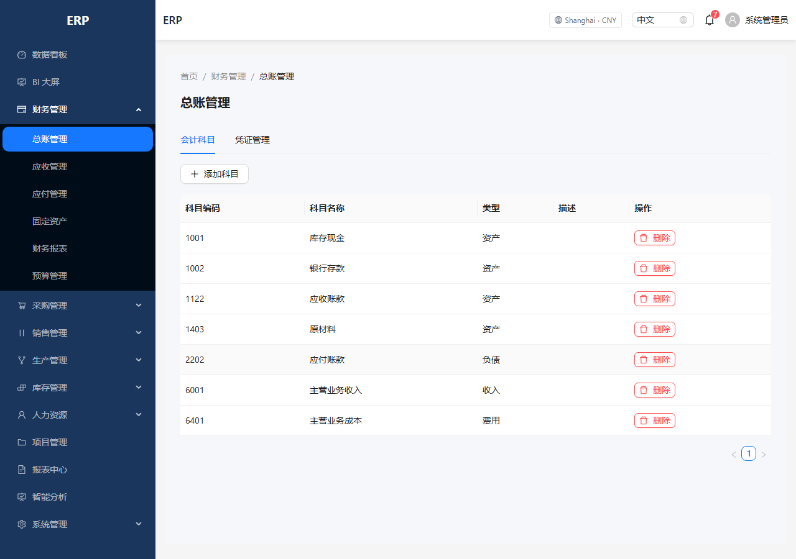

#### 会计科目

1. 打开 **会计科目** Tab。
2. 点击 **+ 添加科目**，填写科目编码、名称、类型（资产/负债/权益/收入/费用）、说明。
3. 列表中可 **删除** 未被凭证引用的科目。

系统预置常用科目示例：

| 编码 | 名称 | 类型 |
|------|------|------|
| 1001 | 库存现金 | 资产 |
| 1002 | 银行存款 | 资产 |
| 1122 | 应收账款 | 资产 |
| 2202 | 应付账款 | 负债 |
| 6001 | 主营业务收入 | 收入 |
| 6401 | 主营业务成本 | 费用 |

#### 凭证管理

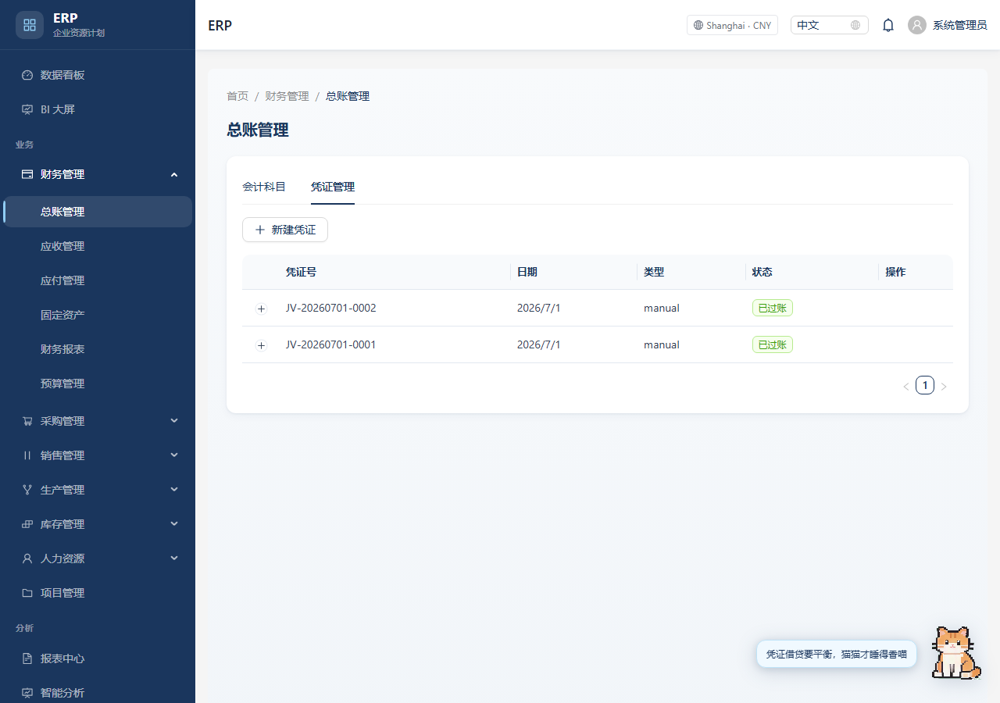

1. 切换到 **凭证管理** Tab。
2. 点击 **+ 新建凭证**：
   - 选择日期、凭证类型（如 `manual` 手工凭证）。
   - 添加分录行：选择科目、填写 **借方** 或 **贷方** 金额（同一凭证借贷须平衡）。
3. 保存后状态为 **草稿（draft）**。
4. 点击 **过账（✓）** 后状态变为 **已过账（posted）**，计入财务报表 **科目余额表**。
5. 仅草稿凭证可删除；已过账凭证不可删改。
6. 点击凭证行 **展开** 可查看分录明细（科目、借贷、摘要）。

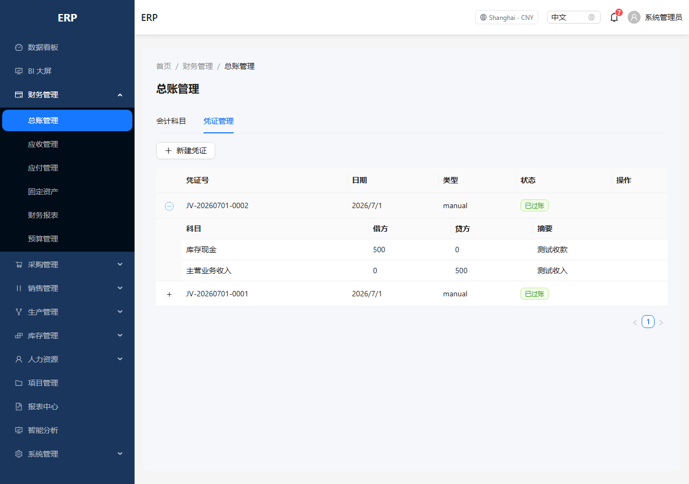

> **注意**：应收/应付由业务单据自动生成，与总账凭证相互独立；科目余额表仅统计 **已过账** 的手工凭证分录。

---

### 10.2 应收管理

路径：**财务管理 → 应收管理**

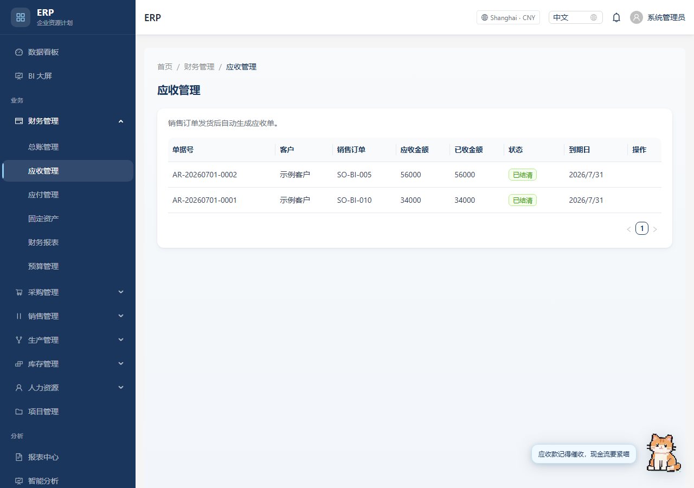

#### 自动生成规则

- 触发条件：**销售订单审批通过** 后，在 **发货管理** 或销售订单页执行 **发货**。
- 系统校验对应仓库 **库存充足**，出库成功后自动生成 **应收单**（单据号形如 `AR-YYYYMMDD-0001`）。
- 应收金额 = 销售订单总金额；到期日默认为生成日后 **30 天**。
- 同一销售订单 **不会重复** 生成应收单。

前置操作详见 [7.4 销售订单](#74-销售订单)、[7.5 发货管理](#75-发货管理)。

#### 登记收款

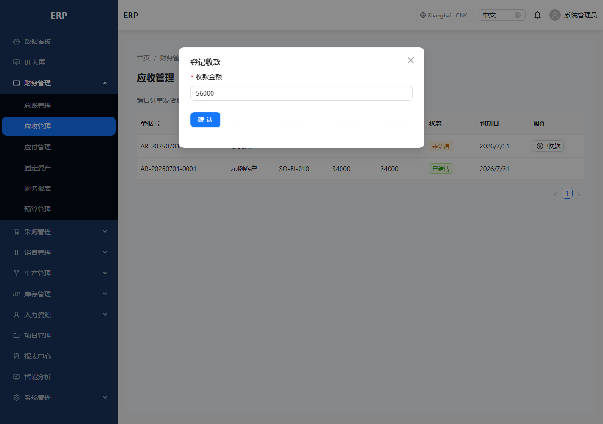

1. 在应收列表找到状态为 **未结清** 的单据（`open` / `partial`）。
2. 点击 **收款**，输入本次收款金额（默认为剩余未收金额，可改）。
3. 点击 **确认** 后更新 **已收金额** 与状态：

| 状态 | 含义 |
|------|------|
| `open` | 未收款 |
| `partial` | 部分收款 |
| `paid` | 已全部收讫（不再显示收款按钮） |

> 单次收款金额不得超过 **应收余额**（应收金额 − 已收金额）。

---

### 10.3 应付管理

路径：**财务管理 → 应付管理**

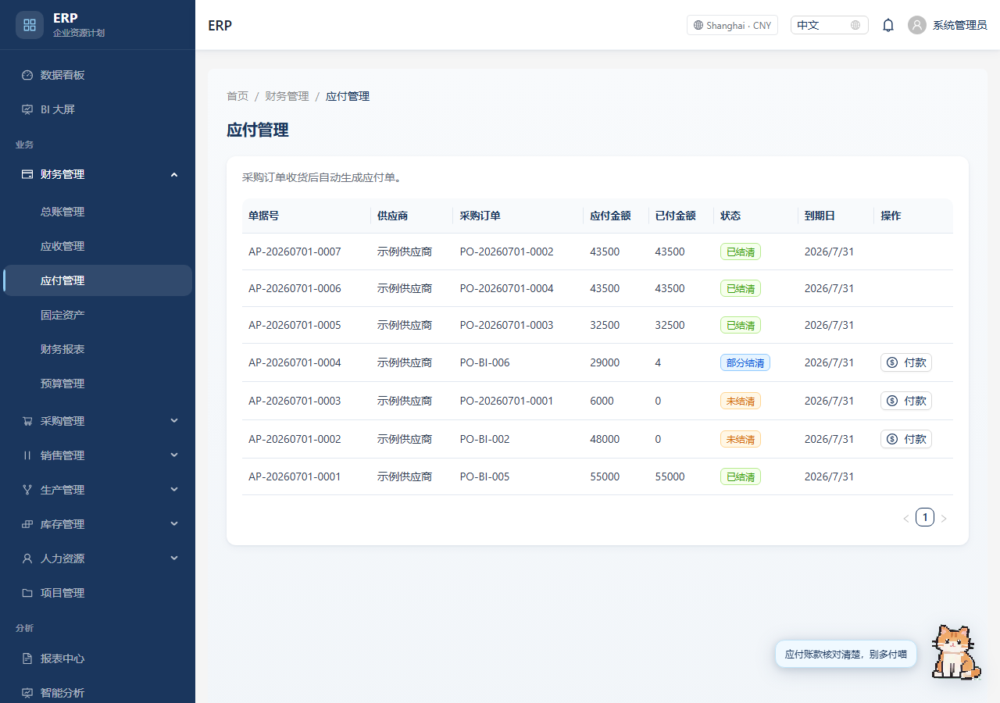

#### 自动生成规则

- 触发条件：**采购订单审批通过** 后，在 **收货验收** 页完成 **收货**。
- 系统按订单明细 **增加库存**，并自动生成 **应付单**（单据号形如 `AP-YYYYMMDD-0001`）。
- 应付金额 = 采购订单总金额；到期日默认为生成日后 **30 天**。
- 同一采购订单 **不会重复** 生成应付单。

前置操作详见 [6.4 采购订单](#64-采购订单)、[6.5 收货验收](#65-收货验收)。

#### 登记付款

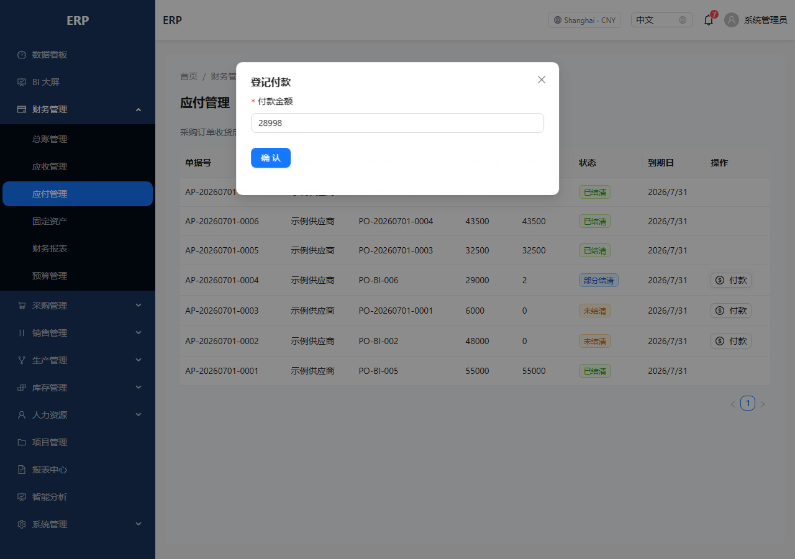

1. 在应付列表找到状态为 **未结清** 的单据（`open` / `partial`）。
2. 点击 **付款**，输入本次付款金额（默认为剩余未付金额，可改）。
3. 点击 **确认** 后更新 **已付金额** 与状态：

| 状态 | 含义 |
|------|------|
| `open` | 未付款 |
| `partial` | 部分付款 |
| `paid` | 已全部付讫（不再显示付款按钮） |

> 单次付款金额不得超过 **应付余额**（应付金额 − 已付金额）。

---

### 10.4 固定资产

路径：**财务管理 → 固定资产**


1. 点击 **+ 新增资产**，填写资产编号、名称、分类、原值、使用年限（月）、购置日期、存放地点等。
2. 对 **在用（active）** 资产可执行：
   - **计提折旧**：按直线法增加累计折旧；
   - **处置**：标记为已处置，不再参与净值统计。
3. 已处置资产可删除卡片。

演示数据含一条 **办公服务器**（原值 60,000）。计提折旧、处置或新增资产后，**财务报表** 与 **智能财务** 中的「固定资产净值」会 **立即更新**（与应收/应付一样自动清除报表缓存）。

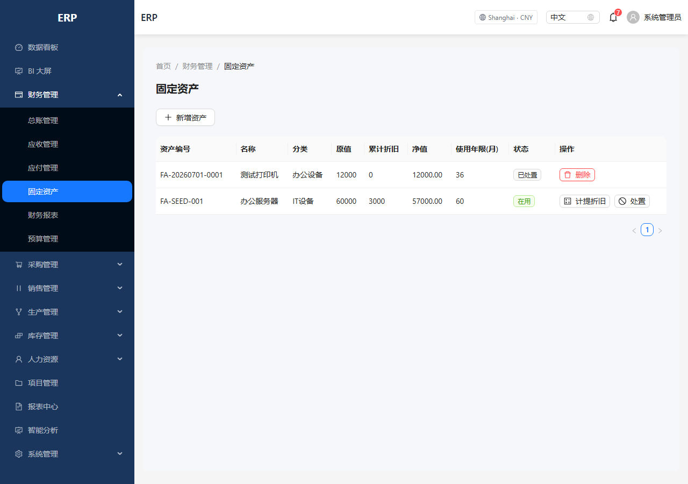

---

### 10.5 预算管理

路径：**财务管理 → 预算管理**

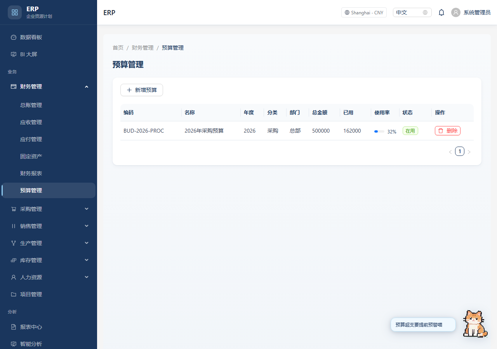

1. 点击 **+ 新增预算**，设置编码、名称、年度、分类（如 `procurement` 采购）、部门、预算总额。
2. **采购订单审批** 时，系统按订单金额 **扣减** 对应年度、分类下 **在用（active）** 预算的已用额度。
3. 若 **已用 + 本次订单金额 > 预算总额**，审批 **被拒绝**（HTTP 400），订单保持 **草稿**；需先 **追加预算总额**（编辑预算）或 **调减订单金额** 后再审批。
4. 审批通过后若仍触发超支（如并发审批），系统会发送 **预算超支** 站内通知。

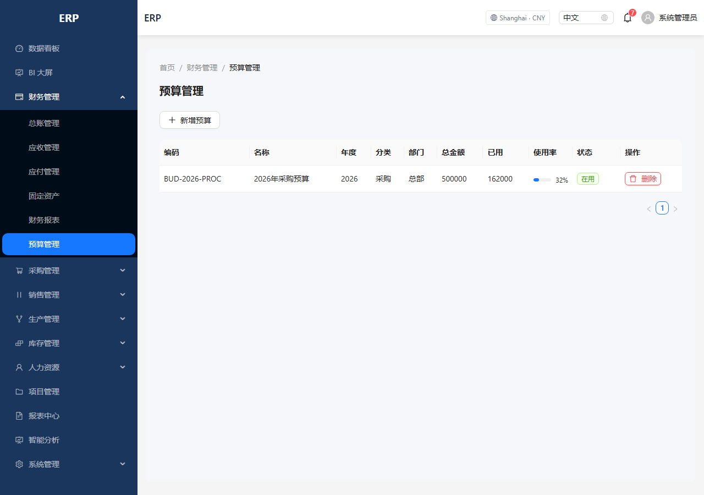

**示例：** 2026 年采购预算总额 500,000，已用 162,000；若新建订单金额 350,000，审批将提示「超出预算可用额度」。

---

### 10.6 财务报表

路径：**财务管理 → 财务报表**

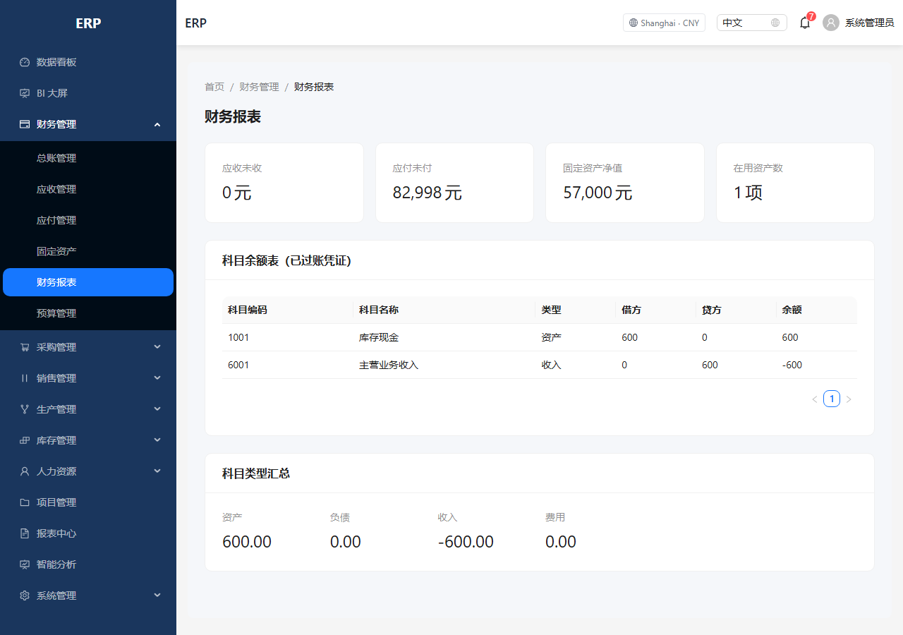

页面分为 **汇总卡片** 与 **科目余额表** 两部分。

#### 汇总指标

| 指标 | 说明 |
|------|------|
| 应收未收 | 所有应收单的（应收金额 − 已收金额）合计 |
| 应付未付 | 所有应付单的（应付金额 − 已付金额）合计 |
| 固定资产净值 | 在用资产原值 − 累计折旧 |
| 在用资产数 | 状态为 `active` 的资产条数 |

#### 科目余额表

- 数据来源：**已过账** 的总账凭证分录，按科目汇总借方、贷方与余额。
- 无过账凭证时，该表可能为空或仅显示历史过账数据。

#### 数据刷新

- **应收/应付收付款**、**凭证过账**、**发货/收货生成应收应付**、**固定资产变更（新增/折旧/处置）** 后，报表汇总会 **立即更新**（服务端自动清除财务报表缓存）。
- 若页面仍显示旧数据，**刷新浏览器** 即可；报表中心 **运营概览** 仍可能有约 60 秒缓存。

---

### 10.7 实操演练（推荐顺序）

适合财务专员 30–45 分钟上机练习：

| 步骤 | 操作 | 预期结果 |
|------|------|----------|
| 1 | 采购管理 → 采购订单 → 找 **已审批** 订单 → 收货验收 | 应付列表出现新应付单 |
| 2 | 财务管理 → 应付管理 → **付款**（可部分或全额） | 已付金额更新；报表「应付未付」减少 |
| 3 | 销售管理 → 销售订单 → 找 **已审批** 订单 → 发货 | 应收列表出现新应收单 |
| 4 | 财务管理 → 应收管理 → **收款** | 已收金额更新；报表「应收未收」减少 |
| 5 | 财务管理 → 总账管理 → 新建平衡凭证 → **过账** | 报表科目余额表出现对应科目 |
| 6 | 财务管理 → 财务报表 | 四项 KPI 与余额表与上步一致 |

若 **发货失败**，请先在 **库存台账** 确认主仓库库存；演示环境 seed 已为原材料产品预置库存。

### 10.8 端到端验证清单

以下场景已在演示环境跑通，可用于验收或培训考核：

| 链路 | 关键验证点 |
|------|------------|
| 智能补货 → 采购 | 预警 → 转 PR → 转 PO → 收货 → 库存增加 |
| 采购 → 应付 → 付款 | 收货后 AP 自动生成；部分/全额付款；超额拒绝 |
| 销售 → 应收 → 收款 | 发货后 AR 自动生成；收付款后状态 `paid` |
| 总账 → 报表 | 平衡凭证过账后科目余额表更新；借贷不平拒绝 |
| 报表缓存 | 收付款/过账/收货后 `GET /api/report/finance` 立即反映新值 |

自动化冒烟：`npm run docs:verify:flows`（需后端 `:3001` 运行）。

---

## 11. 人力资源

### 11.0 业务总览

人力资源模块覆盖 **组织主数据 → 员工档案 → 考勤 → 薪资 → 绩效** 的完整人事链路：

```
部门 / 岗位 → 员工档案 → 考勤登记 → 薪资核算与发放 → 绩效考核
```

| 子模块 | 菜单路径 | 所需权限 | 说明 |
|--------|----------|----------|------|
| 员工管理 | 人力资源 → 员工管理 | `hr:employee` | 员工档案 CRUD |
| 部门管理 | 人力资源 → 部门管理 | `hr:employee` | 组织部门 |
| 岗位管理 | 人力资源 → 岗位管理 | `hr:employee` | 职位定义 |
| 考勤管理 | 人力资源 → 考勤管理 | `hr:attendance` | 出勤/请假登记 |
| 薪资管理 | 人力资源 → 薪资管理 | `hr:salary` | 工资单与发放 |
| 绩效管理 | 人力资源 → 绩效管理 | `hr:performance` | 考核评分 |

演示环境 seed 预置 **D001 总部**、**P-MGR 部门经理**、员工 **E001 王五**；演示账号 **`hr_clerk`**（人事专员）拥有全部 HR 权限。

---

### 11.1 部门与岗位主数据

#### 部门管理

路径：**人力资源 → 部门管理**

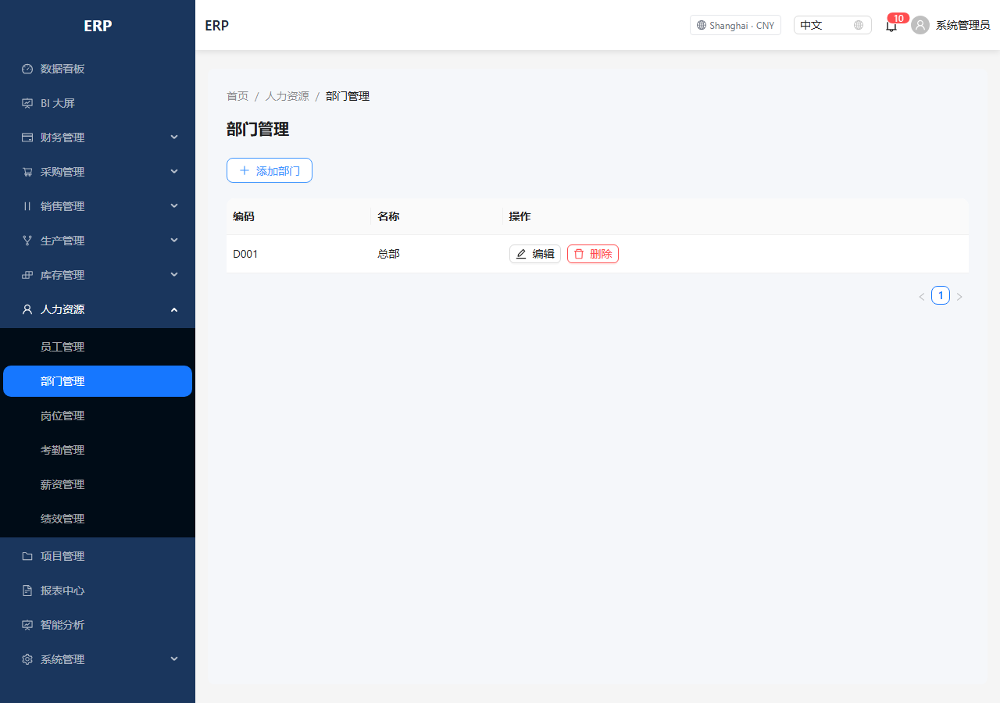

维护部门 **编码**、**名称**。员工档案、预算（按部门）等模块引用部门主数据。

#### 岗位管理

路径：**人力资源 → 岗位管理**

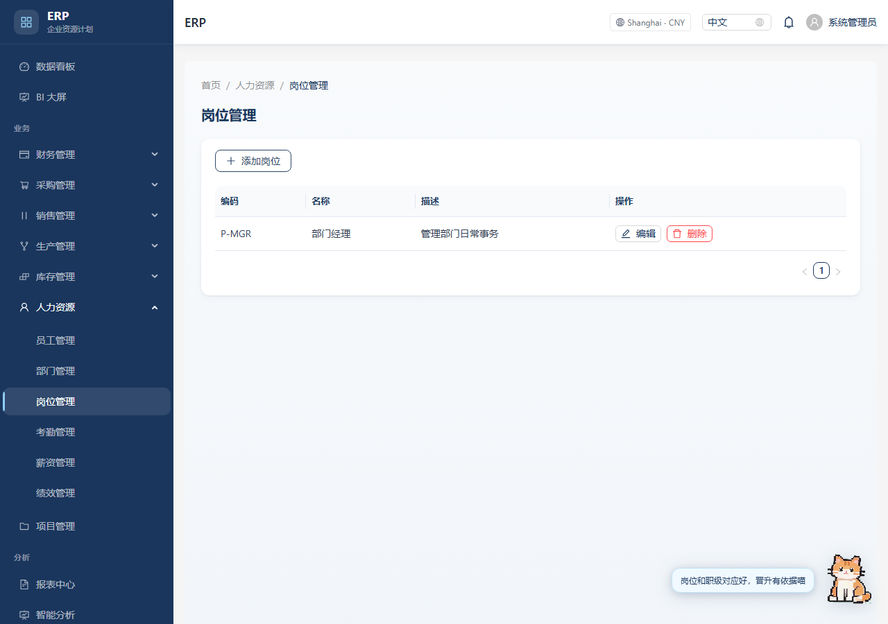

维护岗位编码、名称、描述。创建员工时关联岗位。

> 建议先维护 **部门 / 岗位**，再录入员工，保证档案完整。

---

### 11.2 员工管理

路径：**人力资源 → 员工管理**

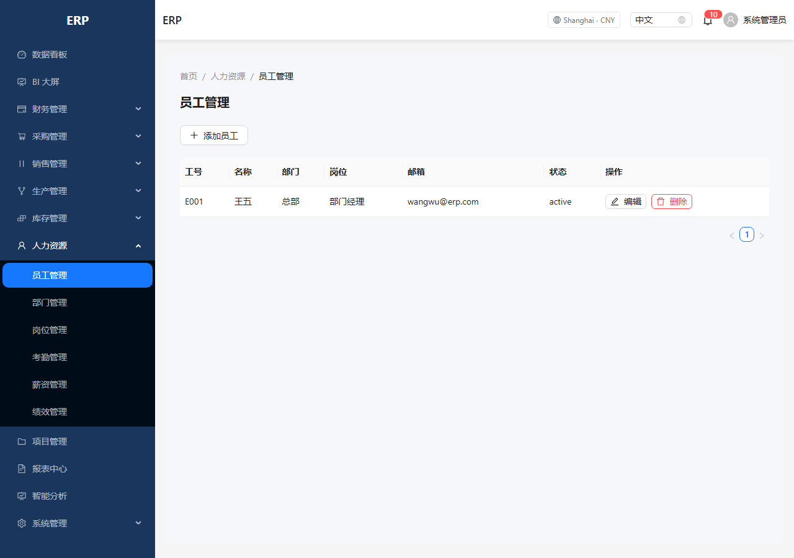

| 字段 | 说明 |
|------|------|
| 工号 | 唯一标识，创建后不可在界面修改 |
| 名称 | 员工姓名 |
| 部门 / 岗位 | 关联主数据 |
| 邮箱 / 电话 | 联系方式 |
| 状态 | 默认 `active` |

#### 添加员工

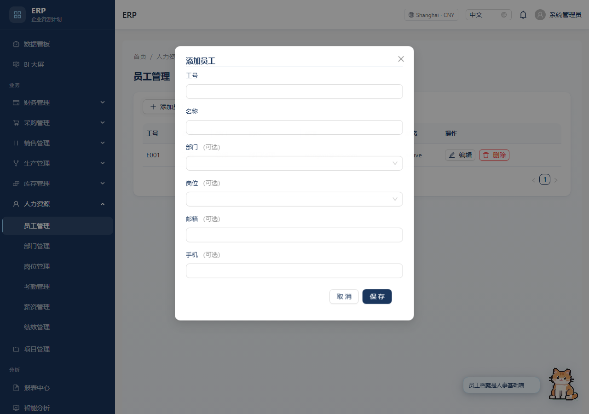

1. 点击 **+ 添加员工**。
2. 填写工号、姓名，可选部门、岗位、邮箱、电话。
3. 保存后在列表中可 **编辑** 或 **删除**。

> **工号重复** 时系统拒绝创建。删除员工前请确认其无项目任务等外键引用（演示环境 E001 为项目经理，不可删）。

---

### 11.3 考勤管理

路径：**人力资源 → 考勤管理**

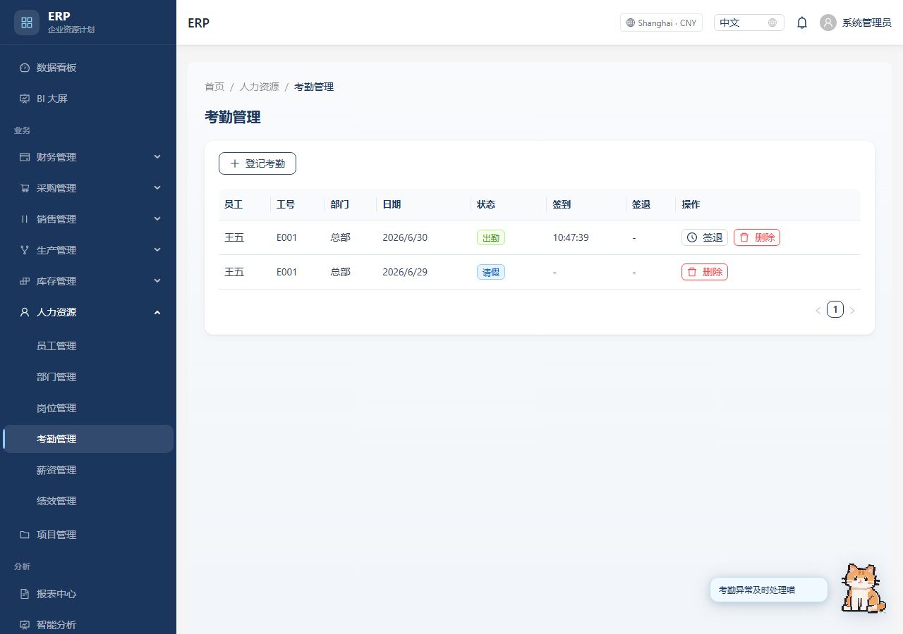

记录员工每日考勤，支持状态：

| 状态 | 说明 |
|------|------|
| 出勤（present） | 登记时自动写入 **签到时间**；可后续 **签退** |
| 缺勤（absent） | 未到岗 |
| 迟到（late） | 迟到记录 |
| 请假（leave） | 请假，不自动签到 |

#### 登记考勤

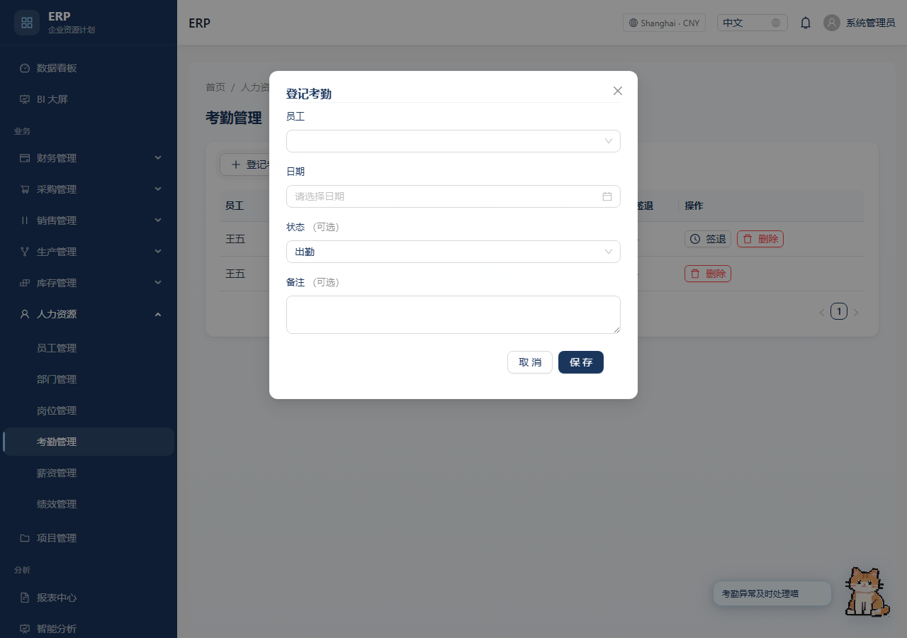

1. 点击 **登记考勤**，选择员工、日期、状态。
2. 可选填备注。
3. 状态为 **出勤** 时，保存后列表显示签到时间；未签退的行可点击 **签退** 记录签退时间。

---

### 11.4 薪资管理

路径：**人力资源 → 薪资管理**

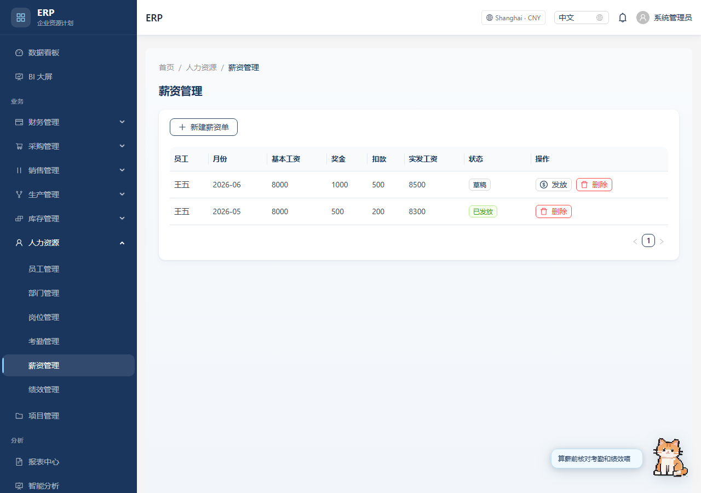

#### 新建薪资单

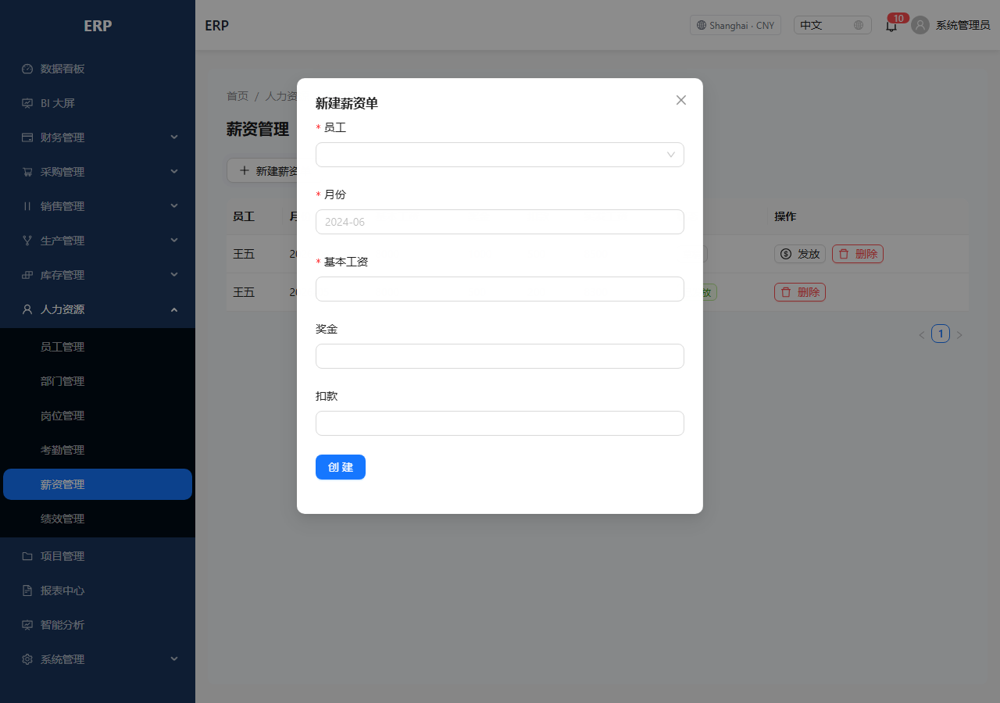

1. 点击 **新建薪资单**，选择员工、月份（格式 `YYYY-MM`）。
2. 填写 **基本工资**、**奖金**、**扣款**（后两项可选，默认 0）。
3. 系统自动计算 **实发工资** = 基本 + 奖金 − 扣款。

| 状态 | 说明 |
|------|------|
| 草稿（draft） | 新建后默认状态，可 **发放** 或删除 |
| 已发放（paid） | 点击 **发放** 后锁定，表示已完成发薪确认 |

> 演示示例：基本 8000 + 奖金 1000 − 扣款 500 = **实发 8500**。

---

### 11.5 绩效管理

路径：**人力资源 → 绩效管理**

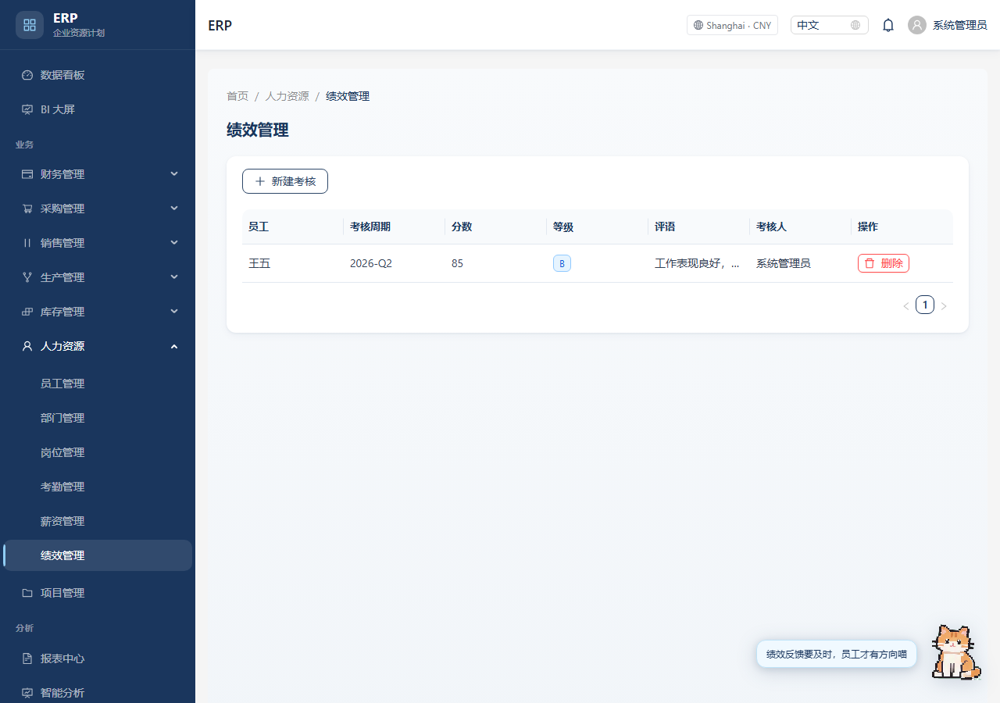

#### 新建考核

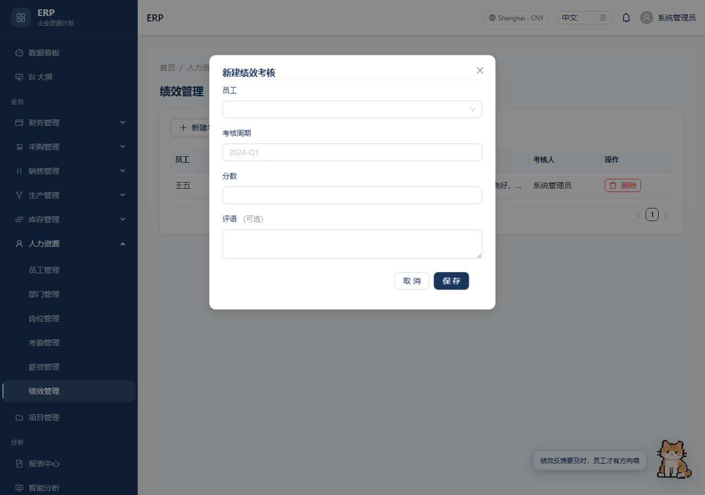

1. 点击 **新建考核**，选择被考核员工。
2. 填写 **考核周期**（如 `2026-Q2`）、**分数**（0–100）、评语。
3. 提交后系统按分数自动评级：

| 分数 | 等级 |
|------|------|
| ≥ 90 | A |
| ≥ 80 | B |
| ≥ 70 | C |
| < 70 | D |

**考核人** 自动取当前登录用户（如 admin / hr_clerk）。

---

### 11.6 实操演练（推荐顺序）

| 步骤 | 操作 | 预期结果 |
|------|------|----------|
| 1 | 部门 / 岗位 → 查看 D001、P-MGR | seed 主数据可见 |
| 2 | 员工管理 → 查看 E001 王五 | 部门总部、岗位部门经理 |
| 3 | 考勤 → 登记出勤 → 签退 | 签到/签退时间写入 |
| 4 | 考勤 → 登记请假 | 状态「请假」，无签到 |
| 5 | 薪资 → 新建 2026-06 薪资单 | 实发自动计算，状态草稿 |
| 6 | 点击 **发放** | 状态变为已发放 |
| 7 | 绩效 → 新建 Q2 考核，85 分 | 等级 B，考核人为当前用户 |

自动化冒烟：`node scripts/test-hr-flow.mjs`（10 项 API 校验）。

---

### 11.7 与其他模块联动

| 模块 | 联动说明 |
|------|----------|
| 项目管理 | 员工 E001 可担任 **项目经理**、任务 **执行人** |
| 预算管理 | 预算可按 **部门** 维度设置与扣减 |
| 系统用户 | ERP 登录用户（如 hr_clerk）与员工档案独立维护；权限由 **角色** 控制 |

普通员工账号（`employee`）仅有采购申请、库存只读等权限，**无法访问** 人力资源菜单（API 返回 403）。

---

## 12. 项目管理

### 12.0 业务总览

项目管理用于 **立项 → 任务分解 → 启动 → 跟踪 → 完成** 的全生命周期管理，并与 **人力资源** 中的员工档案联动（项目经理、任务执行人）。

```
新建项目（规划中）→ 启动 → 进行中 → 完成（进度 100%）
         ↓ 创建时可附带任务行
    展开行查看任务 / 负责人 / 进度
```

| 能力 | 所需权限 | 说明 |
|------|----------|------|
| 创建 / 启动 / 完成 / 删除 | `project:manage` | 完整写操作（admin 默认拥有） |
| 列表 / 详情只读 | `report:center` | 如 production_manager 可查看不可改 |

演示环境 seed 预置 **PRJ001「ERP系统升级项目」**，经理 **E001 王五**，含任务「人力资源模块开发」。

---

### 12.1 项目列表

路径：**项目管理**

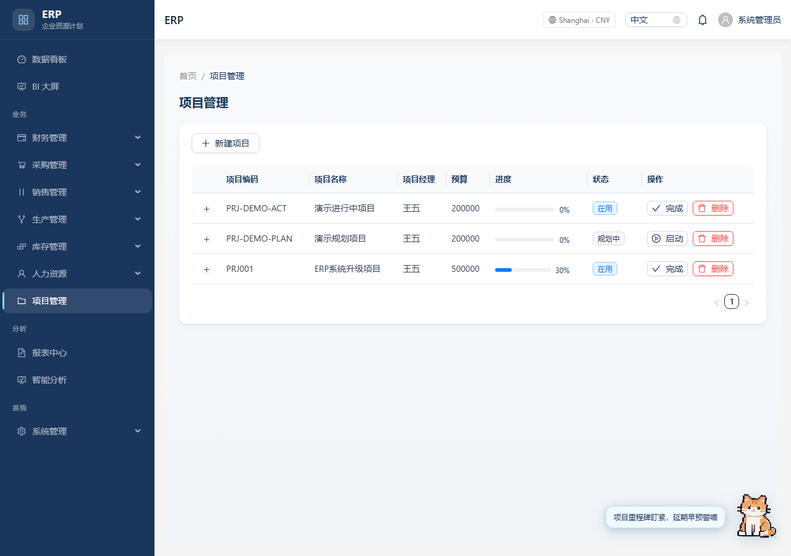

| 列 | 说明 |
|----|------|
| 项目编码 / 名称 | 唯一编码与项目名称 |
| 项目经理 | 关联 **员工档案**（非系统登录用户） |
| 预算 | 项目预算金额 |
| 进度 | 进度条（0–100%） |
| 状态 | planning / active / completed |

#### 状态与操作

| 状态 | 界面显示 | 可用操作 |
|------|----------|----------|
| planning（规划中） | 规划中 | **启动**、删除 |
| active（进行中） | 进行中 | **完成**、删除 |
| completed（已完成） | 已完成 | 删除 |

> **启动** 仅对 **规划中** 项目可用；对进行中项目再次启动返回 400。  
> **完成** 后状态变为已完成，进度自动设为 **100%**。

---

### 12.2 任务明细

点击项目行左侧 **展开行**，查看下属任务：

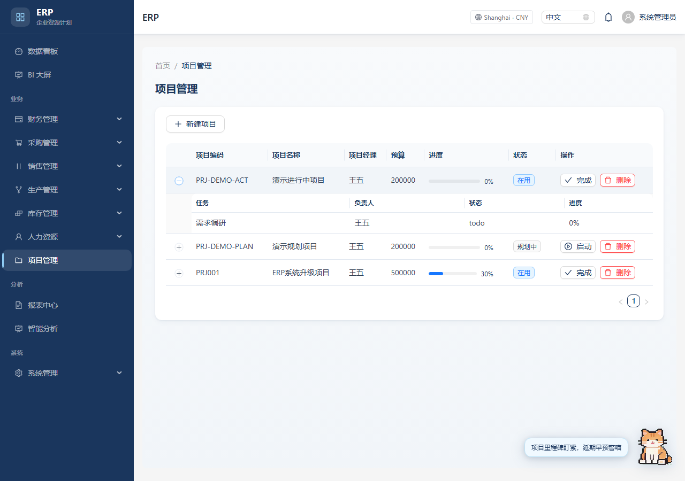

| 列 | 说明 |
|----|------|
| 任务 | 任务名称 |
| 负责人 | 员工姓名 |
| 状态 | 默认 todo；seed 任务可为 in_progress |
| 进度 | 任务完成百分比 |

任务在 **新建项目** 时一并创建；当前版本界面 **不支持** 单独编辑任务进度，项目总进度可通过 API `PATCH /api/projects/:id` 更新。

---

### 12.3 新建项目

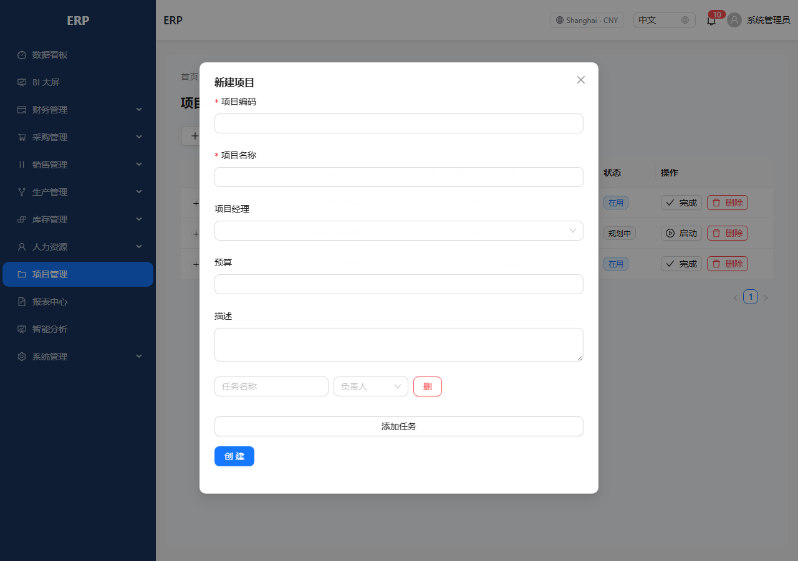

1. 点击 **+ 新建项目**。
2. 填写 **项目编码**（唯一）、**项目名称**。
3. 可选：**项目经理**、**预算**、**描述**。
4. 在 **任务** 区域填写任务名称、负责人；可 **添加任务** 多行。
5. 点击 **创建**；新项目默认状态 **规划中**。

> **项目编码重复** 时创建失败。项目经理与负责人均来自 **员工管理** 中的在职员工。

---

### 12.4 实操演练（推荐顺序）

| 步骤 | 操作 | 预期结果 |
|------|------|----------|
| 1 | 项目管理 → 展开 PRJ001 | 见任务「人力资源模块开发」 |
| 2 | **新建项目** → 编码 PRJ-TEST、选经理、加 1 条任务 | 状态「规划中」 |
| 3 | 点击 **启动** | 状态变为进行中 |
| 4 | （可选）API 更新 progress | 进度条变化 |
| 5 | 点击 **完成** | 状态已完成，进度 100% |
| 6 | 删除测试项目 | 列表移除 |

自动化冒烟：`node scripts/test-project-flow.mjs`（10 项 API 校验）。

---

### 12.5 与其他模块联动

| 模块 | 联动说明 |
|------|----------|
| 人力资源 | 项目经理、任务 **负责人** 引用员工 E001 等档案 |
| 预算管理 | 预算可按 **部门** 维度设置；项目 budget 字段为项目级预算记录 |
| 报表中心 | 拥有 `report:center` 的角色可 **只读** 查看项目列表 |

采购专员等无 `project:manage` / `report:center` 的角色 **无法访问** 项目管理菜单。

---

## 13. 报表与智能分析

### 13.0 业务总览

报表模块提供 **运营汇总、智能决策、大屏展示** 三类能力，数据均来自真实业务单据：

```
销售/采购/库存/人力/项目 业务数据
        ↓
报表中心运营概览 ←→ BI 大屏（同源，~60s 缓存）
        ↓
智能分析：补货建议 / 财务洞察
        ↓
（可选）转采购申请 → 采购闭环
```

| 入口 | 路径 | 所需权限 | 说明 |
|------|------|----------|------|
| 报表中心 | `/report` | `report:center` | KPI + 趋势图 + 订单分布 |
| 智能分析 | `/report/intelligence` | `report:center` 或 `inventory:alert` / `finance:report` | 补货 / 财务 Tab |
| BI 大屏 | `/bi-screen` | 登录即可 | 深色全屏，30s 刷新 |
| 财务报表 | 财务管理 → 财务报表 | `finance:report` 或 `report:center` | 应收应付/科目余额（见 [10.6](#106-财务报表)） |

演示账号 **`employee`** 拥有 `report:center`，可查看报表中心；**`procurement_clerk`** 无此权限。

---

### 13.1 报表中心（运营概览）

路径：**报表中心**

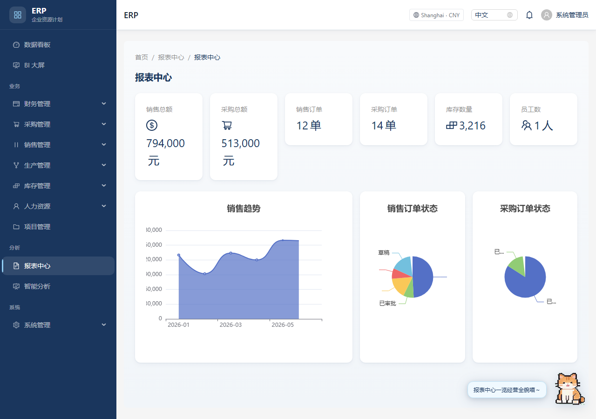

#### 指标卡片

| 指标 | 数据来源 |
|------|----------|
| 销售总额 | 全部销售订单金额合计 |
| 采购总额 | 全部采购订单金额合计 |
| 销售 / 采购订单数 | 订单笔数 |
| 库存数量 | 各仓库存数量汇总 |
| 员工数 | 员工档案计数 |

#### 图表

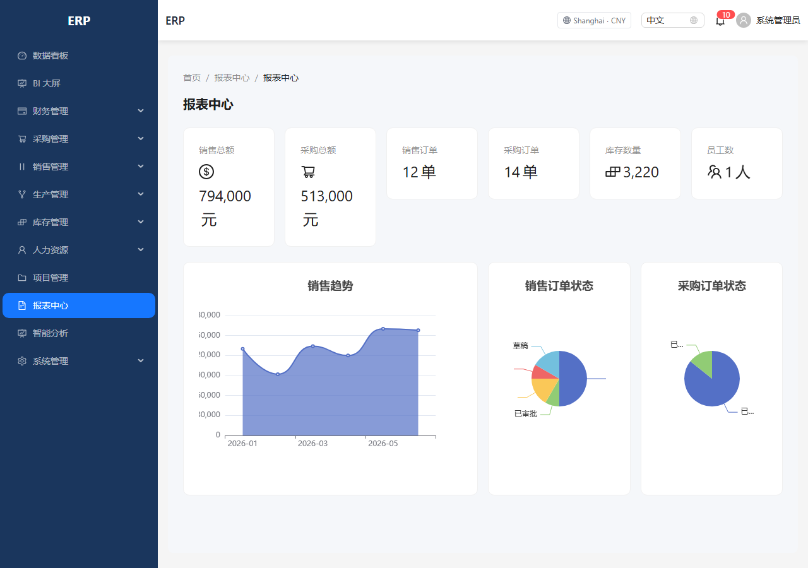

| 图表 | 说明 |
|------|------|
| 销售趋势 | 按 **月份** 汇总销售订单金额（折线/面积图） |
| 销售订单状态 | 草稿 / 已审批 / 已完成 / 已取消 占比（饼图） |
| 采购订单状态 | 同上，按采购订单状态分布 |

> **缓存说明：** 接口 `GET /api/report/overview` 有约 **60 秒** Redis 缓存。新建订单后若数字未变，稍等或 **刷新页面** 即可。  
> 与 **数据看板**（`/dashboard`）使用相同数据源，报表中心展示维度更全（含采购总额、员工数等）。

---

### 13.2 智能分析

路径：**报表中心 → 智能分析**（`/report/intelligence`）


智能分析在运营数据之上提供 **规则驱动的决策建议**，分为两个 Tab：

| Tab | 所需权限（任一） | 核心能力 |
|-----|------------------|----------|
| 智能补货 | `report:center` 或 `inventory:alert` | 低于安全库存 → 建议采购量 → 转采购申请 |
| 智能财务 | `report:center` 或 `finance:report` | 应收应付、净头寸、毛利率、资产负债洞察 |

**转采购申请** 另需 `procurement:request`（admin、`employee` 演示账号均具备）。  
演示：**employee** 可查看两个 Tab 并转 PR；**finance_clerk** 仅智能财务；**procurement_clerk** 无智能分析菜单。

---

#### 13.2.1 智能补货 Tab


**出现条件：** 与 **库存预警** 相同——产品 **全仓合计库存 < 安全库存**（安全库存须 > 0）。

**建议算法：**

```
日均消耗 = 近30天出库量(sales_out/transfer_out/负adjustment) ÷ 30
lead time 需求 = ceil(日均消耗 × 7)
建议采购量 = max(缺口, lead time 需求, 1)
可覆盖天数 = 当前库存 ÷ 日均消耗（无出库时为 null）
```

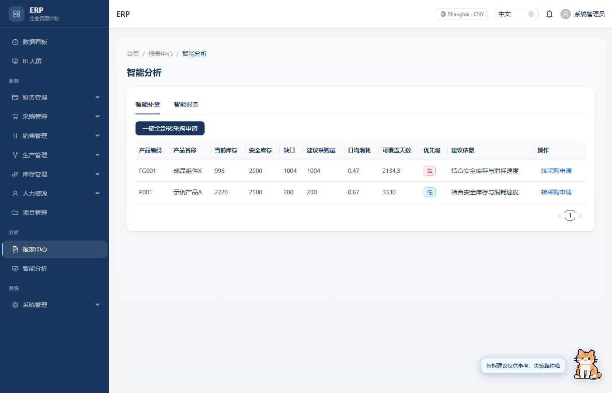

| 字段 | 说明 |
|------|------|
| 当前库存 / 安全库存 / 缺口 | 与库存预警一致 |
| 建议采购量 | 上式计算结果 |
| 日均消耗 | 近 30 天出库 ÷ 30 |
| 可覆盖天数 | 按当前库存与日均消耗估算 |
| 优先级 | **高**：库存 ≤ 50% 安全库存；**低**：缺口 ≤ 20% 安全库存；否则 **中** |
| 原因 | `velocity_and_safety`（有出库速度）或 `safety_stock_only` |

**操作：**

| 按钮 | 说明 |
|------|------|
| **一键全部转采购申请** | 为当前所有建议行生成 **一张** 采购申请（标题「智能补货采购申请」） |
| **转采购申请**（行内） | 仅为该产品生成采购申请，数量 = 建议采购量 |

> 若无低于安全库存的产品，列表为空且「一键全部」按钮禁用。  
> 全部产品安全库存设为 0 时，转申请 API 返回 400「没有可生成采购申请的产品」。

完整采购闭环见 [6.6 智能补货全流程](#66-智能补货全流程)。

---

#### 13.2.2 智能财务 Tab

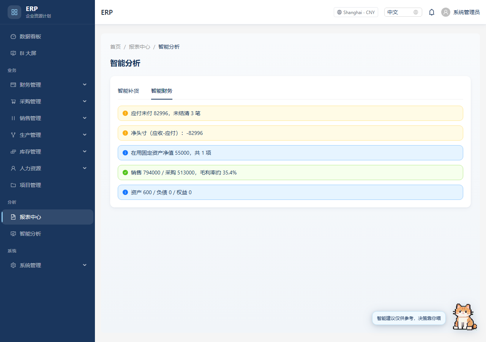

调用 `GET /api/intelligence/finance`，基于 [10.6 财务报表](#106-财务报表) 与运营概览 **实时** 生成洞察卡片（severity：info / warning / success）：

| 洞察 code | 含义 | 典型 severity |
|-----------|------|---------------|
| `ar_outstanding` | 应收未收金额与未结清笔数 | 应收 > 应付时为 warning |
| `ap_outstanding` | 应付未付金额与未结清笔数 | 应付 > 应收时为 warning |
| `net_cash_position` | 净头寸 = 应收未收 − 应付未付 | ≥0 success，<0 warning |
| `fixed_asset_net` | 在用固定资产净值与数量 | info |
| `gross_margin_hint` | 销售总额 vs 采购总额、毛利率 | 毛利率 <15% warning |
| `balance_sheet_snapshot` | 资产 / 负债 / 权益科目余额汇总 | info |

> **与财务报表区别：** 财务管理 → 财务报表展示 **明细表格**（科目余额表等）；智能财务 Tab 展示 **规则摘要卡片**，便于管理层快速浏览。  
> 收付款、计提折旧后数据 **立即** 更新（同 `report:finance` 缓存失效机制）。

---

#### 13.2.3 智能分析实操演练

| 步骤 | 操作 | 预期结果 |
|------|------|----------|
| 1 | 产品管理 → 提高 FG001 安全库存 | 智能补货出现建议行 |
| 2 | 智能补货 → 查看优先级、建议量 | 字段与库存预警一致 |
| 3 | 行内 **转采购申请** | 生成 PR-… draft，标题含「智能补货」 |
| 4 | 采购申请 → 查看明细 | 数量 ≥ 建议采购量 |
| 5 | 智能财务 Tab | 见应付/净头寸/毛利率等卡片 |
| 6 | 应付登记付款后刷新 | 应付未付、净头寸数值变化 |

自动化冒烟：`node scripts/test-intelligence-flow.mjs`（11 项 API 校验）。

---

### 13.3 BI 大屏

路径：**BI 大屏** 或 `/bi-screen`（详见 [5.2 BI 大屏](#52-bi-大屏)）


- 深色全屏风格，适合会议室展示。
- 调用 `GET /api/dashboard/stats`（与运营概览同源，~60s 缓存）。
- **每 30 秒** 前端自动刷新；右上角 **全屏** 进入浏览器全屏模式。
- **无需** `report:center` 权限，任意登录用户可访问。

---

### 13.4 实操演练（推荐顺序）

| 步骤 | 操作 | 预期结果 |
|------|------|----------|
| 1 | 报表中心 → 查看 KPI 与图表 | 销售/采购/库存数字与业务一致 |
| 2 | 智能分析 → 智能补货 | 低于安全库存产品出现建议行 |
| 3 | 行内 **转采购申请** | 生成 PR，可在采购申请中查看 |
| 4 | 智能分析 → 智能财务 | 见应收应付、净头寸等洞察 |
| 5 | BI 大屏 → 全屏 | 深色大屏自动刷新 |

自动化冒烟：`node scripts/test-report-flow.mjs`（报表 API）；`node scripts/test-intelligence-flow.mjs`（智能分析 11 项）。

---

### 13.5 与其他模块关系

| 模块 | 关系 |
|------|------|
| 采购 / 销售 | 订单金额与状态驱动趋势图、饼图 |
| 库存 | 库存总量、智能补货与 **库存预警** 联动 |
| 财务 | 智能财务与 **财务报表** 同源；收付款后财务数据即时更新 |
| 项目管理 | 拥有 `report:center` 时可 **只读** 查看项目列表 |

---

## 14. 系统管理

### 14.0 业务总览

系统管理面向 **IT 管理员 / 实施顾问**，负责账号权限、平台参数、审计合规与外部对接。各子功能通过侧栏 **系统管理** 进入：

```
用户/角色/权限（RBAC）
        ↓
系统配置 + 数据字典
        ↓
审计日志 ← 登录/操作/安全事件
        ↓
租户隔离 / 文件存储 / 集成导出 / 线索导入
```

| 入口 | 路径 | 所需权限 | 说明 |
|------|------|----------|------|
| 用户管理 | `/system/user` | `user:manage` 或 `user:view` | 账号 CRUD、启用/禁用 |
| 角色管理 | `/system/role` | `role:manage` | 角色与 41 项权限绑定 |
| 系统配置 | `/system/config` | `system:config` | 参数配置 + 数据字典 |
| 文件中心 | `/system/files` | `file:manage` 或 `system:config` | MinIO 附件上传/下载 |
| 线索导入 | `/system/leads/import` | `lead:import` | 公海 CSV / JSON 批量导入 |
| 系统集成 | `/system/integration` | `integration:sync` | REST 导出预览 |
| 审计日志 | `/system/audit` | `system:audit` | 登录与操作审计 |
| 租户管理 | `/system/tenant` | `system:tenant` | 多租户创建 |

权限模型详见 [第 4 章](#4-角色与权限管理)。演示账号 **`employee`** 无上述系统管理权限，访问 `/system/role` 等 URL 将显示 **403**。

---

### 14.1 用户管理

路径：**系统管理 → 用户管理**

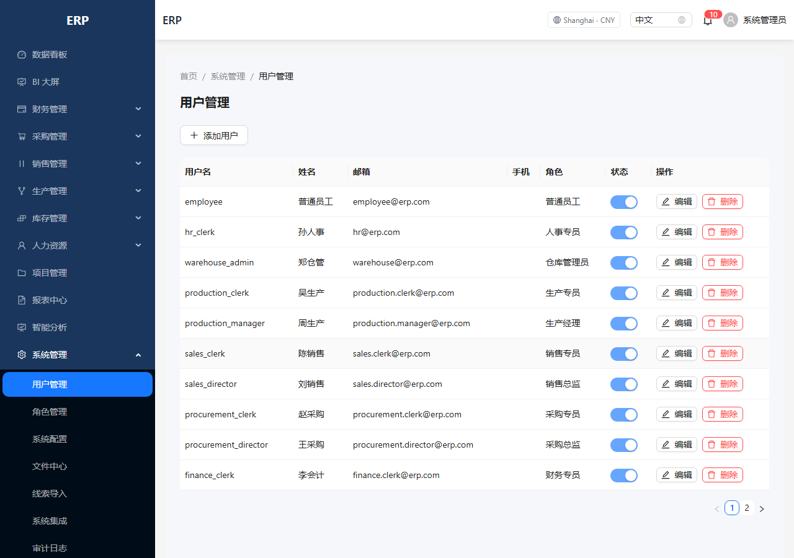

| 列 | 说明 |
|----|------|
| 用户名 | 登录账号，创建后不可修改 |
| 姓名 / 邮箱 / 电话 | 基本信息 |
| 角色 | 决定菜单与 API 权限 |
| 状态 | 启用 / 禁用；禁用后无法登录 |

#### 添加用户

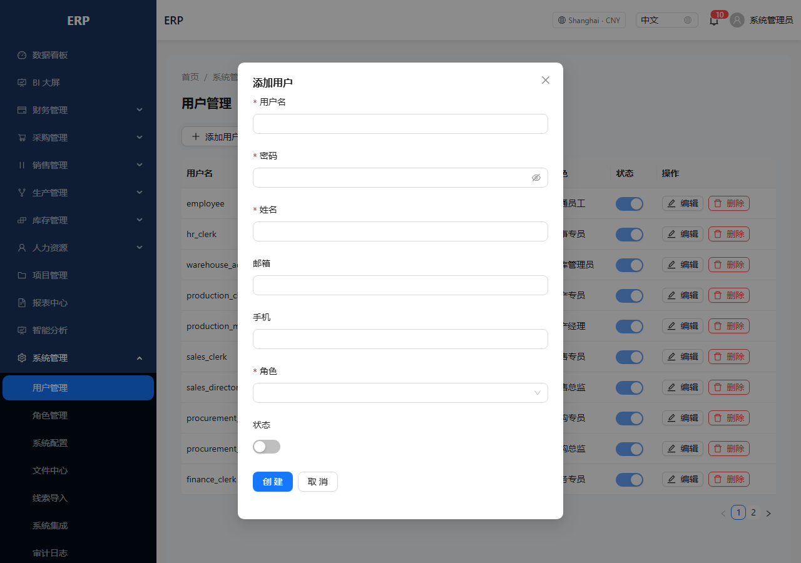

1. 点击 **+ 添加用户**。
2. 填写用户名、姓名、邮箱、角色、初始密码。
3. 保存后用户可使用对应租户编码登录。

**编辑** 可修改角色、联系方式、密码与启用状态。**删除** 将永久移除账号（演示环境勿删 `admin`）。

> 用户名重复时创建失败。新用户默认归属当前登录租户（`default`）。

---

### 14.2 角色管理

路径：**系统管理 → 角色管理**


系统预置 **12 个角色**（系统管理员、财务总监、销售专员等），权限数量见 [4.2 预置角色](#42-预置角色12-个)。

#### 分配权限

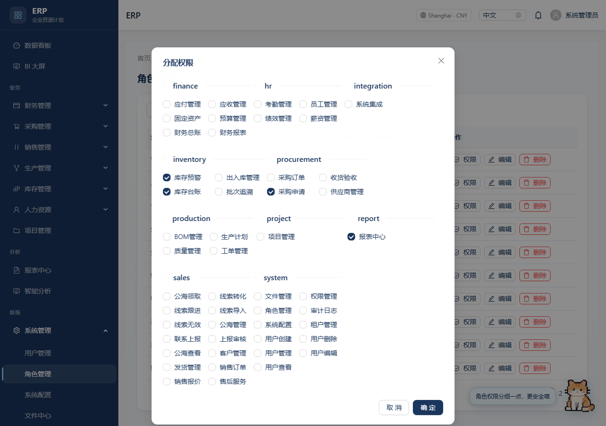

1. 在列表中点击目标行的 **权限** 按钮。
2. 弹窗按 **模块**（system、finance、sales 等）分组展示 41 项权限，勾选所需项。
3. 点击 **确定** 保存；系统 **全量替换** 该角色权限绑定。
4. 已登录用户需 **重新登录** 后 JWT 权限才会刷新。

**新建角色：** 点击 **+ 添加角色** → 填写名称与描述 → 创建后再点 **权限** 分配。

> 更完整的 RBAC 说明见 [4.3 配置角色权限](#43-配置角色权限)。

---

### 14.3 系统配置

路径：**系统管理 → 系统配置**

页面分为两个 Tab：**参数配置** 与 **数据字典**。

#### 参数配置

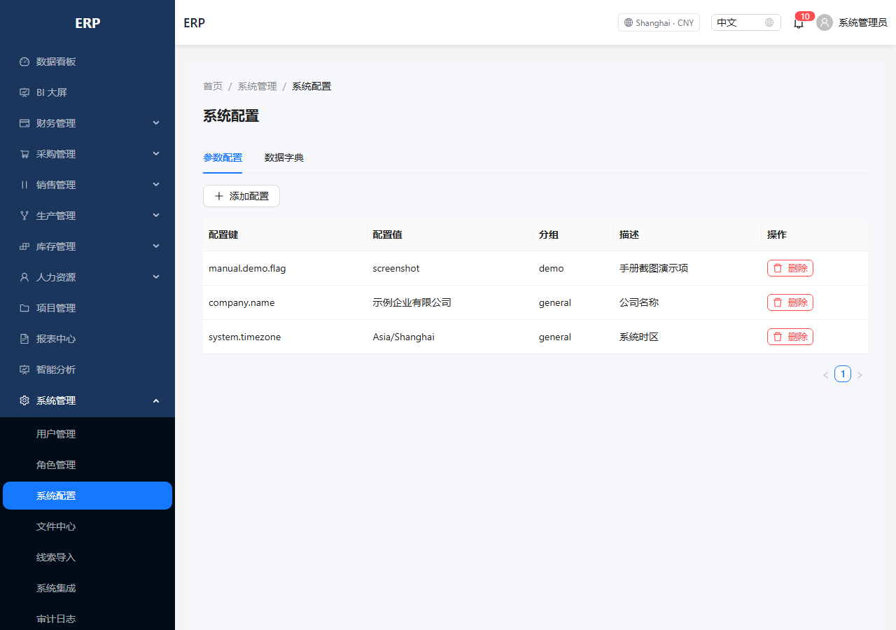

维护键值型系统参数（如 `company.name` 公司名称）。Seed 预置常用项。

| 字段 | 说明 |
|------|------|
| 配置键 | 唯一标识，如 `company.name` |
| 配置值 | 字符串值 |
| 分组 | 归类展示（company、system 等） |
| 描述 | 备注说明 |

点击 **+ 添加配置** 新建；列表行可 **删除** 自定义项（勿删 seed 核心键）。

#### 数据字典

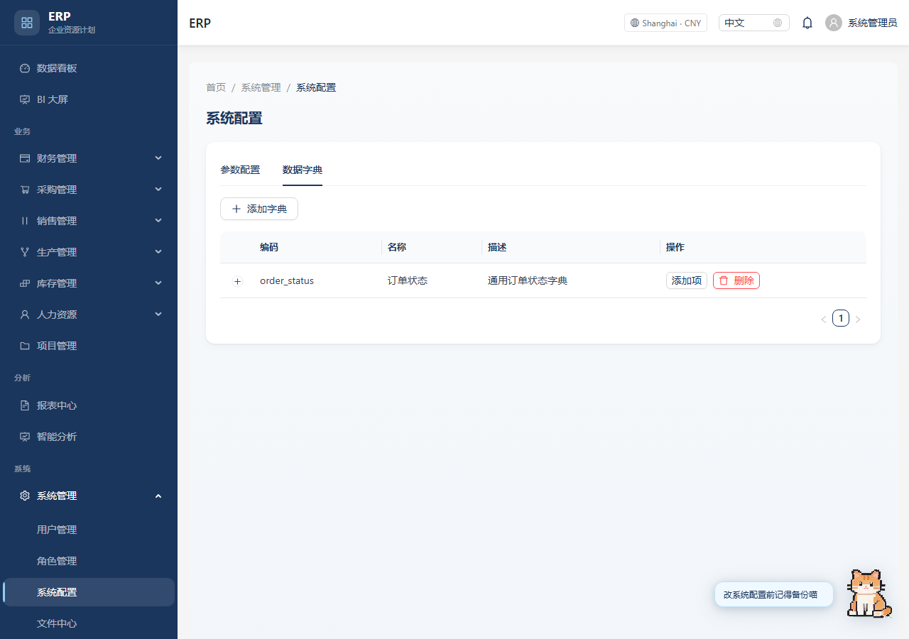

维护下拉选项类主数据，如 **订单状态**（`order_status`：草稿、已审批、已完成等）。

1. 在 **数据字典** Tab 查看字典编码、名称。
2. 点击 **添加字典项** 为指定字典增加 label / value / 排序。
3. 业务模块引用字典 code 渲染状态选项。

---

### 14.4 审计日志

路径：**系统管理 → 审计日志**

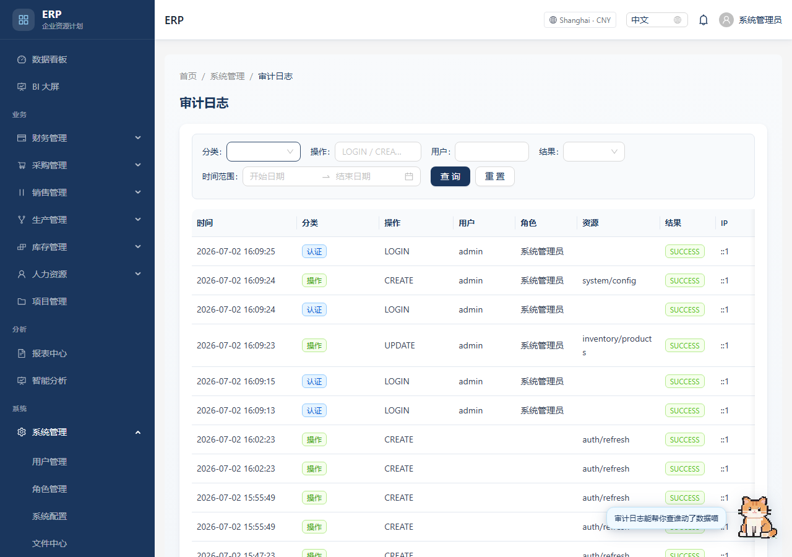

记录系统安全与操作轨迹，支持分页查询。

| 类别 | 颜色 | 典型事件 |
|------|------|----------|
| auth | 蓝 | 登录成功 / 失败 |
| operation | 绿 | POST / PATCH / DELETE 数据变更 |
| security | 红 | 权限拒绝（403） |

**筛选条件：** 分类、操作（如 `LOGIN`）、用户名、结果（SUCCESS / FAILURE）、时间范围。

**操作步骤：**

1. 填写筛选条件（可留空查全部）。
2. 点击 **查询**；**重置** 清空条件。
3. 列表展示时间、用户、角色、资源、IP、详情等字段。

> 合规场景建议定期导出或对接 SIEM；演示环境登录后即可看到 `auth` 类记录。

---

### 14.5 租户管理

路径：**系统管理 → 租户管理**

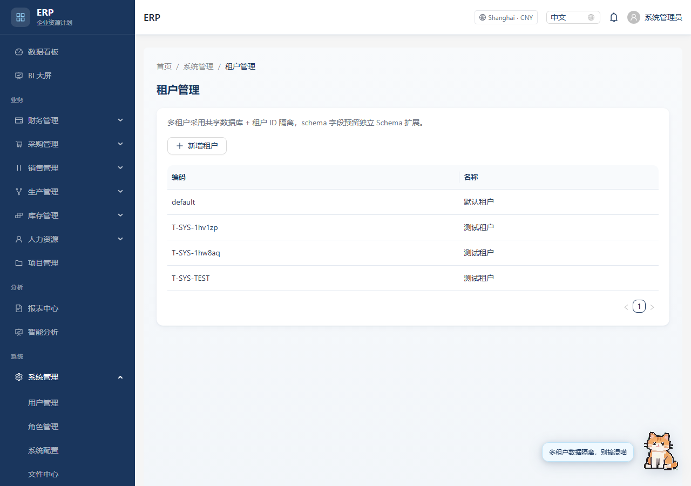

多租户采用 **共享数据库 + 租户 ID 隔离**，`schema` 字段预留独立 Schema 扩展。

#### 新增租户

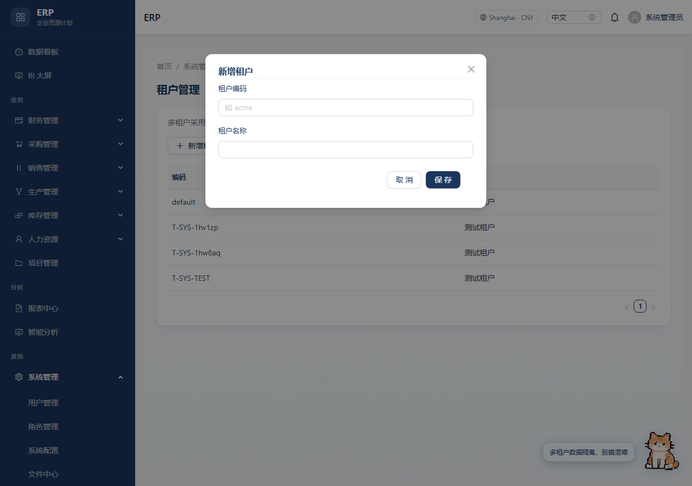

1. 点击 **+ 新增租户**。
2. 填写 **租户编码**（唯一，如 `acme`）与 **租户名称**。
3. 保存后，用户登录时在租户字段输入该编码即可进入隔离数据空间。

> 默认租户编码为 **`default`**。租户编码 **不可重复**，重复提交将报错。新租户需另行 seed 或创建管理员用户。

---

### 14.6 文件中心

路径：**系统管理 → 文件中心**

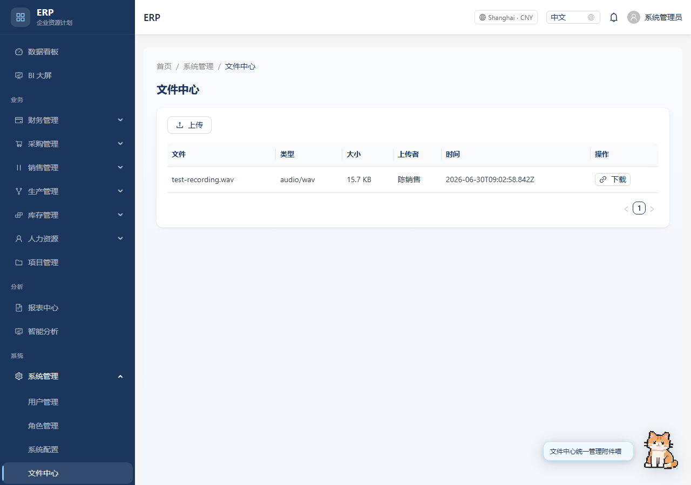

| 能力 | 说明 |
|------|------|
| 上传 | 点击 **上传**，选择本地文件；元数据入库 |
| 列表 | 文件名、类型、大小、上传人、时间 |
| 下载 | 生成 MinIO **预签名 URL** 新窗口打开 |

**环境要求：** 需在 `backend/.env` 配置 `MINIO_ENDPOINT`、`MINIO_ACCESS_KEY`、`MINIO_SECRET_KEY`、`MINIO_BUCKET`。未配置时元数据仍可入库，但下载提示存储未启用（见 [DEPLOYMENT.md](DEPLOYMENT.md)）。

线索 **联系上报录音**、附件等业务亦依赖同一存储。

---

### 14.7 系统集成

路径：**系统管理 → 系统集成**

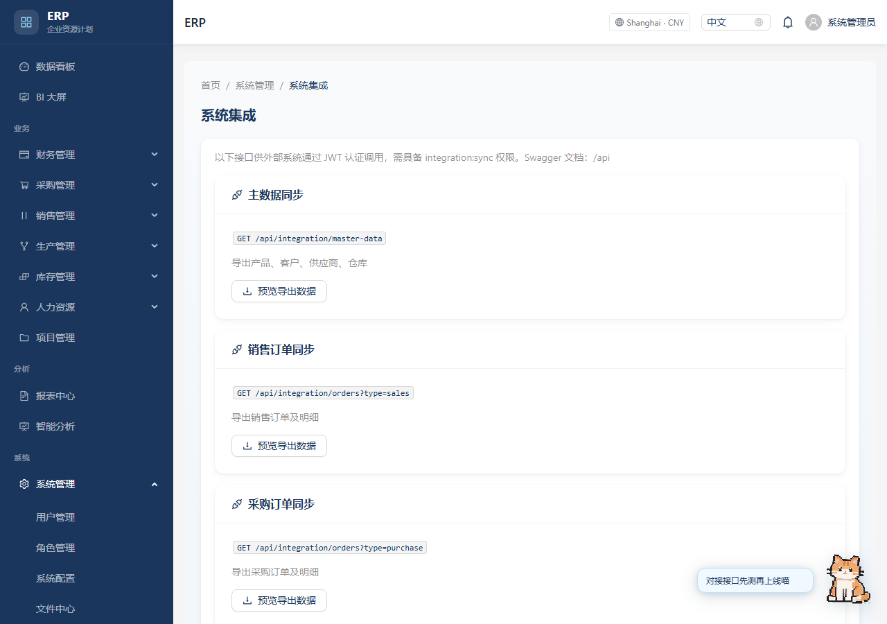

面向外部 ERP / BI / 数据仓库的 **只读 REST 导出**，需 `integration:sync` 权限。页面展示四个接口卡片：

| 接口 | 路径 | 数据范围 |
|------|------|----------|
| 主数据同步 | `GET /api/integration/master-data` | 产品、客户、供应商等 |
| 销售订单 | `GET /api/integration/orders?type=sales` | 销售订单及明细 |
| 采购订单 | `GET /api/integration/orders?type=purchase` | 采购订单及明细 |
| 库存快照 | `GET /api/integration/inventory` | 各仓库存数量 |

点击 **预览导出数据** 可在弹窗查看 JSON 样例（与 API 响应一致）：

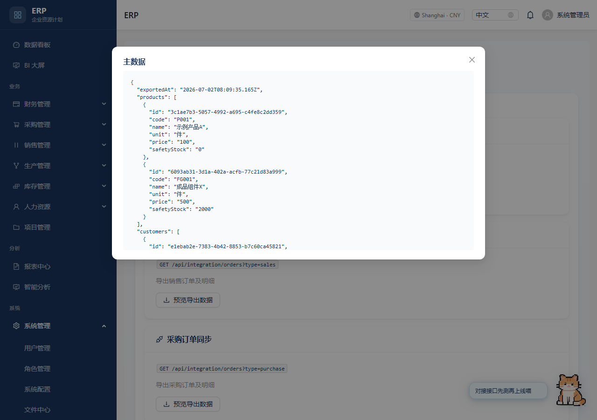

外部系统调用时需携带 **Bearer Token**（与前端相同 JWT），并指定正确租户上下文。

---

### 14.8 线索导入

路径：**系统管理 → 线索导入**（`/system/leads/import`）


管理员将外部线索批量写入 **公海**，供销售领取。支持：

| 方式 | 操作 |
|------|------|
| CSV 上传 | 点击 **上传 CSV**，UTF-8 编码，首行为表头 |
| JSON 粘贴 | 文本框粘贴数组 → **导入 JSON** |
| API | `POST /api/leads/import` |
| 运维脚本 | `scripts/import-shenyang-poi.mjs`（沈阳 POI） |

导入结束显示 **新增 / 跳过（重复）/ 失败** 数量；重复依据 `source` + `source_id` 或业务规则自动跳过。

> CSV 表头、区县与行业枚举、大批量 POI 导入等完整说明见 **[7.10 公海数据导入](#710-公海数据导入管理员)**。

---

### 14.9 实操演练（推荐顺序）

| 步骤 | 操作 | 预期结果 |
|------|------|----------|
| 1 | 角色管理 → 选「普通员工」→ **权限** | 弹窗按模块展示权限勾选 |
| 2 | 用户管理 → **添加用户** → 分配普通员工角色 | 列表出现新用户 |
| 3 | 用新用户登录 | 侧栏仅显示其权限菜单 |
| 4 | 系统配置 → 查看 `company.name` | 显示公司名称 |
| 5 | 审计日志 → 分类选 auth → **查询** | 见登录记录 |
| 6 | 系统集成 → **预览导出数据**（主数据） | JSON 弹窗展示产品等 |
| 7 | 线索导入 → 粘贴示例 JSON → **导入 JSON** | 提示新增/跳过数量 |
| 8 | 禁用测试用户 | 该用户无法再登录 |

自动化冒烟：`npm run docs:verify:system`（13 项 API 校验，含 employee 403）。

权限审计（可选）：`node tests/permissions-audit.mjs`。

---

### 14.10 与其他模块联动

| 模块 | 联动说明 |
|------|----------|
| 全业务模块 | 角色权限控制菜单、路由与 API |
| 销售 / 公海 | 线索导入 → 公海线索池；`lead:import` 与 `lead:manage` 分工 |
| 文件 / 线索 | 联系上报录音、附件经文件中心同一 MinIO |
| 报表 / 集成 | 集成导出与报表中心同源业务数据 |
| 登录 | 租户编码 + 用户认证；审计记录 auth 事件 |

普通业务账号（采购、销售、财务等）**不应** 拥有 `role:manage`、`system:tenant` 等高危权限。

---

## 15. 区域设置与国际化

### 15.1 语言切换

- 登录页或 Header 右上角切换 **中文 / English**。
- 菜单、面包屑、通用按钮已双语；部分业务字段仍可能为中文。

### 15.2 时区与币种

1. 点击 Header **Shanghai · CNY** 区域按钮。
2. 选择时区（如 `Asia/Shanghai`、`America/New_York`）。
3. 选择币种（CNY / USD / EUR / JPY / GBP）。
4. 设置会 **保存到用户 Profile**（`PATCH /api/auth/me/preferences`），下次登录自动恢复。

---

## 16. 移动端与离线

### 16.1 Web 端（PWA）

- 支持安装为 **渐进式 Web 应用**（浏览器「安装应用」）。
- 离线时顶部显示 **离线横幅**，部分功能不可用。
- 新版本可用时提示 **刷新** 以加载最新前端。
- 表格与布局针对窄屏优化（ResponsiveTable + Drawer 侧栏）。

### 16.2 外勤 Android App

面向销售外勤的 **原生 Android 客户端**（当前版本 **1.1.0**），与 Web 共用账号与后端。

| 功能 | 说明 |
|------|------|
| 公海 / 批量领取 | 最多单次 10 条，总持有上限 50 条 |
| 我的线索 | 拨号、地图导航、联系上报 |
| 联系上报 | 上传手机内录音文件（≤10MB） |
| 我的上报 | 查看审核状态、播放录音 |
| 上报审核 | 主管通过/驳回（需 `lead:review`） |
| 消息 | 上报提交与审核结果通知 |
| 离线 | 上报暂存，联网后自动同步 |
| 版本更新 | 启动检查，支持强制/可选更新 |

**安装：** 手机浏览器访问 `http://<服务器IP>:3001/apk/erp-field-latest.apk`（局域网 IP 示例 `192.168.3.4`）。

**完整操作说明：** 请参阅 **[外勤 App 使用说明](FIELD_APP_USER_GUIDE.md)**（安装、登录、各 Tab 操作、FAQ）。

**开发者构建：** 见 [mobile-field/README.md](../mobile-field/README.md)。

---

## 17. 常见问题

### Q1：登录提示用户名或密码错误？

- 确认租户为 `default`。
- 确认密码与 `backend/.env` 中 seed 配置一致。
- 检查后端是否运行、数据库是否已 seed。

### Q2：菜单项缺失？

- 当前角色无对应权限；联系管理员在 **角色管理** 中分配。
- 重新登录使权限生效。

### Q3：访问页面显示 403？

- 直接输入了无权限的路由；从侧栏进入有权限的页面即可。

### Q4：发货提示库存不足？

- 在 **库存台账** 检查对应仓库数量。
- 通过采购收货或生产完工补充库存。

### Q5：库存预警无数据？

- 在 **产品管理** 设置 **安全库存 > 0**，且当前库存低于该值。

### Q6：报表 / BI 数据不是最新？

- **财务报表**（财务管理 → 财务报表）：发货/收货、收付款、凭证过账后服务端会 **立即清除缓存**；若页面数字未变，请 **刷新浏览器**。
- **报表中心运营概览**、**BI 大屏**：仍有约 **60 秒** 缓存，稍等或强刷即可。
- 生产环境配置 Redis 后，多实例共享缓存；财务业务操作会自动失效 `report:finance` 缓存项。

### Q7：权限保存后未生效？

- 用户需 **退出并重新登录**。
- 确认保存时无报错（权限列表接口正常）。

### Q8：区块链上链失败？

- 未配置 RPC 时仅本地哈希链，属正常。
- 配置 `BLOCKCHAIN_RPC_URL` 与 `BLOCKCHAIN_PRIVATE_KEY` 后重试。

### Q9：联系上报按钮灰色或提交失败？

- 确认当前账号持有该线索（**我的线索** 中操作，非公海）。
- 销售专员需具备 `lead:report` 权限；修改权限后 **重新登录**。
- 选择「约下次联系」时必须填写 **下次联系时间**。

### Q10：上报审核页无数据或显示 403？

- **403**：当前角色无 `lead:review`；销售专员只能上报，不能审核。
- **无数据**：待审核为空表示已全部处理；可切换 **全部上报** 查看历史。
- 页面首次加载若 token 未就绪，**刷新** 即可。

### Q11：录音上传或播放失败？

- 确认 MinIO 已启动（Docker：`docker compose` 中 `minio` 服务）。
- 检查 `backend/.env` 中 `MINIO_ENDPOINT`、`MINIO_ACCESS_KEY`、`MINIO_SECRET_KEY`。
- 仅支持音频格式，单文件 ≤ 10MB。

### Q12：公海领取提示已达上限？

- 单人最多同时持有 **50** 条线索；请先 **释放** 或 **转为客户** 后再领取。

### Q13：如何向公海批量导入线索？

- 小批量：管理员登录 → **系统管理 → 线索导入**，上传 CSV 或粘贴 JSON（详见 [7.10 公海数据导入](#710-公海数据导入管理员)）。
- 大批量（沈阳 POI）：配置 `AMAP_API_KEY` 后运行 `scripts/import-shenyang-poi.mjs`。
- 接口对接：调用 `POST /api/leads/import`。
- 重复数据会自动 **跳过**，不会覆盖已有记录。

> **外勤 App** 安装、登录、批量领取、离线上报等问题，见 **[外勤 App 使用说明 — 常见问题](FIELD_APP_USER_GUIDE.md#13-常见问题)**。

### Q14：应收或应付列表为空？

- **应收**：须 **销售订单审批 + 发货** 后才会自动生成（见 [10.2](#102-应收管理)）；仅创建订单不够。
- **应付**：须 **采购订单审批 + 收货验收** 后才会自动生成（见 [10.3](#103-应付管理)）。
- 确认账号具备 `finance:ar` / `finance:ap` 权限。

### Q15：收款或付款提示金额超限？

- 单次金额不能超过 **未收/未付余额**（总额 − 已收/已付）。
- 状态为 `paid` 的单据已结清，不再显示收款/付款按钮。

### Q16：总账凭证无法过账？

- 检查借贷是否 **平衡**（借方合计 = 贷方合计）。
- 仅 **草稿（draft）** 凭证可过账；已过账凭证不可删除，需通过反向凭证调整。

### Q17：登录页提示「服务器错误」？

- 确认 **Docker Desktop 已启动**（PostgreSQL 在 5432 端口）。
- 确认 **后端已运行**（开发环境默认 `http://localhost:3001`）。
- 若 Git 推送 GitHub 失败，本机需配置代理，例如：  
  `git -c http.proxy=http://127.0.0.1:7897 push origin master`（端口以实际为准）。

### Q18：智能补货列表为空？

- 在 **产品管理** 为产品设置 **安全库存**，且 **当前库存低于安全库存** 才会出现建议行。
- 可在 **库存预警** 页先确认有哪些产品低于阈值。
- 转采购申请后，补货建议可能因库存/阈值变化而消失，属正常现象。

### Q19：付款后财务报表数字未变？

- 服务端已自动清除 `report:finance` 缓存；**刷新浏览器** 即可。
- 确认操作的是 **未结清** 应付/应收单；`paid` 状态单据不可再次收付款。

### Q20：采购订单审批提示超出预算？

- 系统按 **当前年度 + 分类 procurement** 的 **在用预算** 校验；**已用 + 订单金额** 不得超过 **预算总额**。
- 可在 **预算管理** 中查看已用/使用率，或 **调减订单** / **提高预算总额** 后重试。
- 未配置对应预算时，审批 **不做预算拦截**（仅在有匹配预算时生效）。

### Q21：计提折旧后报表净值未变？

- 修复后折旧/处置/新增资产会自动刷新报表缓存；若仍异常请 **刷新页面** 并确认后端已重启到最新版本。

### Q22：工单开工提示物料库存不足？

- 在 **库存台账** 查看 BOM 组件（如 P001）是否足够；工单按 **计划数量 × BOM 用量** 扣料。
- 可先 **采购收货** 补充原材料，或减小工单计划数量后再 **开工**。

### Q23：质检提交失败？

- **合格数 + 不合格数** 必须等于 **检验数量**。
- 只能对 **进行中（in_progress）** 或 **已完成（completed）** 的工单创建质检单。

### Q24：库存调整提示「库存不足」？

- 负数量出库会使库存低于 0，系统会拒绝。
- 先在 **库存台账** 确认该仓可用数量，或减小出库数量。

### Q25：盘点无法完成？

- 每条明细须录入 **实盘数量** 后才能完成。
- 盘点单状态为 **已完成** 后不可删除；新建盘点前请确认仓库内有库存记录。

### Q26：调拨失败？

- **源仓库与目标仓库不能相同**；需至少两个仓库（可在 **仓库管理** 新增）。
- 源仓库存不足时调拨会被拒绝，请先在台账确认数量。

### Q27：看不到人力资源菜单？

- 需 `hr:employee` / `hr:attendance` / `hr:salary` / `hr:performance` 中至少一项权限。
- 演示可用 **`hr_clerk`** 登录；`employee` 普通员工账号无 HR 权限。

### Q28：添加工号提示重复？

- **工号全局唯一**，请更换工号后再保存。

### Q29：薪资实发金额不对？

- 实发 = **基本工资 + 奖金 − 扣款**；奖金、扣款留空时按 0 计算。

### Q30：看不到项目管理菜单？

- 需 **`project:manage`**（完整操作）或 **`report:center`**（只读列表）。
- 写操作请使用 **admin**；生产经理等仅有只读权限。

### Q31：项目无法启动？

- 仅 **规划中（planning）** 状态可点 **启动**；已完成项目需新建或调整状态。

### Q32：新建项目提示编码重复？

- **项目编码全局唯一**，请更换编码后再保存。

### Q33：看不到报表中心菜单？

- 需 **`report:center`** 权限；演示可用 **`employee`** 登录。
- **`procurement_clerk`** 等无此权限的角色侧栏不显示报表中心。

### Q34：智能补货列表为空？

- 在 **产品管理** 设置 **安全库存 > 0**，且 **当前库存低于安全库存**。
- 可先查看 **库存预警** 确认有哪些产品低于阈值。

### Q35：转采购申请提示「没有可生成采购申请的产品」？

- 当前 **无任何产品** 低于安全库存，或安全库存均为 0。
- 先在 **库存预警** 或 **智能补货** 确认有建议行后再操作。

### Q36：智能财务卡片数量少或为空？

- 无未结清应收/应付时，对应卡片不出现；**净头寸** 卡片始终展示。
- 若无已过账凭证，资产负债快照可能仅显示部分科目。

---

## 18. 附录

### 18.1 权限代码一览

| 模块 | 权限代码 |
|------|----------|
| 系统 | `user:manage` `user:view` `user:create` `user:update` `user:delete` `role:manage` `permission:manage` `system:config` `system:audit` `system:tenant` `file:manage` |
| 财务 | `finance:gl` `finance:ar` `finance:ap` `finance:asset` `finance:report` `finance:budget` |
| 采购 | `procurement:vendor` `procurement:request` `procurement:order` `procurement:receive` |
| 销售 | `sales:customer` `sales:quote` `sales:order` `sales:delivery` `sales:service` `lead:view` `lead:claim` `lead:follow` `lead:convert` `lead:invalidate` `lead:report` `lead:review` `lead:import` `lead:manage` |
| 生产 | `production:bom` `production:plan` `production:workorder` `production:quality` |
| 库存 | `inventory:stock` `inventory:inout` `inventory:alert` `inventory:trace` |
| 人力 | `hr:employee` `hr:attendance` `hr:salary` `hr:performance` |
| 其他 | `project:manage` `report:center` `integration:sync` |

### 18.2 推荐培训顺序

| 批次 | 对象 | 时长 | 内容 |
|------|------|------|------|
| 1 | 系统管理员 | 2h | 用户/角色/权限、系统配置、审计（见 [14.9 实操演练](#149-实操演练推荐顺序)） |
| 2 | 采购 + 仓管 | 2h | 申请→订单→收货→库存 |
| 3 | 销售 | 2.5h | 公海领取→联系上报→审核；**外勤 App** 实操；报价→订单→发货→售后 |
| 4 | 财务 | 2h | 收货/发货→应收应付→收付款；总账凭证过账；固定资产与预算；财务报表（见 [10.7 实操演练](#107-实操演练推荐顺序)） |
| 5 | 生产 + 计划 | 1.5h | BOM→计划→工单→质检 |
| 6 | 人事专员 | 1.5h | 部门岗位→员工→考勤→薪资→绩效（见 [11.6 实操演练](#116-实操演练推荐顺序)） |
| 7 | 项目经理 | 1h | 新建→任务→启动→完成（见 [12.4 实操演练](#124-实操演练推荐顺序)） |
| 8 | 运营 / 分析 | 1h | 报表中心→智能补货/财务→BI 大屏（见 [13.4 实操演练](#134-实操演练推荐顺序)） |

### 18.3 相关文档

- [部署指南](DEPLOYMENT.md)
- [简明用户指南](USER_GUIDE.md)
- **[外勤 App 使用说明](FIELD_APP_USER_GUIDE.md)**
- [公海与线索 PRD](LEADS_POOL_PRD.md)
- [架构说明](../TECH_ARCH.md)

---

*文档随系统功能更新；截图取自当前部署环境。重新生成截图：`npm run docs:screenshots:leads`（公海线索）、`npm run docs:screenshots:procurement`（采购与智能补货）、`npm run docs:screenshots:finance`（财务管理）、`npm run docs:screenshots:production`（生产管理）、`npm run docs:screenshots:inventory`（库存管理）、`npm run docs:screenshots:hr`（人力资源）、`npm run docs:screenshots:project`（项目管理）、`npm run docs:screenshots:report`（报表中心）、`npm run docs:screenshots:intelligence`（智能分析）、`npm run docs:screenshots:system`（系统管理），或一次性 `npm run docs:screenshots`；流程冒烟：`npm run docs:verify:flows` / `docs:verify:system`；导出 PDF：`npm run docs:pdf`（生成 `USER_MANUAL.pdf` 与 `FIELD_APP_USER_GUIDE.pdf`）。*
